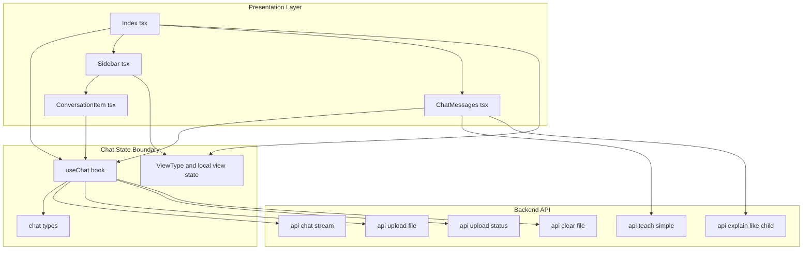
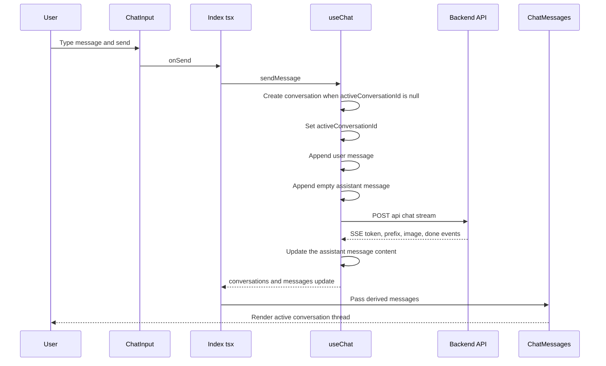
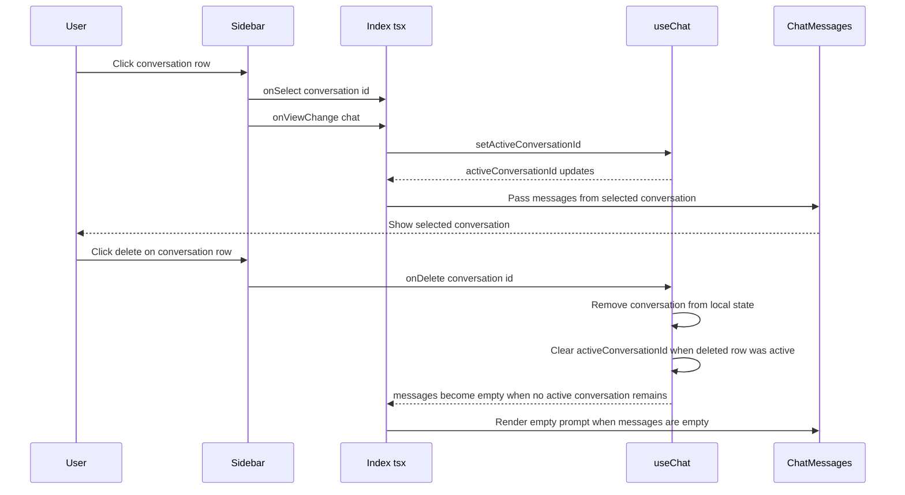

# Chat Interface Domain

## Overview

This domain owns the user-facing chat shell for Nexus: conversation creation, conversation selection, conversation deletion, and the view routing that moves the app between chat, quiz, performance, and roadmap experiences. The state boundary is centered on  and , with the sidebar and conversation items acting as the primary controls for switching chats and navigating history.

The chat experience is driven by local React state rather than a separate store. `activeConversationId` determines which message list is rendered, `conversations` holds the persistent in-memory session history, and the sidebar mirrors that history while also switching the current view mode. The same shell also exposes quiz and roadmap history so the user can jump between the different study workflows without leaving the page.

## Architecture Overview



## Chat State Boundary

### `Index.tsx`

*`src/pages/Index.tsx`*

`Index.tsx` is the shell that combines chat state, sidebar state, and mode routing. It derives the active conversation from `conversations` and `activeConversationId`, then passes the resulting message list into the chat renderer.

#### State and derived values

| State / Derived Value | Type | Responsibility |
| --- | --- | --- |
| `sidebarOpen` | `boolean` | Controls whether the sidebar is visible |
| `showIntro` | `boolean` | Controls the intro splash before the main UI appears |
| `currentView` | `ViewType` | Selects the main content view |
| `latestResult` | `QuizResult \ | null` | Holds the most recent quiz result for the quiz-results view |
| `chatQuestion` | `string \ | null` | Stores a question handed from chat into quiz setup |
| `conversations` | `Conversation[]` | In-memory chat history from `useChat` |
| `activeConversationId` | `string \ | null` | Identifies the selected conversation |
| `messages` | `Message[]` | Messages for the active conversation |
| `isTyping` | `boolean` | Drives the chat streaming indicator |
| `isUploadingFile` | `boolean` | Tracks file upload progress |
| `activeConversation` | `Conversation \ | undefined` | Derived from `conversations.find(c => c.id === activeConversationId)` |


#### View routing callbacks

| Callback | Responsibility |
| --- | --- |
| `handleIntroComplete` | Closes the intro animation and shows the shell |
| `handleToggleSidebar` | Toggles `sidebarOpen` |
| `handleFileUpload` | Wraps `uploadFile` with success and error toasts |
| `handleCheckUploadStatus` | Reads upload status and shows a toast for processing, ready, or error states |
| `handleClearFile` | Clears the active file through `clearFile` and shows a toast |
| `handleStartQuiz` | Starts quiz generation from `chatQuestion` and moves to `quiz` |
| `handleSubmitQuiz` | Evaluates the quiz and moves to `quiz-results` when a result exists |
| `handleViewChange` | Updates `currentView` |
| `handleTakeTestFromChat` | Moves chat content into `quiz-setup` |
| `handleRoadmapFromChat` | Switches to `roadmap` and generates a roadmap |
| `handleRoadmapGenerate` | Switches to `roadmap` and generates a roadmap |
| `handleSelectQuizResult` | Opens a historical quiz result in `quiz-results` |
| `handleSelectRoadmap` | Opens a roadmap in `roadmap` |


#### Active view rendering

| `currentView` value | Rendered content |
| --- | --- |
| `chat` | `ChatMessages` plus `ChatInput` |
| `quiz-setup` | `QuizSetup` |
| `quiz` | `QuizPage`, or a loading spinner while generation is active |
| `quiz-results` | `QuizResults` |
| `performance` | `PerformanceTracker` |
| `roadmap-setup` | `RoadmapSetup` |
| `roadmap` | `RoadmapView`, or a loading spinner, or `RoadmapSetup` when no roadmap is active |


### `useChat.ts`

*`src/hooks/useChat.ts`*

`useChat` is the conversation store and backend bridge. It owns the local React state for conversations, the active conversation id, typing state, and file-upload state, then exposes actions that mutate that state and call the chat-related backend endpoints.

#### State and derived values

| State / Derived Value | Type | Responsibility |
| --- | --- | --- |
| `conversations` | `Conversation[]` | Stores all chat threads in local React state |
| `activeConversationId` | `string \ | null` | Tracks the selected conversation |
| `isTyping` | `boolean` | Indicates that assistant output is streaming or being generated |
| `isUploadingFile` | `boolean` | Indicates a file upload is in progress |
| `activeConversation` | `Conversation \ | undefined` | Derived conversation selected by `activeConversationId` |
| `messages` | `Message[]` | Derived message list for the active conversation |


#### Public API

| Method | Description |
| --- | --- |
| `setActiveConversationId` | Selects the active conversation |
| `createNewConversation` | Creates a blank conversation titled `New Chat` and selects it |
| `sendMessage` | Appends a user message, creates an assistant placeholder, and streams the backend response |
| `explainLikeChild` | Creates or reuses a conversation and fetches a child-friendly explanation |
| `deleteConversation` | Removes a conversation and clears the active id if the deleted conversation was selected |
| `uploadFile` | Uploads a file and attaches the upload metadata to the target conversation |
| `checkUploadStatus` | Polls the backend for the current upload state and stores it on the active conversation |
| `clearFile` | Clears the attached file on the target conversation and calls the backend |
| `isUploadingFile` | Exposed state used by the caller to reflect upload progress |
| `isTyping` | Exposed state used by the caller to reflect assistant generation |


#### Conversation lifecycle rules

| Trigger | Resulting conversation title | State update |
| --- | --- | --- |
| `createNewConversation` | `New Chat` | Prepends a new empty conversation and sets it active |
| First `sendMessage` in a new session | First 30 characters of the message, plus `...` when truncated | Creates a conversation, selects it, then appends user and assistant messages |
| `uploadFile` with no active conversation | `Chat with ${file.name}` | Creates a conversation before uploading, then stores the upload metadata |
| `explainLikeChild` with no active conversation | First 30 characters of the topic, plus `...` when truncated | Creates a conversation before fetching the explanation |


#### Important behavior

- `messages` is always derived from the active conversation only.
- The hook appends an empty assistant message before starting a streaming request so the UI can render incremental content.
- `deleteConversation` removes the conversation from `conversations`; if the deleted id matches `activeConversationId`, the active id becomes `null`.
- `sendMessage` builds the backend payload from the active conversation’s history, but uses a reduced payload when the user message contains `reexplain`.

### 

*`src/types/chat.ts`*

These interfaces define the shape of the chat session data stored in the hook and rendered by the sidebar and message views.

#### `Conversation`

| Property | Type | Description |
| --- | --- | --- |
| `id` | `string` | Stable conversation identifier |
| `title` | `string` | Title shown in the sidebar history list |
| `messages` | `Message[]` | Messages belonging to the conversation |
| `createdAt` | `Date` | Conversation creation timestamp |
| `updatedAt` | `Date` | Last mutation timestamp |
| `uploadedFile?` | `UploadedFile` | File metadata attached to the conversation |


#### `Message`

| Property | Type | Description |
| --- | --- | --- |
| `id` | `string` | Stable message identifier |
| `role` | `'user' \ | 'assistant'` | Message author role |
| `content` | `string` | Rendered message text |
| `timestamp` | `Date` | Message timestamp |
| `imageUrl?` | `string` | Optional image attached to the assistant message |
| `isChildExplain?` | `boolean` | Marks messages generated by the child-friendly explanation flow |


#### `ViewType`

`chat`, `quiz-setup`, `quiz`, `quiz-results`, `performance`, `roadmap-setup`, `roadmap`

## Sidebar History and View Switching

### `Sidebar.tsx`

*`src/components/sidebar/Sidebar.tsx`*

The sidebar is the user’s control surface for switching conversations and switching application modes. It shows recent chats, quiz history, and roadmap history in separate tabs, and it also provides the top-level buttons that move the main panel between chat, quiz, performance, and roadmap views.

#### Props

| Prop | Type | Description |
| --- | --- | --- |
| `conversations` | `Conversation[]` | Chat history entries rendered under the chats tab |
| `activeId` | `string \ | null` | Currently selected conversation id |
| `onSelect` | `(id: string) => void` | Selects a chat conversation |
| `onNew` | `() => void` | Creates a new conversation |
| `onDelete` | `(id: string) => void` | Deletes a conversation |
| `isOpen` | `boolean` | Controls sidebar visibility |
| `onToggle` | `() => void` | Toggles sidebar open state |
| `currentView?` | `ViewType` | Current main view mode |
| `onViewChange?` | `(view: ViewType) => void` | Updates the current view |
| `quizResults?` | `QuizResult[]` | Quiz history entries rendered under the quizzes tab |
| `onSelectQuizResult?` | `(result: QuizResult) => void` | Opens a quiz result from history |
| `roadmaps?` | `Roadmap[]` | Roadmap history entries rendered under the roadmaps tab |
| `onSelectRoadmap?` | `(roadmap: Roadmap) => void` | Opens a roadmap from history |


#### Local state and history mode

| State | Type | Responsibility |
| --- | --- | --- |
| `historyTab` | `'chats' \ | 'quizzes' \ | 'roadmaps'` | Controls which history list is displayed |


#### View controls

| Control | Effect |
| --- | --- |
| `New Chat` | Calls `onNew()` and returns the shell to `chat` |
| `Quiz Mode` | Switches the shell to `quiz-setup` |
| `Performance Tracker` | Switches the shell to `performance` |
| `Roadmap` | Switches the shell to `roadmap-setup` |
| `New Quiz` | Visible in `quiz` and `quiz-results`; switches to `quiz-setup` |


#### History tab behavior

- `historyTab` is auto-selected from `currentView`:- `quiz-setup`, `quiz`, `quiz-results` → `quizzes`
- `roadmap-setup`, `roadmap` → `roadmaps`
- `chat` → `chats`
- The user can still click the tab buttons manually.
- The main view and history tab are controlled separately; the sidebar keeps them visually aligned through the effect above.

#### History rendering

| Tab | Empty state | Item action |
| --- | --- | --- |
| `chats` | `No conversations yet` | Selects a conversation and switches to `chat` |
| `quizzes` | `No quizzes taken yet` | Opens the selected quiz result |
| `roadmaps` | `No roadmaps yet` | Opens the selected roadmap |


### `ConversationItem.tsx`

*`src/components/sidebar/ConversationItem.tsx`*

`ConversationItem` renders a single chat row inside the sidebar chat history. It handles selection and deletion, and it prevents delete clicks from bubbling into the select action.

#### Props

| Prop | Type | Description |
| --- | --- | --- |
| `conversation` | `Conversation` | Conversation shown in the list |
| `isActive` | `boolean` | Controls the active styling |
| `onClick` | `() => void` | Selects the conversation |
| `onDelete` | `() => void` | Deletes the conversation |


#### Behavior

- Clicking the row selects the conversation.
- Clicking the trash button calls `e.stopPropagation()` before deletion.
- The title is truncated visually in the sidebar, but the underlying conversation title stays intact in state.

## Active Conversation Rendering

### `ChatMessages.tsx`

*`src/components/chat/ChatMessages.tsx`*

`ChatMessages` is the consumer that turns `messages` from `useChat` into the visible message list. It receives the derived active-conversation message array from `Index.tsx`, so changing `activeConversationId` immediately changes what the user sees.

#### Props

| Prop | Type | Description |
| --- | --- | --- |
| `messages` | `Message[]` | Messages to render |
| `isTyping` | `boolean` | Controls the streaming indicator |
| `uploadedFile?` | `UploadedFile` | File badge data for the active conversation |
| `onClearFile?` | `() => void` | Clears the current file attachment |
| `onTakeTest?` | `(question: string) => void` | Launches quiz setup from a chat prompt |
| `onRoadmap?` | `(subject: string) => void` | Launches roadmap generation from a chat prompt |


#### UI states

| State | Condition | Result |
| --- | --- | --- |
| Empty | `messages.length === 0 && !isTyping` | Shows the landing prompt `How can I help you today?` |
| Streaming | `isTyping === true` and the last message is assistant text | Shows the pulse cursor beneath the assistant message |
| Defined | `messages.length > 0` | Renders each message bubble in order |
| Simplified expansion loading | `isLoadingSimplified === true` | Shows a full-screen simplification overlay |


## Feature Flows

### Conversation creation and message streaming



### Switching conversations and deleting history



## API Integration

### Send Chat Stream

#### Send Chat Stream

```api
{
    "title": "Send Chat Stream",
    "description": "Streams assistant output for the active conversation using server-sent events. The client consumes token, prefix, image, done, and error event payloads.",
    "method": "POST",
    "baseUrl": "<BackendApiBaseUrl>",
    "endpoint": "/api/chat/stream",
    "headers": [
        {
            "key": "Content-Type",
            "value": "application/json",
            "required": true
        }
    ],
    "queryParams": [],
    "pathParams": [],
    "bodyType": "json",
    "requestBody": "{\n    \"messages\": [\n        {\n            \"role\": \"user\",\n            \"content\": \"Explain Newton's second law in simple English\"\n        },\n        {\n            \"role\": \"assistant\",\n            \"content\": \"\"\n        }\n    ],\n    \"mode\": \"simple_english\"\n}",
    "formData": [],
    "rawBody": "",
    "responses": {
        "200": {
            "description": "Server-sent event stream of JSON event objects",
            "body": "{\n    \"type\": \"token\",\n    \"content\": \"Force equals mass times acceleration.\"\n}"
        }
    }
}
```

### Explain Like a Child

#### Explain Like a Child

```api
{
    "title": "Explain Like a Child",
    "description": "Returns a child-friendly explanation for a topic and is used both by the chat hook and the message expansion modal.",
    "method": "POST",
    "baseUrl": "<BackendApiBaseUrl>",
    "endpoint": "/api/explain-like-child",
    "headers": [
        {
            "key": "Content-Type",
            "value": "application/json",
            "required": true
        }
    ],
    "queryParams": [],
    "pathParams": [],
    "bodyType": "json",
    "requestBody": "{\n    \"topic\": \"photosynthesis\",\n    \"language\": \"en\"\n}",
    "formData": [],
    "rawBody": "",
    "responses": {
        "200": {
            "description": "JSON payload containing the explanation text",
            "body": "{\n    \"response\": \"Plants use sunlight, water, and air to make food.\"\n}"
        }
    }
}
```

### Teach Simple

#### Teach Simple

```api
{
    "title": "Teach Simple",
    "description": "Simplifies an assistant response for the chat expansion modal.",
    "method": "POST",
    "baseUrl": "<BackendApiBaseUrl>",
    "endpoint": "/api/teach-simple",
    "headers": [
        {
            "key": "Content-Type",
            "value": "application/json",
            "required": true
        }
    ],
    "queryParams": [],
    "pathParams": [],
    "bodyType": "json",
    "requestBody": "{\n    \"topic\": \"photosynthesis\",\n    \"language\": \"en\",\n    \"previous_response\": \"Photosynthesis is the process by which plants convert light into chemical energy.\"\n}",
    "formData": [],
    "rawBody": "",
    "responses": {
        "200": {
            "description": "JSON payload containing the simplified response",
            "body": "{\n    \"response\": \"Plants use sunlight to make food from water and air.\"\n}"
        }
    }
}
```

### Upload File

#### Upload File

```api
{
    "title": "Upload File",
    "description": "Uploads a PDF or image file and stores the extracted file metadata on the active conversation.",
    "method": "POST",
    "baseUrl": "<BackendApiBaseUrl>",
    "endpoint": "/api/upload-file",
    "headers": [],
    "queryParams": [],
    "pathParams": [],
    "bodyType": "form-data",
    "requestBody": "{\n    \"file\": \"lecture-notes.pdf\"\n}",
    "formData": [
        {
            "key": "file",
            "type": "file",
            "value": "lecture-notes.pdf",
            "required": true
        }
    ],
    "rawBody": "",
    "responses": {
        "200": {
            "description": "Upload metadata returned by the backend",
            "body": "{\n    \"success\": true,\n    \"filename\": \"lecture-notes.pdf\",\n    \"file_type\": \"pdf\",\n    \"chars_extracted\": 18432,\n    \"processing\": false,\n    \"preview\": \"Chapter 1 introduces the core concepts...\"\n}"
        }
    }
}
```

### Check Upload Status

#### Check Upload Status

```api
{
    "title": "Check Upload Status",
    "description": "Reads the current upload state and updates the active conversation with the latest file metadata.",
    "method": "GET",
    "baseUrl": "<BackendApiBaseUrl>",
    "endpoint": "/api/upload-status",
    "headers": [],
    "queryParams": [],
    "pathParams": [],
    "bodyType": "none",
    "requestBody": "",
    "formData": [],
    "rawBody": "",
    "responses": {
        "200": {
            "description": "Current upload status for the active file",
            "body": "{\n    \"filename\": \"lecture-notes.pdf\",\n    \"file_type\": \"pdf\",\n    \"chars_extracted\": 18432,\n    \"processing\": true,\n    \"ready\": false,\n    \"error\": \"\"\n}"
        }
    }
}
```

### Clear File

#### Clear File

```api
{
    "title": "Clear File",
    "description": "Clears the attached file on the active conversation and tells the backend to reset the file context.",
    "method": "POST",
    "baseUrl": "<BackendApiBaseUrl>",
    "endpoint": "/api/clear-file",
    "headers": [],
    "queryParams": [],
    "pathParams": [],
    "bodyType": "json",
    "requestBody": "[]",
    "formData": [],
    "rawBody": "",
    "responses": {
        "200": {
            "description": "Clears the backend file context",
            "body": "[]"
        }
    }
}
```

## State Management

### Local React state in `Index.tsx`

- `sidebarOpen` controls the shell layout width.
- `currentView` is the primary router for the main panel.
- `latestResult` and `chatQuestion` bridge chat, quiz, and quiz results.
- `activeConversation` is derived every render from `conversations` and `activeConversationId`.

### Local React state in `useChat.ts`

- `conversations` is the in-memory source of truth for all chat history.
- `activeConversationId` is the only selector used to choose which thread is visible.
- `messages` is not stored separately; it is derived from the active conversation.
- `isTyping` and `isUploadingFile` are view-state flags exposed to the shell.

### Sidebar history state

- `historyTab` controls the visible list in the sidebar.
- The effect in `Sidebar.tsx` keeps the tab aligned with the active main view for chat, quiz, and roadmap modes.

## Error Handling

### Chat generation and child explanation

- `sendMessage` catches backend or stream failures and replaces the assistant placeholder with `Failed to get a response. Is the backend running?`
- `explainLikeChild` uses the same fallback content when its request fails.
- `MessageExpandModal` falls back to `Something went wrong. Please close and try again.` when simplification cannot be produced.

### File handling

- `uploadFile` logs the error, creates an error-shaped `UploadedFile` entry, and rethrows.
- `checkUploadStatus` logs status errors and returns `null`.
- `clearFile` logs failures without mutating the conversation file state when the backend call fails.

### Sidebar and selection

- `ConversationItem` prevents delete clicks from triggering selection by stopping event propagation.
- Deleting the active conversation clears `activeConversationId`, which makes the chat view render the empty state.

## Dependencies

- `React` state and callback hooks for all conversation and routing behavior
- `fetch` for chat, explanation, upload, and file-context calls
- `sonner` for upload and file-status toasts in `Index.tsx`
- `lucide-react` for sidebar and conversation action icons
- `chat`, `quiz`, and `roadmap` feature state in `Index.tsx` for cross-view routing

## Testing Considerations

- Creating a first message should create a conversation automatically and select it.
- Clicking a sidebar conversation should switch `activeConversationId` and keep the main panel on `chat`.
- Deleting the active conversation should clear the rendered messages.
- Switching `currentView` should keep the sidebar history tab aligned for chat, quiz, and roadmap views.
- Selecting a quiz result or roadmap from history should move the main panel to the corresponding detail view.
- Streaming chat responses should update the active conversation incrementally, not replace the whole history array.

## Key Classes Reference

| Class | Responsibility |
| --- | --- |
| `Index.tsx` | Routes the shell between chat, quiz, performance, and roadmap views while wiring chat state into the sidebar and main panel |
| `useChat.ts` | Owns conversation history, active conversation selection, streaming chat updates, and file attachment state |
|  | Defines the conversation and message shapes used across the chat shell |
| `Sidebar.tsx` | Switches between chats, quiz history, and roadmap history and controls the current view mode |
| `ConversationItem.tsx` | Renders a single conversation row with select and delete actions |
| `ChatMessages.tsx` | Renders the message list for the currently active conversation |
