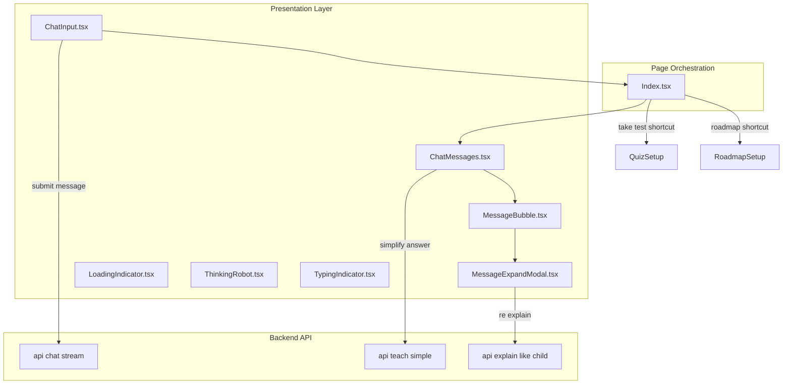
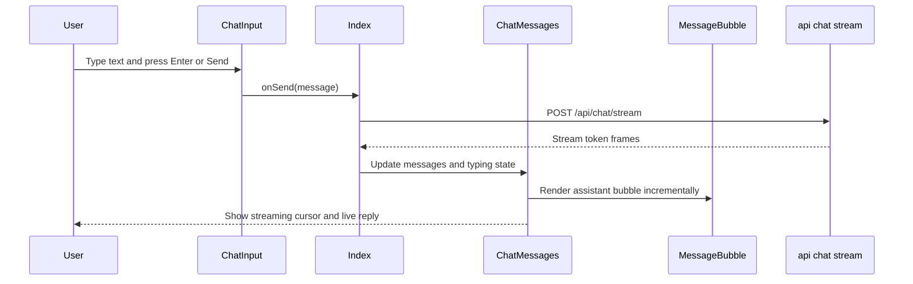
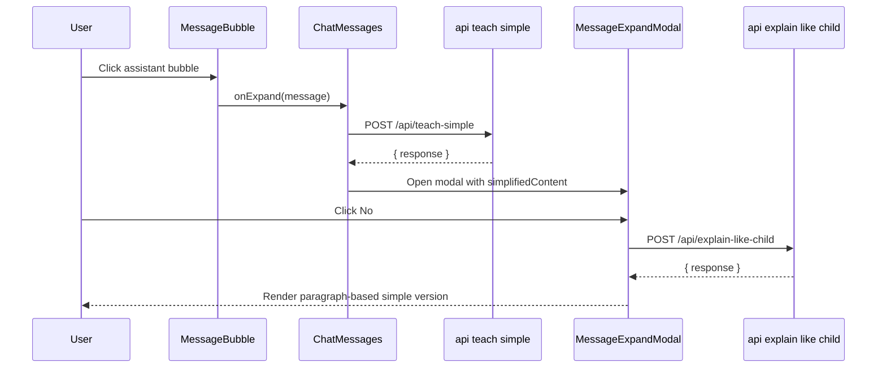
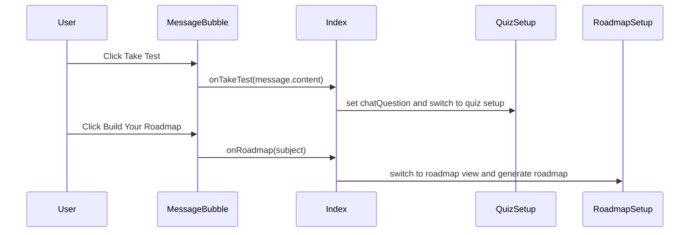
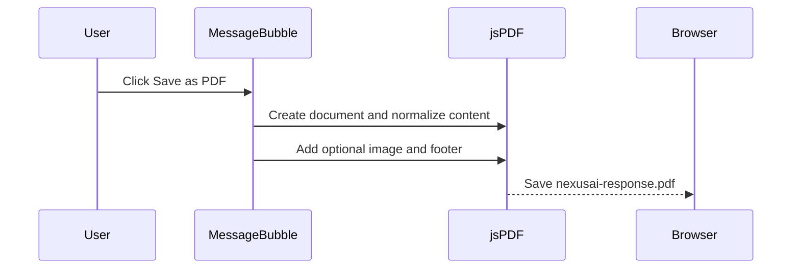

# Chat Interface Domain

## Overview

The chat interface is the main conversational surface in Nexus. It lets a learner type or dictate a question, submit it, and receive an assistant reply that can stream in incrementally. The same surface also supports message expansion, simple-language re-explanation, PDF export, image enlargement, and shortcut actions that can launch quiz or roadmap workflows from an assistant answer.

This feature is built from a small set of focused components: `ChatInput.tsx` handles composition and submission, `ChatMessages.tsx` owns the message list and expansion flow, `MessageBubble.tsx` renders each message by role and exposes assistant affordances, and `MessageExpandModal.tsx` provides the expanded/simplified reading experience. `LoadingIndicator.tsx`, `ThinkingRobot.tsx`, and `TypingIndicator.tsx` provide waiting cues that match the assistant’s conversational state.

## Architecture Overview



## Data Shapes

### `Message`

*File: `src/types/chat.ts`*

| Property | Type | Description |
| --- | --- | --- |
| `id` | `string` | Stable message identifier used as the React key and for in-place assistant streaming updates. |
| `role` | `'user' \ | 'assistant'` | Determines left/right rendering, avatar choice, and which affordances are shown. |
| `content` | `string` | Message body rendered in the bubble and reused for simplify, copy, PDF export, and shortcuts. |
| `timestamp` | `Date` | Message creation time. |
| `imageUrl` | `string \ | undefined` | Optional image rendered inside assistant messages and exported when available. |
| `isChildExplain` | `boolean \ | undefined` | Flags plain-text rendering for child-style explanations. |


### `Conversation`

*File: `src/types/chat.ts`*

| Property | Type | Description |
| --- | --- | --- |
| `id` | `string` | Conversation identifier. |
| `title` | `string` | Display name for the conversation. |
| `messages` | `Message[]` | Ordered message history for the active chat. |
| `createdAt` | `Date` | Creation timestamp. |
| `updatedAt` | `Date` | Last update timestamp. |
| `uploadedFile` | `UploadedFile \ | undefined` | Optional attachment metadata associated with the conversation. |


### `ChatInputProps`

*File: `src/components/chat/ChatInput.tsx`*

| Property | Type | Description |
| --- | --- | --- |
| `onSend` | `(message: string) => void` | Called when the user submits a non-empty message. |
| `onFileUpload` | `((file: File) => void) \ | undefined` | Called after a supported file is selected and validated. |
| `disabled` | `boolean \ | undefined` | Disables composition, recording, and submit actions. |


### `ChatMessagesProps`

*File: `src/components/chat/ChatMessages.tsx`*

| Property | Type | Description |
| --- | --- | --- |
| `messages` | `Message[]` | Message list to render in order. |
| `isTyping` | `boolean` | Controls typing cursor visibility and streaming-state behavior. |
| `uploadedFile` | `UploadedFile \ | undefined` | Optional attached-file state forwarded from the conversation. |
| `onClearFile` | `(() => void) \ | undefined` | Clears the attached file from the active conversation. |
| `onTakeTest` | `((question: string) => void) \ | undefined` | Launches quiz setup from an assistant answer. |
| `onRoadmap` | `((subject: string) => void) \ | undefined` | Launches roadmap generation from an assistant answer. |


### `MessageBubbleProps`

*File: `src/components/chat/MessageBubble.tsx`*

| Property | Type | Description |
| --- | --- | --- |
| `message` | `Message` | Message being rendered. |
| `userQuestion` | `string \ | undefined` | Prior user message used to derive roadmap subjects from assistant answers. |
| `onExpand` | `((message: Message) => void) \ | undefined` | Opens the expansion modal for the clicked message. |
| `onTakeTest` | `((question: string) => void) \ | undefined` | Starts the quiz shortcut using the message content. |
| `onRoadmap` | `((subject: string) => void) \ | undefined` | Starts the roadmap shortcut using a derived subject. |
| `isStreaming` | `boolean \ | undefined` | Suppresses action buttons while the assistant reply is still being built. |


### `MessageExpandModalProps`

*File: `src/components/chat/MessageExpandModal.tsx`*

| Property | Type | Description |
| --- | --- | --- |
| `message` | `Message` | Expanded message content shown in the modal. |
| `onClose` | `() => void` | Closes the modal and resets expansion state. |


## Component Structure

### `ChatInput`

*File: `src/components/chat/ChatInput.tsx`*

`ChatInput` is the message composition surface. It combines text entry, file attachment, voice input, and submit controls into one compact composer. Submission is intentionally simple: pressing Enter without Shift or clicking the send button calls `onSend` with the trimmed text, then clears the local text and attached file state.

#### Props

| Property | Type | Description |
| --- | --- | --- |
| `onSend` | `(message: string) => void` | Emits a user message to the parent orchestration layer. |
| `onFileUpload` | `((file: File) => void) \ | undefined` | Forwards a validated attachment to the parent. |
| `disabled` | `boolean \ | undefined` | Disables the composer during assistant activity. |


#### Key behaviors

- `handleSubmit` trims the input, invokes `onSend`, clears the text box, and resets `attachedFile`.
- `handleKeyDown` submits on `Enter` and preserves multiline composition with `Shift+Enter`.
- `handleFileChange` accepts only PDF and image files, enforces a 100 MB cap, and surfaces large-file warnings over 20 MB.
- Voice input is backed by `window.SpeechRecognition` or `window.webkitSpeechRecognition`.
- `toggleRecording` starts or stops recognition by checking `isListeningRef.current`.

#### File and voice affordances

- The attachment button opens the hidden file input.
- The composer shows a live attached-file chip with name, size, and remove control.
- Recording state changes the microphone button into a destructive pulsing state.
- Voice failures and unsupported browsers are surfaced through `toast`.

### `ChatMessages`

*File: `src/components/chat/ChatMessages.tsx`*

`ChatMessages` renders the full message timeline, manages auto-scroll, and owns the expansion modal lifecycle. It decides when to show the empty welcome panel, when to show the simplify overlay, and when to render the streaming cursor for an assistant reply.

#### Props

| Property | Type | Description |
| --- | --- | --- |
| `messages` | `Message[]` | Ordered messages to render. |
| `isTyping` | `boolean` | Controls streaming cues and the empty-state fallback. |
| `uploadedFile` | `UploadedFile \ | undefined` | Forwarded conversation attachment metadata. |
| `onClearFile` | `(() => void) \ | undefined` | Clears attachment state. |
| `onTakeTest` | `((question: string) => void) \ | undefined` | Passed into assistant bubbles for quiz launch. |
| `onRoadmap` | `((subject: string) => void) \ | undefined` | Passed into assistant bubbles for roadmap launch. |


#### Local state

| State | Type | Description |
| --- | --- | --- |
| `expandedMessage` | `Message \ | null` | Message currently shown in `MessageExpandModal`. |
| `simplifiedContent` | `string` | Response returned by `/api/teach-simple` and injected into the modal. |
| `isLoadingSimplified` | `boolean` | Controls the full-screen simplify overlay. |
| `bottomRef` | `HTMLDivElement \ | null` | Scroll target used to keep the newest message in view. |


#### Key methods

| Method | Description |
| --- | --- |
| `handleExpand` | Expands a message and, for assistant messages with content, requests a simplified version from `/api/teach-simple`. |
| `handleCloseExpand` | Clears the modal state and stops any simplify loading state. |


#### Rendering pipeline

- When `messages.length === 0` and `isTyping` is false, the component renders the centered greeting panel.
- For each message, it computes `isLastAssistant` and passes `isStreaming` to the bubble only for the last assistant message while typing.
- `userQuestion` is set to the prior message content for assistant bubbles, which lets roadmap shortcuts derive a better subject.
- When the last message is an assistant reply and `isTyping` is true, a thin pulsing cursor line appears under the timeline.
- When `expandedMessage` is set, the modal renders with either the simplified content or the original message.

### `MessageBubble`

*File: `src/components/chat/MessageBubble.tsx`*

`MessageBubble` is the role-aware renderer for individual messages. It styles user and assistant content differently, supports message expansion, exposes shortcut actions, and handles copy, image enlargement, and PDF export.

#### Props

| Property | Type | Description |
| --- | --- | --- |
| `message` | `Message` | Message to render. |
| `userQuestion` | `string \ | undefined` | Previous user prompt used for roadmap subject extraction. |
| `onExpand` | `((message: Message) => void) \ | undefined` | Opens the expansion modal. |
| `onTakeTest` | `((question: string) => void) \ | undefined` | Starts quiz flow from the answer. |
| `onRoadmap` | `((subject: string) => void) \ | undefined` | Starts roadmap flow from the answer. |
| `isStreaming` | `boolean \ | undefined` | Hides action buttons while the assistant bubble is still receiving tokens. |


#### Key methods

| Method | Description |
| --- | --- |
| `handleCopy` | Copies rendered message text to the clipboard after stripping HTML and visual hint text. |
| `handleBubbleClick` | Expands the message unless the click originated from an embedded image container or the message is a greeting. |
| `handleImageClick` | Opens the image overlay for assistant images. |
| `handleTakeTest` | Calls `onTakeTest` with `message.content`. |
| `handleRoadmap` | Derives a subject from `userQuestion` or `message.content` and calls `onRoadmap`. |
| `handleConvertToPdf` | Builds a PDF from the message body and optional image using `jsPDF`. |


#### Role-based rendering

| Role | Behavior |
| --- | --- |
| `user` | Right-aligned bubble, `bg-chat-user`, default cursor, user avatar at the edge. |
| `assistant` | Left-aligned bubble, `bg-chat-ai`, Sparkles avatar, clickable expansion area, visible helper banner. |


#### Assistant affordances

- Assistant messages show the hint banner `✨ Click this message to explore deeper` unless the message is a greeting.
- `Take Test` and `Build Your Roadmap` are only shown for assistant messages that are not greetings and are not streaming.
- `Save as PDF` is only shown after the assistant reply is complete.
- Embedded images can be clicked to open a fullscreen overlay.

#### PDF export behavior

`handleConvertToPdf` converts the rendered message into `nexusai-response.pdf`:

- Creates an A4 document with `jsPDF`.
- Reuses `message.imageUrl` when present, drawing it onto a canvas first.
- Converts HTML content to plain text, removes hint lines, strips markdown, normalizes punctuation, and collapses whitespace.
- Adds footer text on every page: `Generated by NexusAI` and the page counter.

### `MessageExpandModal`

*File: `src/components/chat/MessageExpandModal.tsx`*

`MessageExpandModal` is the full-screen message viewer and simplification workspace. It can show the original message, a simplified version returned by `/api/teach-simple`, or a second-pass child-friendly explanation returned by `/api/explain-like-child`.

#### Props

| Property | Type | Description |
| --- | --- | --- |
| `message` | `Message` | Message being expanded. |
| `onClose` | `() => void` | Dismisses the modal. |


#### Local state

| State | Type | Description |
| --- | --- | --- |
| `showRobotDialog` | `boolean` | Shows the initial “Do you understand?” prompt. |
| `showReExplain` | `boolean` | Switches from assistant content to paragraph-based simple explanation rendering. |
| `paragraphs` | `string[]` | Paragraph chunks created from the simplify response. |
| `loading` | `boolean` | Displays the simplification loading card. |


#### Key methods

| Method | Description |
| --- | --- |
| `handleYes` | Closes the modal immediately. |
| `handleNo` | Requests a simpler explanation from `/api/explain-like-child`, then splits the response into readable paragraphs. |


#### Expansion and simplification flow

- `cleanedContent` removes schedule-specific boilerplate such as `Here is a ...study schedule` and `Study Plan:`.
- `plainTopic` strips base64 images, HTML, and markdown before extracting the topic for the child-style rewrite call.
- If the user clicks `No`, the modal:1. hides the question card,
2. shows the loading card,
3. calls `/api/explain-like-child`,
4. normalizes the response into paragraphs,
5. renders the simplified version alongside the robot panel.
- If the response is empty or unreadable, the modal shows a fallback paragraph telling the user to close and try again.

### `LoadingIndicator`

*File: `src/components/chat/LoadingIndicator.tsx`*

A compact assistant-busy indicator used to show that the system is generating a response.

| Property | Type | Description |
| --- | --- | --- |
| Props | none | The component is self-contained. |


### `ThinkingRobot`

*File: `src/components/chat/ThinkingRobot.tsx`*

A decorative, high-emphasis assistant-thinking visual with animated orbit, antenna, eyes, mouth bars, and status text. It is used to reinforce that the assistant is actively processing a request.

| Property | Type | Description |
| --- | --- | --- |
| Props | none | The component is self-contained. |


### `TypingIndicator`

*File: `src/components/chat/TypingIndicator.tsx`*

A minimal three-dot typing cue used when the assistant is in a short “typing” state.

| Property | Type | Description |
| --- | --- | --- |
| Props | none | The component is self-contained. |


## Feature Flows

### 1. Send Message and Stream the Assistant Reply



`ChatInput` only emits the trimmed string. The page-level orchestration in  connects that emit to the assistant streaming path, and `ChatMessages` reflects the assistant state back into the UI.

### 2. Expand an Assistant Answer and Simplify It



The first simplify pass happens in `ChatMessages`. The modal can then perform a second, even simpler explanation pass if the learner still wants help.

### 3. Launch Quiz or Roadmap from an Assistant Answer



`MessageBubble` emits the shortcut action, and  moves the application into the correct workflow. The quiz path pre-fills the question context, and the roadmap path uses the derived subject immediately.

### 4. Export an Assistant Message to PDF



The PDF export uses the same message content that is displayed in the bubble, but it strips hint banners, markdown markers, and HTML tags before writing the file.

## API Integration

### `POST /api/chat/stream`

#### Stream Chat Response

```api
{
    "title": "Stream Chat Response",
    "description": "Streams assistant tokens and structured frames used to build the live assistant reply",
    "method": "POST",
    "baseUrl": "http://localhost:8000",
    "endpoint": "/api/chat/stream",
    "headers": [
        {
            "key": "Content-Type",
            "value": "application/json",
            "required": true
        }
    ],
    "queryParams": [],
    "pathParams": [],
    "bodyType": "json",
    "requestBody": "{\n    \"messages\": [\n        {\n            \"role\": \"user\",\n            \"content\": \"Explain photosynthesis simply\"\n        },\n        {\n            \"role\": \"assistant\",\n            \"content\": \"Photosynthesis is how plants make food using sunlight.\"\n        }\n    ],\n    \"mode\": \"simple_english\"\n}",
    "formData": [],
    "rawBody": "",
    "responses": {
        "200": {
            "description": "Server-sent stream of JSON frames parsed by the chat hook",
            "body": "{\n    \"type\": \"token\",\n    \"content\": \"Photosynthesis is how plants make food using sunlight.\"\n}"
        }
    }
}
```

The chat submit flow sends a message array and a `mode` value. The client parses newline-delimited frames and reacts to `token`, `prefix`, `image`, `done`, and `error` frames while updating the assistant bubble in place.

### `POST /api/teach-simple`

#### Teach Simple Response

```api
{
    "title": "Teach Simple Response",
    "description": "Returns a simplified explanation for the expanded assistant answer shown in the chat modal",
    "method": "POST",
    "baseUrl": "http://localhost:8000",
    "endpoint": "/api/teach-simple",
    "headers": [
        {
            "key": "Content-Type",
            "value": "application/json",
            "required": true
        }
    ],
    "queryParams": [],
    "pathParams": [],
    "bodyType": "json",
    "requestBody": "{\n    \"topic\": \"Photosynthesis\",\n    \"language\": \"en\",\n    \"previous_response\": \"Plants use sunlight, water, and carbon dioxide to make glucose and oxygen.\"\n}",
    "formData": [],
    "rawBody": "",
    "responses": {
        "200": {
            "description": "Simplified answer returned to the expansion modal",
            "body": "{\n    \"response\": \"Photosynthesis is how plants make their own food using sunlight.\"\n}"
        }
    }
}
```

`ChatMessages.handleExpand` posts a compact topic extracted from the assistant message, plus the original response as `previous_response`. The returned `response` replaces the modal content when the simplify request succeeds.

### `POST /api/explain-like-child`

#### Explain Like a Child Response

```api
{
    "title": "Explain Like a Child Response",
    "description": "Produces a plain-text explanation that the modal splits into readable paragraphs after the user asks for a simpler version",
    "method": "POST",
    "baseUrl": "http://localhost:8000",
    "endpoint": "/api/explain-like-child",
    "headers": [
        {
            "key": "Content-Type",
            "value": "application/json",
            "required": true
        }
    ],
    "queryParams": [],
    "pathParams": [],
    "bodyType": "json",
    "requestBody": "{\n    \"topic\": \"Photosynthesis\",\n    \"language\": \"en\"\n}",
    "formData": [],
    "rawBody": "",
    "responses": {
        "200": {
            "description": "Plain-text simplification used by MessageExpandModal",
            "body": "{\n    \"response\": \"Photosynthesis is like a plant kitchen. The plant uses sunlight, water, and air to make food.\"\n}"
        }
    }
}
```

`MessageExpandModal.handleNo` uses this endpoint after the learner declines the first simple version. The returned text is stripped of emoji-only leading lines and then broken into paragraphs for readable display.

## State Management

### Chat Input Composition State

- `input`: current textarea content.
- `isRecording`: toggles the voice-recording button styling and on-screen listening banner.
- `attachedFile`: stores the currently selected file chip.
- `recognitionRef` and `isListeningRef`: coordinate the speech-recognition lifecycle.

### Message List and Expansion State

- `ChatMessages` keeps `expandedMessage`, `simplifiedContent`, and `isLoadingSimplified`.
- The list scrolls to the bottom whenever `messages` or `isTyping` changes.
- `MessageExpandModal` switches between `showRobotDialog`, loading, and simplified paragraph rendering.

### Streaming State

- The last assistant bubble receives `isStreaming`.
- While `isTyping` is true, `ChatMessages` shows a pulse cursor line below the last assistant response.
- `MessageBubble` hides `Take Test`, `Save as PDF`, and `Build Your Roadmap` while a reply is still streaming.

## Integration Points

-  wires `ChatInput` to `sendMessage` and forwards `onTakeTest` and `onRoadmap` into quiz and roadmap view changes.
-  sets `disabled={isTyping}` on `ChatInput`, so the composer is locked while the assistant is generating.
-  passes `onTakeTestFromChat` and `handleRoadmapFromChat` into `ChatMessages`.
- `MessageBubble` reuses `userQuestion` from the previous user message to produce better roadmap subjects.
- The browser Clipboard API, Speech Recognition API, and `jsPDF` all participate in the same interaction surface.

## Error Handling

- `ChatInput` uses `toast.error` for unsupported speech recognition, voice-recognition failures, invalid file types, and oversized attachments.
- `ChatMessages.handleExpand` logs simplify failures and still opens the modal with an empty simplified payload fallback.
- `MessageExpandModal.handleNo` shows a friendly fallback paragraph if the child-style explanation endpoint fails or returns unreadable text.
- `MessageBubble` skips image PDF rendering silently if the image cannot be loaded into a canvas.

## Dependencies

- `react` hooks: `useState`, `useRef`, `useEffect`, `useMemo`, `useCallback`, `memo`.
- `lucide-react` icons: `Send`, `Mic`, `MicOff`, `Plus`, `X`, `FileText`, `FileImage`, `File`, `Sparkles`, `User`, `Copy`, `Check`, `ClipboardList`, `Map`, `FileDown`, `Loader2`.
- `sonner` for toast notifications.
- `jsPDF` for PDF export.
- Browser APIs:- `navigator.clipboard`
- `window.SpeechRecognition`
- `window.webkitSpeechRecognition`
- `Image`
- `canvas`
- `fetch`

## Testing Considerations

- Submit with Enter and with the Send button; both should call `onSend` with trimmed content.
- Verify `Shift+Enter` keeps multiline composition intact.
- Confirm attachment validation rejects unsupported file types and files over 100 MB.
- Verify assistant bubbles render the click hint and shortcut buttons only when not streaming.
- Verify `MessageExpandModal` opens for assistant messages and can show both simplified and re-explained content.
- Verify PDF export includes images when available and saves as `nexusai-response.pdf`.
- Verify quiz and roadmap shortcuts route through the page-level callbacks in .

## Key Classes Reference

| Class | Location | Responsibility |
| --- | --- | --- |
| `ChatInput` | `ChatInput.tsx` | Composes user prompts, file attachments, and voice input. |
| `ChatMessages` | `ChatMessages.tsx` | Renders the message timeline and owns message expansion state. |
| `MessageBubble` | `MessageBubble.tsx` | Renders per-message role styling and assistant affordances. |
| `MessageExpandModal` | `MessageExpandModal.tsx` | Shows expanded content and simple-language re-explanation. |
| `LoadingIndicator` | `LoadingIndicator.tsx` | Displays a compact response-generation indicator. |
| `ThinkingRobot` | `ThinkingRobot.tsx` | Displays the animated assistant-thinking state. |
| `TypingIndicator` | `TypingIndicator.tsx` | Displays the three-dot typing cue. |
| `Index` | `Index.tsx` | Wires chat callbacks into quiz and roadmap navigation. |
