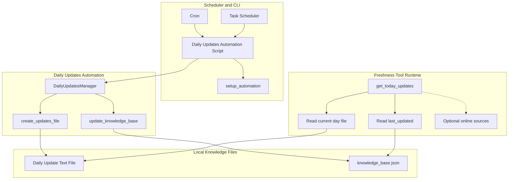
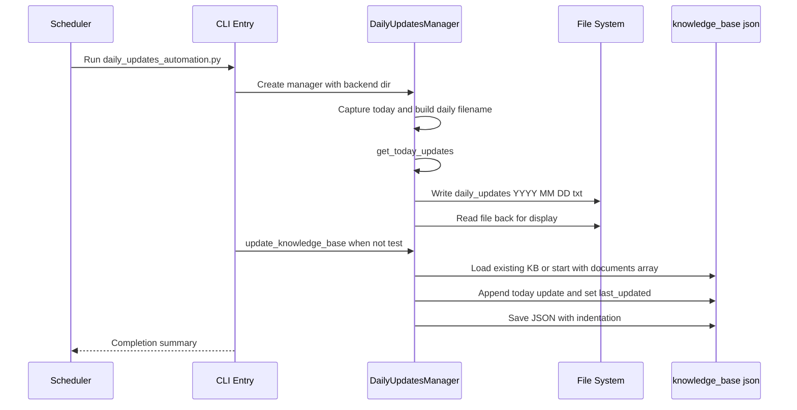
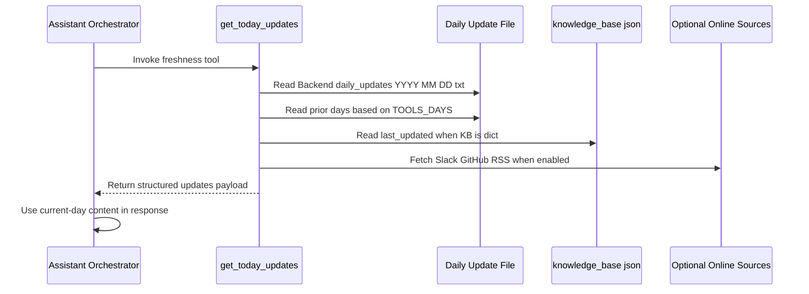

# Document Knowledge Base Domain - Daily Updates Injection and Knowledge Freshness Operations

## Overview

This backend feature keeps Nexus current by writing day-stamped update files and exposing them through the `get_today_updates` tool instead of retraining or fine-tuning the model. The flow is file-first: a daily automation script creates , optionally folds that content into , and the tool runtime reads the current day’s file when the assistant needs fresh information.

For the user, the impact is simple: “today’s” announcements, schedule items, new documents, and team notes can be surfaced on demand through function calling. The freshness mechanism is intentionally operational rather than model-based, so the system stays up to date by reading local files and metadata at runtime.

## Architecture Overview

## Operational Entry Points

### `daily_updates_automation.py`

*`Backend/daily_updates_automation.py`*

This script is the daily freshness generator. It can run as a normal one-shot job, print setup instructions, or perform a test run depending on CLI flags.

#### Invocation Modes

| Mode | Command | Behavior |
| --- | --- | --- |
| Normal run | `python daily_updates_automation.py` | Creates the daily text file and updates `knowledge_base.json` |
| Test run | `python daily_updates_automation.py --test` | Creates the daily text file, prints it, and skips `knowledge_base.json` updates |
| Setup help | `python daily_updates_automation.py --setup` | Prints cron and Task Scheduler instructions |

#### Scheduling Instructions

The --test path still calls create_updates_file(), so it does write the daily text file even though the console message says “No file modifications”.

The script docstring and `setup_automation()` output both support these operational schedules:

| Platform | Scheduled Command |
| --- | --- |
| Linux / macOS cron |  |
| Windows Task Scheduler | Program: `python.exe` Arguments: `daily_updates_automation.py` Start in: `C:\path\to\Backend` |

## Automation Script Components

### `DailyUpdatesManager`

*`Backend/daily_updates_automation.py`*

`DailyUpdatesManager` owns the date snapshot, output filename, file creation, and knowledge base augmentation. It captures `datetime.now()` during initialization and derives the day-specific file name from that snapshot.

#### Properties

| Property | Type | Description |
| --- | --- | --- |
| `backend_dir` | `Path` | Root directory used to resolve update files and `knowledge_base.json` |
| `today` | `datetime` | Timestamp captured when the manager is created |
| `date_str` | `str` | Date string formatted as `YYYY_MM_DD` |
| `updates_file` | `Path` | Full path to `daily_updates_YYYY_MM_DD.txt` under `backend_dir` |

#### Public Methods

| Method | Description |
| --- | --- |
| `get_today_updates` | Collects daily update content from the manager’s internal fetch helpers |
| `create_updates_file` | Builds and writes the daily update text file |
| `update_knowledge_base` | Appends the daily update to `knowledge_base.json` and updates the freshness timestamp |
| `run` | Orchestrates file creation, optional KB update, and completion output |

#### Internal Fetch Helpers

| Method | Description |
| --- | --- |
| `_fetch_announcements` | Returns the daily announcement list used in the file body |
| `_fetch_schedule` | Returns the daily schedule mapping used in the file body |
| `_fetch_new_documents` | Returns the new document list used in the file body |
| `_fetch_team_notes` | Returns the team notes list used in the file body |

#### File Output Shape

`create_updates_file()` writes a plain-text document with these sections:

- `ANNOUNCEMENTS`
- `SCHEDULE`
- `NEW DOCUMENTS`
- `TEAM NOTES`

Each section is populated from the dictionaries and lists returned by the helper methods.

#### Knowledge Base Write Behavior

`update_knowledge_base()` loads  if it exists; otherwise it starts from `{"documents": []}`. It then appends a new entry with:

- `title`
- `content`
- `date`
- `source`

It also sets `last_updated` to today’s ISO date string before saving the file with `indent=2`.

#### Main Control Flow

| Step | Behavior |
| --- | --- |
| 1 | Print banner with current date and backend directory |
| 2 | If `test=True`, print the test mode banner |
| 3 | Call `create_updates_file()` |
| 4 | Print the generated file contents if the file exists |
| 5 | If `test=False`, call `update_knowledge_base()` |
| 6 | Print completion summary and the filenames the AI should use |

### `setup_automation()`

The method comment says it keeps only the “last 30 days,” but the implemented cutoff is the first day of the current month. As written, daily update documents are retained only when their date is later than that month-start cutoff. [!NOTE] The repository snapshot shows  as a list of strings, but update_knowledge_base() rewrites it into an object with documents and last_updated. That schema shift is tolerated by search_knowledge_base, which already accepts both list and dict shapes. [!NOTE] run() does not check the boolean result returned by update_knowledge_base(). If the KB write fails, the script still reaches the “completed successfully” banner after printing the warning from update_knowledge_base().

*`Backend/daily_updates_automation.py`*

This function does not schedule anything itself. It prints the operational instructions for cron, Task Scheduler, and source customization, so it acts as a setup helper rather than a runtime scheduler.

| Method | Description |
| --- | --- |
| `setup_automation` | Prints the scheduling and customization instructions |

## Freshness Tool Runtime

### `get_today_updates`

*`Backend/tools_manager.py`*

This is the freshness mechanism exposed to the function-calling layer. It reads one or more local update files for the current date window and returns them as structured data so the assistant can answer “today”, “latest”, and “new” prompts without fine-tuning.

#### Purpose

- Read  files
- Return the current date and loaded update payloads
- Include `knowledge_base.json` freshness metadata when available
- Optionally add online source results when environment variables enable them

#### Function Parameters

| Parameter | Type | Description |
| --- | --- | --- |
| `category` | `str` | Tool schema argument with default `all` |

#### Runtime Behavior

| Input / Source | Behavior |
| --- | --- |
| Current date | Sets `updates["date"]` to today |
| `TOOLS_DAYS` | Determines how many prior days of update files to scan |
| `TOOLS_INCLUDE_ONLINE` | Enables Slack, GitHub, and RSS retrieval paths |
|  | File content is read and appended when present |
|  | If it is a dict with `last_updated`, that value is returned as `last_kb_update` |

#### Tool Output Shape

| Field | Type | Description |
| --- | --- | --- |
| `status` | `str` | `success` or `error` |
| `category` | `str` | Echo of the requested category |
| `days` | `int` | Date window used for file lookup |
| `include_online` | `bool` | Whether online sources were included |
| `updates` | `dict` | Loaded local and optional online update data |
| `last_kb_update` | `str \ | null` | Freshness timestamp from `knowledge_base.json` when available |
| `note` | `str` | Operational hint about file creation and online sources |

#### Tool Schema vs Runtime Mismatch

| Argument | Exposed in `get_tool_definitions()` | Used by `get_today_updates()` runtime |
| --- | --- | --- |
| `category` | Yes | Not used to filter the returned file content |
| `days` | Yes | Runtime reads `TOOLS_DAYS` from the environment |
| `include_online` | Yes | Runtime reads `TOOLS_INCLUDE_ONLINE` from the environment |

### Supporting Fetch Helpers

The tool schema advertises days and include_online, but the function body shown here does not read them from tool input. The runtime uses environment variables instead, so tool-call arguments alone do not change the date window or online fetch behavior.

*`Backend/tools_manager.py`*

These helpers are only used when the online path is enabled.

#### `fetch_slack_messages`

| Method | Description |
| --- | --- |
| `fetch_slack_messages` | Calls Slack `conversations.history` with a bearer token and returns recent message text items |

| Return Shape | Description |
| --- | --- |
| `[{ "ts": ..., "text": ... }]` | Successful message list |
| `[{ "error": ... }]` | Error wrapper when the Slack API call fails |

#### `fetch_rss_feeds`

| Method | Description |
| --- | --- |
| `fetch_rss_feeds` | Reads RSS or Atom feeds using `feedparser` when available, otherwise falls back to `requests.get` and returns snippets |

| Return Shape | Description |
| --- | --- |
| `[{ "feed": ..., "items": ... }]` | Parsed feed data when `feedparser` succeeds |
| `[{ "feed": ..., "snippet": ... }]` | Fallback raw-content snippet list |
| `[{ "feed": ..., "error": ... }]` | Error wrapper for individual feeds |

## Knowledge Base Update Behavior

### `knowledge_base.json`

*`Backend/knowledge_base.json`*

The repository snapshot starts with a list of plain text strings. The daily update workflow can replace that shape with a dictionary that contains:

- `documents`
- `last_updated`

This matters because the freshness tool and the broader search logic both accept either representation.

#### Shape Compatibility

| Shape | Seen When | Behavior |
| --- | --- | --- |
| List of strings | Initial repository content | Existing searchable text items |
| Dict with `documents` | After daily update augmentation | New daily update entries are stored here |
| Dict with `last_updated` | After augmentation | Used as freshness metadata by `get_today_updates` |

### Daily Update Document Entries

Each appended daily update document contains:

| Field | Type | Description |
| --- | --- | --- |
| `title` | `str` | Human-readable label like `Daily Update - March 23, 2025` |
| `content` | `str` | Full text of the generated daily update file |
| `date` | `str` | ISO date string for the update |
| `source` | `str` | Fixed value `daily_updates` |

## Freshness Flows

### 1. Scheduled Daily Injection

### 2. Freshness Lookup at Tool Call Time

## State Management

### Date-Driven Artifact State

The freshness workflow uses a simple date snapshot model:

- `DailyUpdatesManager.today` captures a single timestamp at construction time
- `DailyUpdatesManager.date_str` and `updates_file` are derived from that timestamp
- `get_today_updates` uses `datetime.now()` at call time to locate the active update window
- `knowledge_base.json` stores `last_updated` as a persisted freshness marker

### Persistence States

| State | Description |
| --- | --- |
| Generated | Daily text file has been written |
| Displayed | The file content has been printed in the console |
| Augmented | `knowledge_base.json` has been updated with the new daily entry |
| Readable by tool | `get_today_updates` can load the current file and freshness metadata |

## Error Handling

### Automation Script

| Method | Error Behavior |
| --- | --- |
| `create_updates_file` | Catches exceptions, prints `❌ Failed to create updates file: ...`, returns `False` |
| `update_knowledge_base` | Catches exceptions, prints `⚠️ Failed to update knowledge base: ...`, returns `False` |
| `run` | Stops immediately if file creation fails; otherwise continues to completion output |
| `__main__` | Exits with status code `1` if the normal run fails and `--test` is not set |

### Tool Runtime

| Function | Error Behavior |
| --- | --- |
| `get_today_updates` | Returns `{"status":"error","message":...}` on exception |
| `fetch_slack_messages` | Returns a one-item error list instead of raising |
| `fetch_rss_feeds` | Falls back to raw HTTP snippets when parsing fails or `feedparser` is unavailable |

## Integration Points

- `tools_manager.get_today_updates` is the freshness hook used by function-calling orchestration.
- `knowledge_base.json` remains compatible with older list-based content and newer document objects.
-  is the canonical daily artifact the assistant reads for current information.
-  is the operational writer that keeps those artifacts current on a schedule.
- Optional online enrichment paths are controlled by `TOOLS_INCLUDE_ONLINE`, `SLACK_BOT_TOKEN`, `SLACK_CHANNEL`, `GITHUB_TOKEN`, `GITHUB_REPO`, and `RSS_FEEDS`.

## Testing Considerations

- Run `python daily_updates_automation.py --test` to verify file generation without KB augmentation.
- Run `python daily_updates_automation.py` to verify both file creation and `knowledge_base.json` rewrite behavior.
- Run `python daily_updates_automation.py --setup` to confirm the cron and Task Scheduler instructions.
- Verify that a current-day file exists at  before asking update-oriented prompts.
- Validate that `get_today_updates` returns a structured success object and that `last_kb_update` appears only after the KB has been rewritten into object form.
- In `test_function_calling.py`, the tool is exercised through `handle_tool_call("get_today_updates", {})`, which confirms the registration path is wired into the tool handler registry.

## Key Classes Reference

| Class | Responsibility |
| --- | --- |
| `DailyUpdatesManager` | Creates daily update files, optionally augments `knowledge_base.json`, and coordinates freshness artifact generation |
