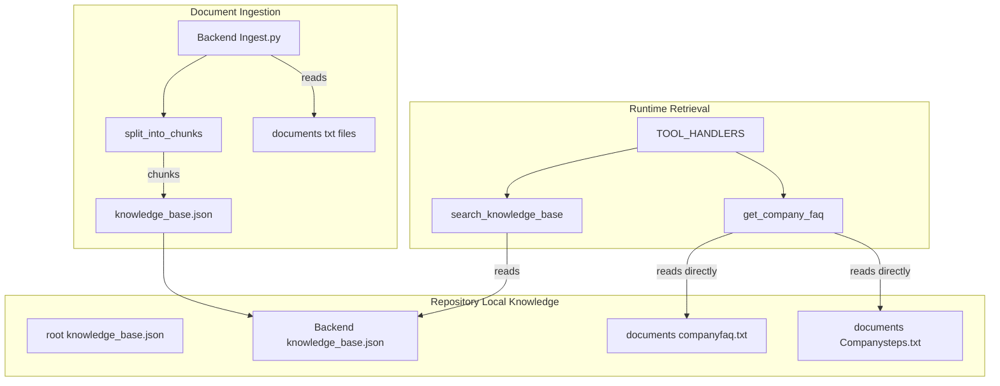
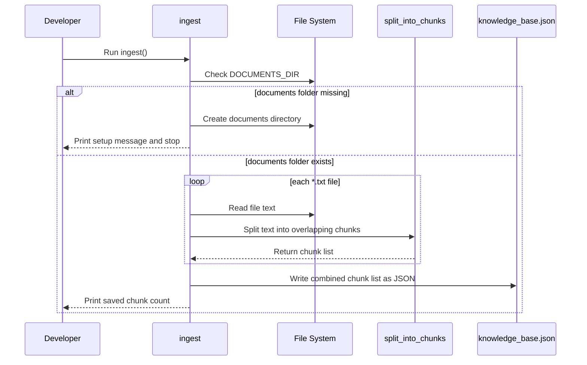
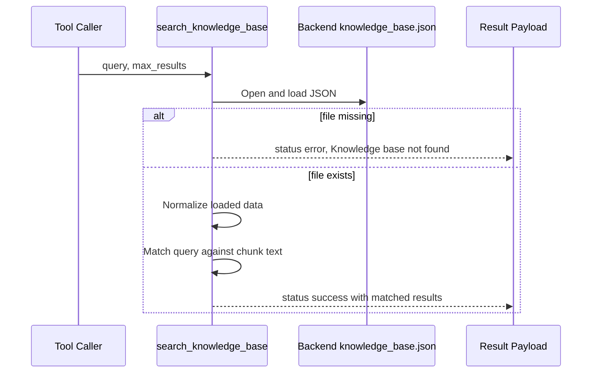
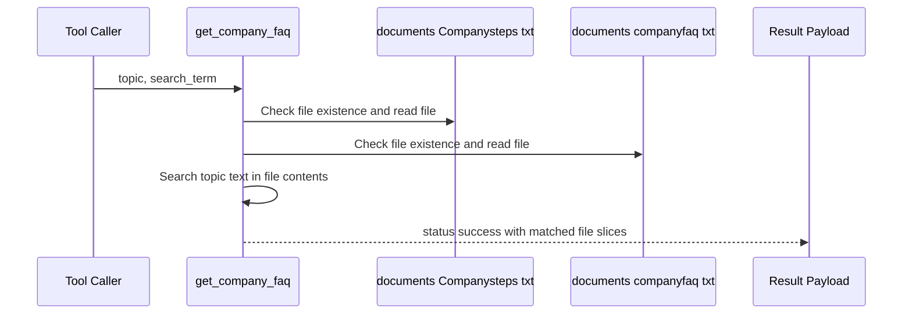

# Document Knowledge Base Domain

*Backend/Ingest.py*

*Backend/tools_manager.py*

*Backend/knowledge_base.json*

*knowledge_base.json*

*documents/companyfaq.txt*

*documents/Companysteps.txt*

## Overview

This domain is the repository-local knowledge layer for Nexus. It keeps document knowledge close to the codebase by turning plain-text files in `./documents` into a persisted JSON chunk store and by reading company FAQ content directly from text files at runtime. The design favors simple filesystem-backed assets over a heavier external database, which keeps the knowledge layer easy to inspect, easy to regenerate, and easy to version alongside the repository.

The knowledge layer is split into two retrieval styles.  builds `knowledge_base.json` from chunked text documents for general knowledge lookup, while `get_company_faq()` in  reads  and  directly for FAQ- and procedure-style answers. This makes the FAQ path immediate and file-native, while the chunked JSON store provides a broader repository-local document index.

## Architecture Overview



## Component Structure

### 1. Ingestion Layer

#### **Ingest.py** ()

 writes to the relative path knowledge_base.json, while tools_manager.py reads . The paths line up when ingestion is run from the Backend/ directory, but they are not hard-coded to the same working directory. [!NOTE] get_company_faq() accepts search_term, but the implementation only checks whether topic.lower() appears in each file. search_term is returned in the payload and is not used for matching.

`Ingest.py` is the document-to-JSON build step for the local knowledge base. It scans `../documents` for plain-text files, chunks each file into overlapping word windows, and writes the resulting list into `knowledge_base.json`.

##### Module members

| Name | Type | Description |
| --- | --- | --- |
| `DOCUMENTS_DIR` | `str` | Relative path used to find source text files: `../documents`. |
| `KB_FILE` | `str` | Output filename for the generated knowledge base JSON: `knowledge_base.json`. |


##### Functions

| Function | Description |
| --- | --- |
| `ingest` | Loads `.txt` files from `DOCUMENTS_DIR`, chunks their contents, and writes the combined chunks to `KB_FILE`. |
| `split_into_chunks` | Splits text into overlapping word chunks. |
| `simple_tokenize` | Lowercases text, removes punctuation, and returns word tokens. |


##### Function behavior

- `ingest()`:- Creates the documents directory if it does not exist.
- Processes only `*.txt` files.
- Calls `split_into_chunks(text)` for each file.
- Appends every chunk into one combined list.
- Writes the list to `knowledge_base.json` using `json.dump(..., ensure_ascii=False, indent=2)`.
- Prints progress messages for loaded files, errors, and final chunk count.

- `split_into_chunks(text, chunk_size=300, overlap=50)`:- Splits on whitespace words.
- Uses a step of `chunk_size - overlap`.
- Returns a list of non-empty chunk strings.

- `simple_tokenize(text)`:- Lowercases the text.
- Replaces punctuation with spaces.
- Returns a list of tokens.

##### Ingestion rules implemented in code

- Only `.txt` files are included.
- PDFs are intentionally excluded in the ingestion step.
- Chunks overlap by 50 words so adjacent windows retain context.
- The generated JSON is a flat list of strings in the provided example.

#### **knowledge_base.json** ()

This is the repository-local runtime store produced by ingestion in the example context.

##### Example stored shape

```json
[
  "What is your return policy? You can return items within 30 days of purchase with a receipt. How do I contact support? Email support@example.com or call +1-555-123-4567.",
  "Installation steps: 1. Unbox the device 2. Plug into power outlet 3. Press the blue button for 3 seconds"
]
```

##### Stored data model

| Property | Type | Description |
| --- | --- | --- |
| Array item | `string` | A chunk of plain-text document content generated by `split_into_chunks`. |


### 2. Runtime Retrieval Layer

#### **tools_manager.py** ()

This module exposes the knowledge retrieval functions that the tool-calling layer can invoke. For the knowledge base domain, the relevant runtime behaviors are direct JSON search and direct FAQ-file lookup.

##### Public functions

| Method | Description |
| --- | --- |
| `get_tool_definitions` | Returns the Groq-compatible function definitions used for tool calling. |
| `search_knowledge_base` | Searches  using simple keyword matching. |
| `get_company_faq` | Reads  and  directly and returns matching content. |


##### Tool registry

| Name | Description |
| --- | --- |
| `search_knowledge_base` | JSON chunk-store lookup. |
| `get_company_faq` | Direct FAQ/procedure file lookup. |


##### `get_tool_definitions`

This function returns the tool specification list used by the orchestration layer.

For the knowledge-base domain, the relevant entries are:

- `search_knowledge_base`
- `get_company_faq`

These are exposed as function tools with JSON-object parameters and required fields enforced by the tool schema.

##### `search_knowledge_base(query: str, max_results: int = 5)`

This function reads  and performs keyword matching against the stored chunks.

Behavior implemented in code:

- Checks whether  exists.
- Loads the file with `json.load`.
- Supports both:- a list of chunk strings, and
- a dict containing `documents` or other values.
- Searches only the first 100 items in the loaded data.
- Matches by checking whether `query.lower()` is a substring of each item’s text.
- Returns each hit truncated to 500 characters.
- Limits the returned result list to `max_results`.

Return shape in code:

| Field | Type | Description |
| --- | --- | --- |
| `status` | `string` | `success` or `error`. |
| `query` | `string` | Original query string. |
| `results_count` | `int` | Number of matched items before truncation to `max_results`. |
| `results` | `array` | Matched chunks with content and relevance. |
| `timestamp` | `string` | ISO timestamp generated at response time. |


Each result item contains:

| Field | Type | Description |
| --- | --- | --- |
| `content` | `string` | Matched text truncated to 500 characters. |
| `relevance` | `string` | Hard-coded as `"high"`. |


##### `get_company_faq(topic: str, search_term: Optional[str] = None)`

This function reads FAQ/procedure source files directly from disk instead of querying the JSON chunk store.

Behavior implemented in code:

- Checks .
- Checks .
- Opens each file with UTF-8 encoding.
- Loads the full file contents into memory.
- Adds a result only when `topic.lower()` is found in the file content.
- Truncates returned content to 1000 characters.
- Returns a success payload even when no file matches.

Return shape in code:

| Field | Type | Description |
| --- | --- | --- |
| `status` | `string` | Always returns `"success"` unless an exception occurs. |
| `topic` | `string` | Requested FAQ topic. |
| `search_term` | `string \ | null` | Optional search term passed through in the response. |
| `results` | `array` | Matching file payloads. |
| `timestamp` | `string` | ISO timestamp generated at response time. |


Each result item contains:

| Field | Type | Description |
| --- | --- | --- |
| `source` | `string` | Either `Companysteps.txt` or `companyfaq.txt`. |
| `content` | `string` | Matching file content truncated to 1000 characters. |


### 3. Repository Local Content

#### **companyfaq.txt** ()

get_company_faq() does not parse the files into question/answer pairs. It performs a plain substring check against the full file content and returns the file text slice when the topic is found.

This file contains the FAQ text used by `get_company_faq()`.

Example content shown in the repository context:

- Return policy:- Returns are allowed within 30 days of purchase with a receipt.
- Support contact:- `support@example.com`
- `+1-555-123-4567`

#### **Companysteps.txt** ()

This file is the second direct-read FAQ/procedure source. It is searched exactly the same way as `companyfaq.txt`.

### 4. Tool Dispatch

#### **TOOL_HANDLERS** ()

This registry maps tool names to implementation functions.

Relevant entries for this domain:

| Tool name | Handler |
| --- | --- |
| `search_knowledge_base` | `search_knowledge_base` |
| `get_company_faq` | `get_company_faq` |


This is the dispatch point that makes the knowledge base and FAQ file readers callable by the orchestration layer.

## Feature Flows

### 1. Document Ingestion Flow



#### Step-by-step

1. `ingest()` creates a local list named `chunks`.
2. It converts `DOCUMENTS_DIR` into a `Path`.
3. If the directory is missing, it creates it and stops.
4. It reads every `*.txt` file from `./documents`.
5. It passes each file’s text to `split_into_chunks`.
6. It extends the shared `chunks` list with every chunk from every file.
7. It writes the final list to `knowledge_base.json`.

### 2. Knowledge Base Search Flow



#### Step-by-step

1. The caller passes a `query` string.
2. `search_knowledge_base()` opens .
3. It accepts either list-shaped or dict-shaped JSON.
4. It scans up to 100 items.
5. It matches by substring containment on lowercased content.
6. It returns up to `max_results` hits, truncated to 500 characters each.

### 3. FAQ Retrieval Flow



#### Step-by-step

1. The caller passes `topic` and optionally `search_term`.
2. `get_company_faq()` checks .
3. It checks .
4. For each existing file, it reads the full content.
5. It appends a result when the topic text is found.
6. It returns all matching slices in one payload.

## State Management

### File-backed knowledge state

-  is the persisted document chunk store used by `search_knowledge_base()`.
-  and  are the direct-source FAQ assets used by `get_company_faq()`.
- `TOOL_HANDLERS` is the runtime registry that binds the tool names to their implementations.

### Supported JSON shapes in the knowledge store

| Shape | Producer | Consumer |
| --- | --- | --- |
| `list[str]` | `Ingest.py` | `search_knowledge_base` |
| `dict` with `documents` | other repository flows that write richer KB payloads | `search_knowledge_base` |


## Integration Points

Ingest.py writes a flat list of strings, while search_knowledge_base() accepts both list and dict forms. That lets the runtime read the ingested chunk store and also tolerate richer JSON structures when they are present.

- Groq tool calling via `get_tool_definitions()` and `TOOL_HANDLERS`.
- Repository-local document maintenance through .
- Direct FAQ/procedure reading from  and .
- The shared JSON store at .

## Error Handling

### `Ingest.py`

- Creates `DOCUMENTS_DIR` if it is missing.
- Catches file read exceptions per `.txt` file and continues processing the rest.
- Prints the failing path and exception text when a file cannot be read.

### `search_knowledge_base()`

- Returns `{"status": "error", "message": "Knowledge base not found"}` when  is missing.
- Wraps the full read/search path in `try/except` and returns the exception text on failure.

### `get_company_faq()`

- Wraps file reads in `try/except`.
- Returns `{"status": "error", "message": str(e)}` on exception.
- Returns success with an empty `results` array when the files exist but the topic does not match.

## Caching Strategy

The knowledge layer is file-persisted rather than database-backed.

- `knowledge_base.json` is the durable chunk store written by ingestion.
- `search_knowledge_base()` loads the JSON file when invoked and searches the loaded contents directly.
- `get_company_faq()` reads the FAQ files directly from disk on each call.

## Dependencies

### Standard library usage

#### 

- `json`
- `re`
- `pathlib.Path`

#### 

- `os`
- `json`
- `datetime`
- `timedelta`
- `typing` types such as `Dict`, `Any`, `List`, `Optional`, `Callable`

### Repository dependencies

- 
- 
- 

## Testing Considerations

 includes `test_knowledge_base()` for validating the JSON store.

### What it checks

- Whether  exists.
- Whether the file contains valid JSON.
- Whether the payload is a list or a dict.
- Whether it can count the stored items.

### Validation shape

| Loaded type | Check performed |
| --- | --- |
| `dict` | Reads `documents` and counts entries. |
| `list` | Counts list items directly. |


## Key Classes Reference

| Class | Responsibility |
| --- | --- |
| `Ingest.py` | Reads plain-text documents from `./documents`, chunks them, and writes `knowledge_base.json`. |
| `tools_manager.py` | Exposes local knowledge search and direct FAQ retrieval tools. |
| `knowledge_base.json` | Stores chunked repository-local knowledge in JSON form. |
| `companyfaq.txt` | Provides direct FAQ content for runtime lookup. |
| `Companysteps.txt` | Provides direct company procedure content for runtime lookup. |
