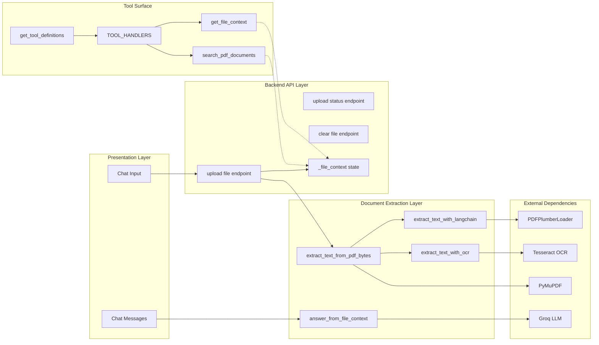
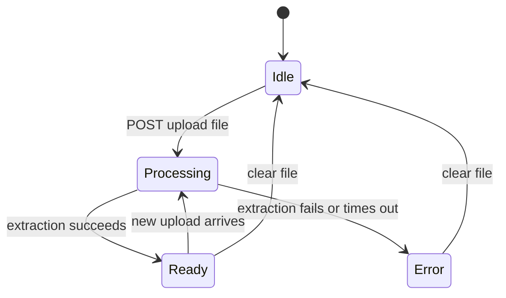
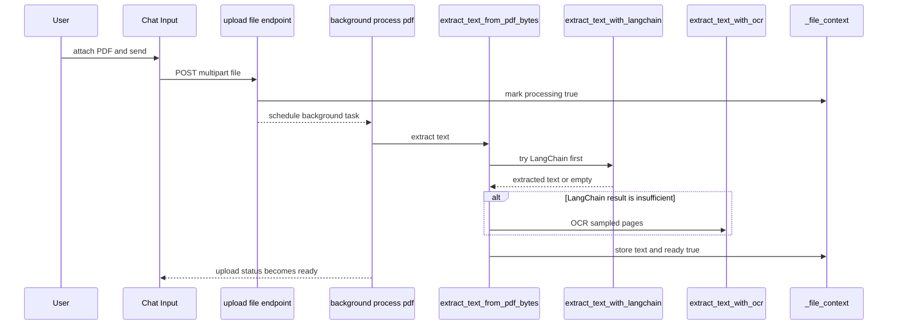
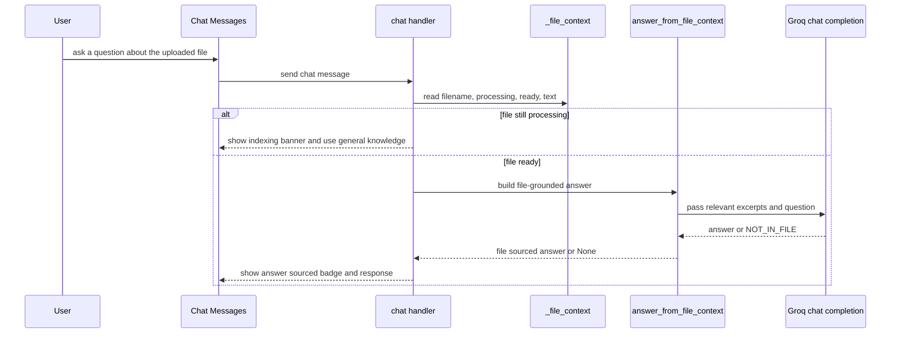

# Document Knowledge Base Domain - PDF Extraction, OCR Fallback, and File-Context Retrieval

## Overview

This feature lets a user upload a PDF or image, wait for the backend to index it, and then ask questions that are answered from the uploaded content instead of general model knowledge. The document path is centered in , where uploads are accepted, text is extracted, and the current file content is stored in a thread-safe in-memory context for later chat turns.

The pipeline evolved from a Groq vision-based OCR approach to a local Tesseract-based path for scanned PDFs. It now tries LangChain text extraction first, falls back to PyMuPDF plus sampled OCR, and uses a larger answer window when generating file-grounded responses. The tool layer in  exposes `get_file_context` and `search_pdf_documents` for Groq function calling, while the live uploaded-file chat path in `main.py` answers from `_file_context` directly.

## Architecture Overview



## Presentation Layer

### Chat Input

*File: `src/components/chat/ChatInput.tsx`*

This is the user entry point for file uploads in the chat surface. It accepts PDFs and images, enforces the 100 MB cap that matches the backend, and warns the user when a large file may take longer to process.

| Property | Type | Description |
| --- | --- | --- |
| `onSend` | `(message: string) => void` | Sends the typed chat message. |
| `onFileUpload` | `(file: File) => void` | Forwards the selected file to the upload flow. |
| `disabled` | `boolean` | Disables input, file picking, and send actions. |


Key behaviors:

- Accepts `.pdf` and `image/*` files.
- Shows a warning above 20 MB.
- Limits uploads to 100 MB.
- Resets the attached file after send.

### Chat Messages

*File: `src/components/chat/ChatMessages.tsx`*

This component renders the conversation thread that later shows file-sourced answers, indexing banners, and assistant messages that can be expanded or summarized. It also receives the uploaded-file state used by the chat surface.

| Property | Type | Description |
| --- | --- | --- |
| `messages` | `Message[]` | Current conversation messages. |
| `isTyping` | `boolean` | Indicates that the assistant is streaming or generating. |
| `uploadedFile` | `UploadedFile` | Current uploaded-file metadata passed from chat state. |
| `onClearFile` | `() => void` | Clears the uploaded-file UI state. |
| `onTakeTest` | `(question: string) => void` | Starts a quiz from the selected answer. |
| `onRoadmap` | `(subject: string) => void` | Starts roadmap generation from the selected answer. |


## Backend Processing Pipeline

### Runtime File Context

*File: `Backend/main.py`*

The file knowledge base is held in a module-level dictionary protected by a lock. Uploads update this object, the chat path reads from it, and `/api/clear-file` resets it.

| Property | Type | Description |
| --- | --- | --- |
| `_file_context_lock` | `threading.Lock` | Synchronizes reads and writes to file state. |
| `_file_context` | `dict` | Stores current file text, filename, type, processing flags, and errors. |
| `_executor` | `ThreadPoolExecutor` | Shared background worker pool for extraction and chat tasks. |
| `TRANSLATOR_AVAILABLE` | `bool` | Controls optional translation support. |
| `PYMUPDF_AVAILABLE` | `bool` | Indicates whether PyMuPDF is installed. |
| `LANGCHAIN_AVAILABLE` | `bool` | Indicates whether LangChain PDF loaders are available. |
| `PYTESSERACT_AVAILABLE` | `bool` | Indicates whether local OCR support is available. |


### Public Functions

*File: `Backend/main.py`*

| Method | Description |
| --- | --- |
| `extract_text_from_pdf_bytes` | Extracts text from PDF bytes using LangChain first, then PyMuPDF sampling, then OCR fallback. |
| `extract_text_with_langchain` | Loads PDF text with `PDFPlumberLoader` and returns combined page text. |
| `extract_text_with_ocr` | Runs local OCR over image bytes with `pytesseract` and a timeout. |
| `answer_from_file_context` | Pulls relevant file excerpts and asks Groq to answer only from uploaded content. |
| `describe_image_with_groq` | Describes uploaded images using Groq vision for the image branch of the upload endpoint. |


### LangChain First Extraction

`extract_text_from_pdf_bytes()` tries `extract_text_with_langchain()` before doing any OCR work. If the LangChain result exists and is longer than 500 characters, it is returned immediately as the primary extraction result.

`extract_text_with_langchain()` writes the PDF bytes to a temporary file, loads it with `PDFPlumberLoader`, joins the `page_content` of every page, and removes the temporary file afterward.

### OCR Fallback and Page Sampling

If LangChain extraction fails or is too small, `extract_text_from_pdf_bytes()` opens the PDF with `fitz.open()`, counts the pages, and samples a subset instead of scanning every page. The current code samples:

- the first 15 pages,
- every 10th page,
- the last 10 pages.

Each sampled page is handled by a worker in `ThreadPoolExecutor(max_workers=4)`. If a page already has more than 100 characters of extracted text, that text is used directly. Otherwise the page is rendered at `fitz.Matrix(0.75, 0.75)` and passed to `extract_text_with_ocr()`.

`extract_text_with_ocr()`:

- opens the rendered image with `PIL.Image`,
- runs `pytesseract.image_to_string(img, lang='eng', timeout=3)`,
- returns empty text on timeout, missing Tesseract, or low-value output.

### File-Context Answering

 describes a different sampling plan and context window than the current extract_text_from_pdf_bytes() implementation. The documentation file says first 10 pages, every 15th page, and last 5 pages, while the code samples first 15, every 10th, and last 10. The same file also describes a 20,000-character answer window, while answer_from_file_context() currently trims the extracted context to 15,000 characters.

`answer_from_file_context()` is the direct file-grounded chat path. It extracts up to three keywords from the user question, finds 500-character windows around each keyword match, and falls back to the first 20,000 characters of the uploaded text if no keyword match is found.

It then:

- caps the merged context at 15,000 characters,
- sends the question and context to `chat_completion()`,
- uses a system prompt that requires the model to answer from the file,
- returns `None` if the model replies with `NOT_IN_FILE` or if the response is too short.

### File Upload Endpoint Flow

The file-context answer path in main.py is the live retrieval path used for uploaded-file conversations. The tool functions in  are separate contracts for function calling and do not currently implement the same retrieval logic.

`upload_file()` reads the uploaded file in 256 KB chunks, rejects payloads larger than 100 MB, and classifies the file as PDF or image.

- PDFs: `_file_context` is marked as `processing=True`, then `_background_process_pdf()` is queued in `BackgroundTasks`.
- Images: `describe_image_with_groq()` is run in the worker pool with a 45-second timeout.
- Unsupported types: a 400 error is raised.

`_background_process_pdf()` updates `_file_context` with the extracted text on success, or writes an error message and clears the ready flag on failure.

### File State Transitions



## API Integration

### Upload File for Document Context

```api
{
    "title": "Upload File for Document Context",
    "description": "Uploads a PDF or image. PDFs are indexed in the background and become available for file-grounded chat answers. Images are analysed immediately with Groq vision.",
    "method": "POST",
    "baseUrl": "<BackendBaseUrl>",
    "endpoint": "/api/upload-file",
    "headers": [
        {
            "key": "Content-Type",
            "value": "multipart/form-data",
            "required": true
        }
    ],
    "queryParams": [],
    "pathParams": [],
    "bodyType": "form-data",
    "requestBody": "",
    "formData": [
        {
            "key": "file",
            "type": "file",
            "value": "<attach pdf file>",
            "required": true
        }
    ],
    "rawBody": "",
    "responses": {
        "200": {
            "description": "PDF received and background indexing started",
            "body": "{\n    \"success\": true,\n    \"filename\": \"uploaded-notes.pdf\",\n    \"file_type\": \"pdf\",\n    \"processing\": true,\n    \"message\": \"\\u2705 'uploaded-notes.pdf' (12.4 MB) received! Indexing in the background (6-18 seconds)...\"\n}"
        },
        "400": {
            "description": "Unsupported file type or empty file content",
            "body": "{\n    \"detail\": \"Unsupported file type. Upload a PDF or image.\"\n}"
        },
        "413": {
            "description": "File exceeds the 100 MB limit",
            "body": "{\n    \"detail\": \"File too large. Maximum size is 100 MB.\"\n}"
        },
        "504": {
            "description": "Processing timed out",
            "body": "{\n    \"detail\": \"File processing timed out\"\n}"
        },
        "500": {
            "description": "Unexpected file processing failure",
            "body": "{\n    \"detail\": \"File processing failed: <error message>\"\n}"
        }
    }
}
```

### Get Upload Status

```api
{
    "title": "Get Upload Status",
    "description": "Returns the current upload and indexing state for the active file context.",
    "method": "GET",
    "baseUrl": "<BackendBaseUrl>",
    "endpoint": "/api/upload-status",
    "headers": [],
    "queryParams": [],
    "pathParams": [],
    "bodyType": "none",
    "requestBody": "",
    "formData": [],
    "rawBody": "",
    "responses": {
        "200": {
            "description": "Current file state",
            "body": "{\n    \"ready\": true,\n    \"processing\": false,\n    \"error\": \"\",\n    \"filename\": \"uploaded-notes.pdf\",\n    \"chars_extracted\": 27384\n}"
        }
    }
}
```

### Clear File Context

```api
{
    "title": "Clear File Context",
    "description": "Clears the current uploaded-file context and resets the in-memory state.",
    "method": "POST",
    "baseUrl": "<BackendBaseUrl>",
    "endpoint": "/api/clear-file",
    "headers": [],
    "queryParams": [],
    "pathParams": [],
    "bodyType": "none",
    "requestBody": "",
    "formData": [],
    "rawBody": "",
    "responses": {
        "200": {
            "description": "File context cleared successfully",
            "body": "{\n    \"success\": true,\n    \"message\": \"File context cleared.\"\n}"
        }
    }
}
```

## OCR Fix and Tesseract Setup

### OCR Fix Summary

*File: `Backend/OCR_FIX_SUMMARY.md`*

The OCR rewrite was driven by a Groq API failure: the previous multimodal payload produced `messages[0].content must be a string`. The fix replaced the PDF OCR branch with local Tesseract and Pillow, which avoids the Groq vision payload entirely for PDFs.

The document also records the intended result of the change:

- no API errors,
- local OCR on the machine,
- improved reliability for scanned PDFs,
- faster results when text extraction succeeds before OCR is needed.

### Tesseract Setup Notes

*File: `Backend/TESSERACT_SETUP.md`*

The setup guide is operational rather than architectural, but it is required for the PDF OCR path to work.

Key steps:

- install Python dependencies with ,
- install the Tesseract binary separately,
- verify the binary with `tesseract --version` or the Windows executable path,
- optionally set `pytesseract.pytesseract.pytesseract_cmd` in  if the binary is not auto-discovered.

Common troubleshooting notes in the guide:

- `TesseractNotFoundError` means the binary is missing or not on the expected path,
- `pytesseract not available` means the Python package is missing,
- slow processing is expected for large scanned PDFs,
- very low-quality images can still produce empty OCR output.

### Requirements

*File: `Backend/requirements.txt`*

| Package | Role in this feature |
| --- | --- |
| `fastapi==0.115.0` | Hosts the upload and file-state endpoints. |
| `uvicorn[standard]==0.32.0` | Runs the backend server. |
| `groq==0.15.0` | Powers file-grounded answers and image description. |
| `python-dotenv==1.0.1` | Loads `GROQ_API_KEY` and other environment values. |
| `PyMuPDF==1.24.13` | Opens PDFs, counts pages, renders sampled pages. |
| `googletrans==4.0.0rc1` | Optional translation support in `main.py`. |
| `pydantic==2.5.0` | Backend model support. |
| `aiofiles==23.2.1` | Async file support in the backend runtime. |
| `langchain==0.1.20` | Shared LangChain runtime for document loaders. |
| `langchain-community==0.0.34` | Provides `PDFPlumberLoader`. |
| `pdf2image==1.16.3` | Installed for document-processing support. |
| `pytesseract==0.3.10` | Python OCR bridge to the Tesseract binary. |
| `pillow==10.1.0` | Opens rendered page images before OCR. |


## Tool Surface

### Tool Registry and Handlers

*File: `Backend/tools_manager.py`*

The tools module exposes Groq-compatible function definitions and a registry that maps tool names to Python callables.

| Method | Description |
| --- | --- |
| `get_tool_definitions` | Returns the Groq tool schema list used for function calling. |
| `search_knowledge_base` | Searches  with simple keyword matching. |
| `search_pdf_documents` | Declares a PDF search tool for uploaded-document retrieval. |
| `get_company_faq` | Searches  and . |
| `get_today_updates` | Collects daily update files and optional online sources. |
| `web_search` | Performs web search when Google API credentials are present. |
| `get_file_context` | Declares a tool for retrieving the current uploaded-file context. |


`TOOL_HANDLERS` maps these tool names to callables:

- `search_knowledge_base`
- `search_pdf_documents`
- `get_company_faq`
- `get_today_updates`
- `web_search`
- `get_file_context`

### Tool Definitions Relevant to File Context

search_pdf_documents() and get_file_context() currently return placeholder success objects. They do not read _file_context or indexed PDF text in this snapshot, so the live document-answer behavior comes from answer_from_file_context() in .

`get_tool_definitions()` includes two document-retrieval tools that matter to uploaded-file conversations:

- `search_pdf_documents`- `query`: search terms for the PDF
- `document_type`: `company_faq`, `training_materials`, `guidelines`, or `all`
- `get_file_context`- `section`: `summary`, `full`, or `first_100_chars`

These definitions are important for Groq orchestration, but the code path that actually answers from uploaded files is the direct file-context branch in `main.py`.

## Feature Flows

### PDF Upload and Indexing



This flow is what turns a PDF into searchable file context. The upload response returns immediately for PDFs with `processing: true`, and the frontend is expected to poll `/api/upload-status` until `_file_context.ready` flips to `true`.

### Answering From Uploaded File Context



The file-grounded branch shows the `📄 Answer sourced from: <filename>` badge before the answer text. If the extractor cannot find a confident answer, the chat falls back to the general answer path.

## State Management

### File Context State

The file domain uses a simple in-memory state model with explicit readiness flags rather than a database-backed document index.

| State Key | Type | Meaning |
| --- | --- | --- |
| `text` | `str` | Extracted document text used for later answers. |
| `filename` | `str` | Original upload filename. |
| `type` | `str` | Current upload type, typically `pdf` or `image`. |
| `processing` | `bool` | Background extraction is still running. |
| `ready` | `bool` | Extracted text is available for answering. |
| `error` | `str` | Last processing error message. |


State transitions are driven by the endpoints:

- `/api/upload-file` initializes the state and starts processing,
- background extraction writes `text` and `ready`,
- `/api/upload-status` exposes the current flags,
- `/api/clear-file` resets everything.

## Error Handling

### Endpoint and Extraction Errors

| Location | Condition | Behavior |
| --- | --- | --- |
| `upload_file()` | File exceeds 100 MB | Returns HTTP 413. |
| `upload_file()` | Unsupported file type | Returns HTTP 400. |
| `upload_file()` | Processing timeout | Writes timeout text into `_file_context.error` and returns HTTP 504. |
| `upload_file()` | Unexpected exception | Returns HTTP 500 with a failure message. |
| `extract_text_with_ocr()` | Tesseract missing | Logs `Tesseract not installed` and returns empty text. |
| `extract_text_with_ocr()` | OCR timeout | Logs a timeout warning and returns empty text. |
| `extract_text_from_pdf_bytes()` | Extraction too small | Returns empty text, which triggers the background error path. |
| `answer_from_file_context()` | Not enough evidence | Returns `None`, which makes the chat handler fall back to general knowledge. |


### Discrepancy Note

## Dependencies

### External Packages and Services

| Dependency | Used For |
| --- | --- |
| `Groq` | File-grounded answer generation and image description. |
| `PyMuPDF` | Page counting, page rendering, and PDF text extraction. |
| `LangChain` PDF loaders | First-pass extraction for searchable PDFs. |
| `pytesseract` | OCR fallback for scanned pages. |
| `Pillow` | Decoding rendered page images before OCR. |
| `Tesseract` binary | Local OCR engine required by `pytesseract`. |
| `FastAPI` | Upload, status, and clear-file endpoints. |
| `ThreadPoolExecutor` | Parallel OCR workers and shared background work. |
| `python-dotenv` | Loads `GROQ_API_KEY` and other runtime settings. |


## Testing Considerations

### Validation Script

 still validates a Groq-style multimodal message payload with image_url and text, even though the PDF OCR pipeline in  now uses local Tesseract for PDFs. The test script therefore documents the legacy vision payload shape rather than the current PDF extraction path.

*File: `Backend/test_ocr_fix.py`*

| Function | Description |
| --- | --- |
| `test_base64_encoding` | Confirms that image bytes can be encoded and decoded cleanly. |
| `test_groq_message_structure` | Validates the legacy Groq multimodal payload shape. |
| `check_dependencies` | Prints which runtime dependencies are installed. |


The script prints pass or fail status for the core checks and then lists missing optional libraries with install hints. It is a quick validation step for the OCR pipeline shape and the runtime dependency set.

### Practical Test Points

- Upload a small searchable PDF and verify that LangChain returns text first.
- Upload a scanned PDF and verify that OCR kicks in for sampled pages.
- Poll `/api/upload-status` until `ready` becomes `true`.
- Ask a question that is definitely present in the PDF and confirm the `Answer sourced from` badge appears.
- Clear the context with `/api/clear-file` and confirm the filename and extracted text reset.

## Key Classes Reference

| Class | Responsibility |
| --- | --- |
| `main.py` | Hosts the PDF upload endpoint, OCR pipeline, file context state, and file-grounded chat answering. |
| `tools_manager.py` | Declares Groq tool schemas and maps tool names to callable handlers. |
| `ChatInput.tsx` | Lets the user attach PDFs or images and send them to the backend. |
| `ChatMessages.tsx` | Renders the conversation view that consumes file-grounded assistant replies. |
| `test_ocr_fix.py` | Validates the OCR payload shape and dependency availability. |
| `requirements.txt` | Lists the Python packages required by the document-processing pipeline. |
| `OCR_FIX_SUMMARY.md` | Summarizes the switch from Groq vision OCR to local Tesseract OCR. |
| `PDF_OPTIMIZATION_COMPLETE.md` | Describes the optimized extraction and prompt changes for file-grounded answers. |
| `TESSERACT_SETUP.md` | Provides Tesseract installation and verification steps. |
