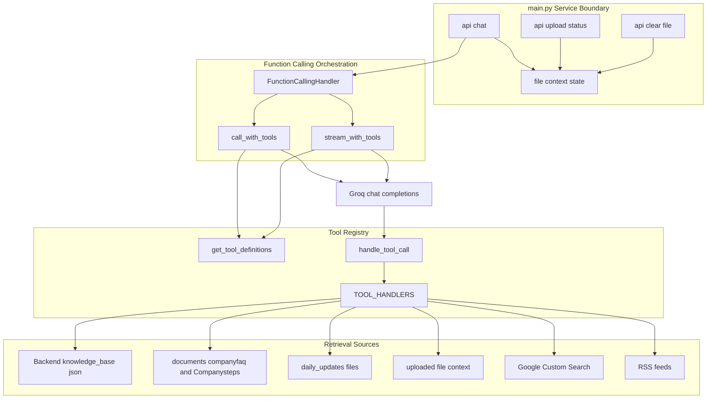
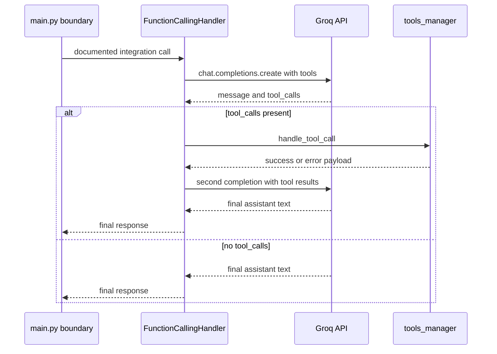

# Document Knowledge Base Domain Tool Registry and Retrieval Surface

## Overview

This domain connects Nexus’ chat boundary to the knowledge sources the model can query at runtime: the local knowledge base, FAQ files, daily update files, web search, PDF retrieval hooks, and uploaded file context. The backend exposes these capabilities as Groq-compatible tools in , then executes them through the orchestration loop in .

The service boundary in  manages the shared file context and the HTTP endpoints that expose and reset it. The visible chat handler normalizes the user message, applies routing shortcuts, and can answer from uploaded file context before falling back to normal generation; the repository docs also reference `chat_completion_with_tools()` as the integration wrapper for the tool-enabled path.

## Architecture Overview



## Main.py Service Boundary

The visible /api/chat handler shown in  still calls chat_completion(). The repository docs in  and  reference chat_completion_with_tools() as the tool-enabled integration point, but that wrapper is not shown in the handler body provided here. The tool registry exists, but the visible chat path does not invoke it directly.

*File: `Backend/main.py`*

`main.py` owns the shared file context used by the chat flow and the status/reset endpoints. The visible handler checks `_file_context` under `_file_context_lock`, and the file-state endpoints read or clear that same dictionary.

### Chat Request Model

#### `ChatRequest`

*File: `Backend/main.py`*

| Property | Type | Description |
| --- | --- | --- |
| `messages` | `List[dict]` | Raw chat messages passed into `/api/chat`. The model does not further constrain the inner message shape in the shown code. |


### `/api/chat`

#### Chat

```api
{
    "title": "Chat",
    "description": "Normalizes the latest user message, applies routing shortcuts, and generates a chat response. The visible handler may use the shared file context before falling back to general generation.",
    "method": "POST",
    "baseUrl": "<BackendApiBaseUrl>",
    "endpoint": "/api/chat",
    "headers": [
        {
            "key": "Content-Type",
            "value": "application/json",
            "required": true
        }
    ],
    "queryParams": [],
    "pathParams": [],
    "bodyType": "json",
    "requestBody": "{\n    \"messages\": [\n        {\n            \"role\": \"user\",\n            \"content\": \"What updates happened today?\"\n        }\n    ]\n}",
    "formData": [],
    "rawBody": "",
    "responses": {
        "200": {
            "description": "Success",
            "body": "{\n    \"response\": \"Here are today's updates...\",\n    \"is_multiple\": false,\n    \"question_count\": 1\n}"
        },
        "400": {
            "description": "Missing messages",
            "body": "{\n    \"detail\": \"No messages provided\"\n}"
        }
    }
}
```

**Execution path in the visible handler**

1. Reads `request.messages`.
2. Rejects empty message arrays with HTTP 400.
3. Extracts the latest user message and runs `process_user_input()`.
4. Trims history to the most recent messages when the list grows beyond the configured limit.
5. Short-circuits greeting and coding branches before the general response path.
6. Checks `_file_context` under `_file_context_lock` and can answer from uploaded file content when available.

### `/api/upload-status`

#### Upload Status

```api
{
    "title": "Upload Status",
    "description": "Returns the current shared file-context state for the knowledge surface.",
    "method": "GET",
    "baseUrl": "<BackendApiBaseUrl>",
    "endpoint": "/api/upload-status",
    "headers": [],
    "queryParams": [],
    "pathParams": [],
    "bodyType": "none",
    "requestBody": "",
    "formData": [],
    "rawBody": "",
    "responses": {
        "200": {
            "description": "Success",
            "body": "{\n    \"ready\": true,\n    \"processing\": false,\n    \"error\": \"\",\n    \"filename\": \"uploaded.pdf\",\n    \"chars_extracted\": 12480\n}"
        }
    }
}
```

### `/api/clear-file`

#### Clear File

```api
{
    "title": "Clear File",
    "description": "Resets the shared file-context state.",
    "method": "POST",
    "baseUrl": "<BackendApiBaseUrl>",
    "endpoint": "/api/clear-file",
    "headers": [
        {
            "key": "Content-Type",
            "value": "application/json",
            "required": true
        }
    ],
    "queryParams": [],
    "pathParams": [],
    "bodyType": "none",
    "requestBody": "",
    "formData": [],
    "rawBody": "",
    "responses": {
        "200": {
            "description": "Success",
            "body": "{\n    \"success\": true,\n    \"message\": \"File context cleared.\"\n}"
        }
    }
}
```

### File Context State

| Property | Type | Description |
| --- | --- | --- |
| `text` | `str` | Processed file content stored in memory for the active upload session. |
| `filename` | `str` | Name of the active uploaded file. |
| `type` | `str` | File classification used by the chat boundary. |
| `processing` | `bool` | Indicates that file processing is still in progress. |
| `ready` | `bool` | Marks the file context as ready for use. |
| `error` | `str` | Stores the last file-processing error message. |


The state is always accessed under `_file_context_lock`. `upload_status` reads it, `clear_file` resets it, and the chat handler reads it before generating the response.

## Tool Registry

*File: `Backend/tools_manager.py`*

`get_tool_definitions()` returns the Groq function list that the model can call. The registry exposes six tools in this order: `search_knowledge_base`, `search_pdf_documents`, `get_company_faq`, `get_today_updates`, `web_search`, and `get_file_context`.

### Tool Definitions

| Tool | Purpose | Required Arguments | Optional Arguments |
| --- | --- | --- | --- |
| `search_knowledge_base` | Search local knowledge content for a topic match. | `query` | `max_results` |
| `search_pdf_documents` | Search and extract text from uploaded PDFs. | `query` | `document_type` |
| `get_company_faq` | Retrieve FAQ and steps content from local FAQ files. | `topic` | `search_term` |
| `get_today_updates` | Retrieve daily update files and optional online sources. | none in the implementation signature | `category`, `days`, `include_online` in the tool schema |
| `web_search` | Run Google Custom Search for current information. | `query` | `num_results` |
| `get_file_context` | Surface the active file context label to the model. | none | `section` |


### TOOL_HANDLERS Mapping

| Tool Name | Handler Function | Notes |
| --- | --- | --- |
| `search_knowledge_base` | `search_knowledge_base` | Reads . |
| `search_pdf_documents` | `search_pdf_documents` | Stubbed PDF search response in the visible code. |
| `get_company_faq` | `get_company_faq` | Reads  and . |
| `get_today_updates` | `get_today_updates` | Loads daily update files and optional online updates. |
| `web_search` | `web_search` | Calls Google Custom Search API. |
| `get_file_context` | `get_file_context` | Returns a static context note in the visible code. |


### Standard Tool Result Contract

get_today_updates is advertised with days and include_online in the tool schema, but the visible function signature accepts only category. When handle_tool_call() forwards model arguments directly, those extra fields raise TypeError and the call returns an error payload.

Every tool is expected to return a JSON-like dictionary with a normalized `status` field.

| Status | Shape | Meaning |
| --- | --- | --- |
| `success` | `{"status":"success", ...}` | Tool executed successfully and returned tool-specific data. |
| `error` | `{"status":"error", "message":"..."}` | Tool failed, was called with invalid parameters, or missing prerequisites were detected. |


`handle_tool_call()` adds `tool_name` to the returned payload after successful handler execution.

### `handle_tool_call()`

| Behavior | Details |
| --- | --- |
| Tool lookup | Returns an error payload when `tool_name` is not present in `TOOL_HANDLERS`. |
| Dispatch | Calls the mapped handler with `handler(**tool_input)`. |
| Tool name tagging | Adds `tool_name` to the result payload on success. |
| Parameter validation | Catches Python `TypeError` and returns `{"status":"error","message":"Invalid parameters: ..."}`. |
| Runtime failures | Catches all other exceptions and returns `{"status":"error","message":"Tool execution failed: ..."}`. |


## Tool Implementations

### `search_knowledge_base()`

| Aspect | Details |
| --- | --- |
| Input | `query`, `max_results=5` |
| Source |  |
| Matching mode | Lowercased substring match against `content` and `title` |
| Scope limit | Only the first 100 items are scanned |
| Result truncation | Each matched content snippet is trimmed to 500 characters |
| Return shape | `status`, `query`, `results_count`, `results`, `timestamp` |


handle_tool_call() accepts file_context, but the visible implementation does not pass that value into any handler. The get_file_context tool therefore cannot read the active file state through this dispatch path in the code shown here.

**Behavior**

- Returns `{"status":"error","message":"Knowledge base not found"}` if the file is missing.
- Accepts either a dictionary or a list as the JSON root.
- Marks every substring match as `"relevance": "high"`.

### `search_pdf_documents()`

| Aspect | Details |
| --- | --- |
| Input | `query`, `document_type="all"` |
| Purpose | PDF retrieval hook |
| Visible behavior | Returns a success payload that says the PDF search is initialized |
| Return shape | `status`, `query`, `document_type`, `message`, `documents_found`, `note` |


This tool is a stub in the shown code. It does not scan PDFs yet; it only returns a placeholder success response.

### `get_company_faq()`

| Aspect | Details |
| --- | --- |
| Input | `topic`, `search_term=None` |
| Sources | ,  |
| Match rule | `topic.lower()` must appear in file content |
| Snippet length | First 1000 characters of each matched file |
| Return shape | `status`, `topic`, `search_term`, `results`, `timestamp` |


**Behavior**

- Returns a success payload even when `search_term` is not used to filter results.
- Adds one result per matching file, each with `source` and `content`.

### `get_today_updates()`

| Aspect | Details |
| --- | --- |
| Input | `category="all"` |
| Local source |  |
| Date window | Controlled by `TOOLS_DAYS` fallback, default `1` |
| Online source toggle | Controlled by `TOOLS_INCLUDE_ONLINE` |
| Online sources | Slack, GitHub commits, RSS feeds when configured |
| Return shape | `status`, `category`, `days`, `include_online`, `updates`, `note` |


**Behavior**

- Builds a `updates` object with local daily files for the selected lookback window.
- Adds `last_kb_update` when  contains `last_updated`.
- Appends online source results under `updates["online"]` when `TOOLS_INCLUDE_ONLINE` is truthy.
- Captures per-source errors inside the online results list instead of failing the whole call.

### `web_search()`

| Aspect | Details |
| --- | --- |
| Input | `query`, `num_results=3` |
| External service | Google Custom Search API |
| Credentials | `GOOGLE_API_KEY`, `GOOGLE_CX` |
| Result cap | `num_results` is clamped to 10 |
| Return shape | `status`, `query`, `results_count`, `results`, `timestamp` |


**Behavior**

- Returns `{"status":"error","message":"Google API credentials not configured"}` when the required environment variables are missing.
- Converts each result item into a compact object containing `title`, `link`, and `snippet`.

### `get_file_context()`

| Aspect | Details |
| --- | --- |
| Input | `section="summary"` |
| Intended source | Shared file context from `main.py` |
| Visible behavior | Returns a success payload with the requested section and a note |
| Return shape | `status`, `section`, `note` |


The function does not read the shared file content in the visible code. It only returns a contract placeholder that points back to `main.py`.

### `fetch_rss_feeds()`

| Aspect | Details |
| --- | --- |
| Input | `urls`, `days=1` |
| Primary parser | `feedparser` |
| Fallback | `requests.get()` and raw snippet capture |
| Return shape | List of feed dictionaries |


This helper is used by `get_today_updates()` when RSS feeds are configured. It returns parsed feed metadata when `feedparser` is available, or raw content snippets when the fallback path runs.

## Function Calling Orchestration

*File: `Backend/function_calling.py`*

`FunctionCallingHandler` runs the model-tool loop. It prepares the message list, sends the tool definitions to Groq, executes tool calls through `handle_tool_call()`, appends tool outputs back into the conversation, and retries until the model stops requesting tools or the iteration cap is reached.

### `FunctionCallingHandler`

#### Properties

| Property | Type | Description |
| --- | --- | --- |
| `client` | `Groq` | Groq client used for chat completion calls. |
| `model` | `str` | Model name used in `chat.completions.create`. |
| `max_iterations` | `int` | Upper bound for the tool loop. The visible constructor sets this to `10`. |


#### Constructor Dependencies

| Type | Description |
| --- | --- |
| `Groq` | Injected client used to call the Groq chat completion API. |
| `str` | Model name passed to the completion request. |


#### Public Methods

| Method | Description | Returns |
| --- | --- | --- |
| `call_with_tools` | Runs the tool-enabled completion loop and returns the final text response. | `str` |
| `stream_with_tools` | Runs the same loop and yields streamed output chunks. | `Generator[str, None, None]` |
| `async_call_with_tools` | Async wrapper that delegates to `call_with_tools`. | `str` |
| `async_stream_with_tools` | Async wrapper that yields from `stream_with_tools`. | `AsyncGenerator[str, None]` |


### Orchestration Flow



### Runtime Details

| Step | Behavior |
| --- | --- |
| Message preparation | Copies the input list and prepends `system_prompt` when provided. |
| Tool list | Loads the full registry from `get_tool_definitions()`. |
| Groq call | Calls `self.client.chat.completions.create()` with `tool_choice="auto"`. |
| Tool execution | Parses `tool_call.function.arguments` with `json.loads()` and forwards them to `handle_tool_call()`. |
| Message stitching | Appends the assistant tool-call message, then appends a `role="tool"` message containing the serialized tool result. |
| Loop cap | Stops after `max_iterations` and returns a fixed fallback message. |


### Streaming Behavior

`stream_with_tools()` emits a JSON `"thinking"` chunk before tool execution and then yields the final response token by token. When the loop exceeds `max_iterations`, it returns a fixed exhaustion message.

## Retrieval Surface and File Context

The file-context surface is split between the shared `_file_context` state in `main.py` and the `get_file_context` tool in `tools_manager.py`. The state is the active runtime memory for uploaded file processing; the tool is the model-facing registry entry that documents the section selector.

### Retrieval Surface Contract

| Surface | Role |
| --- | --- |
| `_file_context` | Holds the live file-processing state for the current session. |
| `/api/upload-status` | Exposes the current file-processing state to callers. |
| `/api/clear-file` | Resets the state. |
| `get_file_context` | Model-facing tool entry that should surface file context metadata. |


### Relevant Dependency Chain

| Class or Function | Depends On | Purpose |
| --- | --- | --- |
| `FunctionCallingHandler.call_with_tools` | `handle_tool_call()` | Executes tool requests from the model. |
| `FunctionCallingHandler.stream_with_tools` | `handle_tool_call()` | Streams the same tool loop. |
| `handle_tool_call()` | `TOOL_HANDLERS` | Resolves the callable implementation. |
| `main.py` chat handler | `_file_context` | Answers from the active uploaded file when present. |


## Error Handling

### Tool-Level Errors

| Tool | Error behavior |
| --- | --- |
| `search_knowledge_base` | Returns `status:error` when the knowledge base file is missing or an exception is raised. |
| `search_pdf_documents` | Returns `status:error` on exceptions; otherwise returns a placeholder success payload. |
| `get_company_faq` | Returns `status:error` on exceptions. |
| `get_today_updates` | Returns `status:error` on exceptions; source-specific errors are embedded in the `updates["online"]` list. |
| `web_search` | Returns `status:error` when credentials are missing or an exception occurs. |
| `get_file_context` | Returns `status:error` on exceptions. |


### Orchestrator Errors

| Error case | Handling |
| --- | --- |
| Unknown tool name | `{"status":"error","message":"Unknown tool: ..."}` |
| Invalid tool arguments | `{"status":"error","message":"Invalid parameters: ..."}` |
| Tool runtime failure | `{"status":"error","message":"Tool execution failed: ..."}` |
| Tool loop exhaustion | Fixed fallback string after the iteration cap is reached |


### Endpoint Errors

| Endpoint | Error behavior |
| --- | --- |
| `/api/chat` | Returns HTTP 400 when `messages` is empty. |
| `/api/upload-status` | Reads the current state and returns it directly. |
| `/api/clear-file` | Resets the state and returns a success message. |


## Dependencies

### External Packages

- `groq`
- `requests`
- `googleapiclient.discovery` inside `web_search()`
- `feedparser` optionally inside `fetch_rss_feeds()`

### Environment Variables

- `GROQ_API_KEY`
- `GOOGLE_API_KEY`
- `GOOGLE_CX`
- `TOOLS_INCLUDE_ONLINE`
- `TOOLS_DAYS`
- `SLACK_BOT_TOKEN`
- `SLACK_CHANNEL`
- `GITHUB_TOKEN`
- `GITHUB_REPO`
- `RSS_FEEDS`

### File-Based Sources

- 
- 
- 
- 

## Testing Considerations

 exercises the registry and execution boundary directly.

| Test | What it checks |
| --- | --- |
| `test_imports` | Imports `tools_manager` and `function_calling`. |
| `test_tool_definitions` | Verifies `get_tool_definitions()` returns tool entries. |
| `test_tool_handlers` | Verifies `TOOL_HANDLERS` is populated. |
| `test_tool_execution` | Calls `handle_tool_call()` for `search_knowledge_base`, `get_today_updates`, and `get_company_faq`. |
| `test_file_structure` | Confirms the expected backend files exist. |
| `test_knowledge_base` | Checks that `knowledge_base.json` exists and is valid JSON. |
| `test_env_file` | Verifies environment configuration. |


## Key Classes Reference

| Class | Location | Responsibility |
| --- | --- | --- |
| `FunctionCallingHandler` | `function_calling.py` | Runs the Groq tool-calling loop and streams or returns the final model response. |
| `ChatRequest` | `main.py` | Carries the chat message array into `/api/chat`. |
| `_file_context` | `main.py` | Stores the active uploaded-file state for the knowledge surface. |
