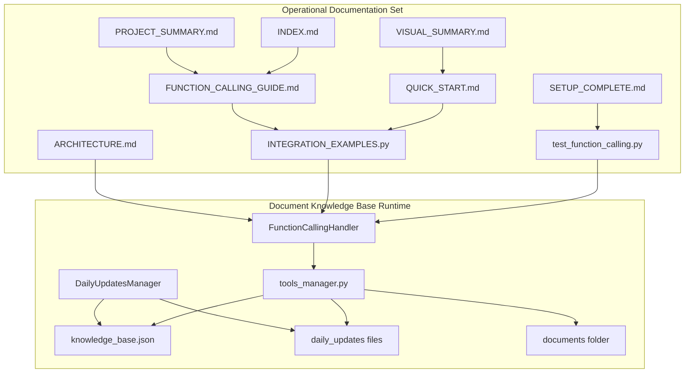
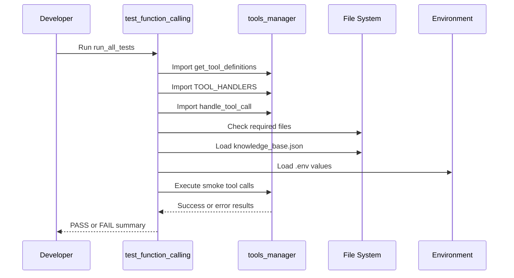
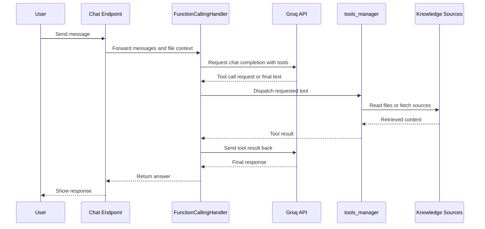

# Document Knowledge Base Domain - Verification, Integration Examples, and Knowledge-Domain Runbooks

## Overview

This domain packages the runtime pieces and operational docs that let Nexus answer with live, source-backed knowledge instead of relying on fine-tuning. The core path is Groq function calling: the model decides when it needs a tool, the backend dispatches that tool, and the result is folded back into the response loop.

For maintainers, the domain is split into two parts: the executable support code in , , and , and the operational documentation set that explains how to verify, wire, and maintain the behavior. The visible docs show a workflow centered on quick setup, integration examples, smoke tests, and daily knowledge injection files.

## Architecture Overview



## Operational Documentation Set

### Documentation bundle used for this domain

*Repository root references shown in the title column.*

| File | Role in this domain |
| --- | --- |
|  | Verification harness for imports, tool registry, handlers, file structure, knowledge base, and environment variables. |
|  | Four integration patterns for enabling function calling in chat and streaming endpoints. |
|  | Fast setup runbook for enabling tools, creating daily updates, and testing behavior. |
|  | Complete reference guide for the function-calling workflow and extension points. |
|  | Architecture companion document in the operational set. |
|  | Navigation entry point for the documentation set. |
|  | High-level summary document in the operational set. |
|  | Visual companion document in the operational set. |
|  | Completion document in the operational set. |


## Runtime Components

### `FunctionCallingHandler`

*`Backend/function_calling.py`*

`FunctionCallingHandler` is the orchestration layer that connects Groq chat completions to the registered tools. It prepares the prompt, requests tool-enabled completions, executes tool calls through `tools_manager`, and loops until the model returns a final answer or the iteration cap is reached.

#### Properties

| Property | Type | Description |
| --- | --- | --- |
| `client` | `Groq` | Groq client used for chat completion requests. |
| `model` | `str` | Model name used for tool-enabled responses. Defaults to `mixtral-8x7b-32768`. |
| `max_iterations` | `int` | Safety cap for repeated tool-call loops. Defaults to `10`. |


#### Constructor dependencies

| Type | Description |
| --- | --- |
| `Groq` | Injected Groq client instance used to call `chat.completions.create`. |
| `str` | Optional model override for the Groq request. |


#### Public methods

| Method | Description |
| --- | --- |
| `call_with_tools` | Runs the full tool-call loop and returns the final response text. |
| `stream_with_tools` | Streams the response while handling tool calls and emitting a thinking event. |
| `async_call_with_tools` | Async wrapper around `call_with_tools`. |
| `async_stream_with_tools` | Async wrapper that yields the sync stream output token by token. |


#### Behavior of the tool loop

1. Prepends `system_prompt` when provided.
2. Loads tool schemas from `get_tool_definitions()`.
3. Calls Groq with `tool_choice="auto"`.
4. If the model requests tools, appends the assistant tool-call payload.
5. Executes each tool through `handle_tool_call(...)`.
6. Appends each tool result back into the message list.
7. Repeats until the model returns plain content or `max_iterations` is hit.

### `tools_manager.py`

*`Backend/tools_manager.py`*

`tools_manager.py` defines the tool registry, the Groq-compatible tool schemas, and the execution functions that retrieve knowledge from local files, daily update files, and external sources.

#### Registry and service symbols

| Symbol | Type | Description |
| --- | --- | --- |
| `TOOL_HANDLERS` | `Dict[str, Callable]` | Maps tool names to their execution functions. |
| `get_tool_definitions` | function | Returns Groq-compatible function definitions for the available tools. |
| `handle_tool_call` | function | Dispatches a tool call by name using the registry. |


#### Tool handler registry

| Tool name | Backing function | Primary data source |
| --- | --- | --- |
| `search_knowledge_base` | `search_knowledge_base` |  |
| `search_pdf_documents` | `search_pdf_documents` | Uploaded PDF retrieval hook |
| `get_company_faq` | `get_company_faq` | ,  |
| `get_today_updates` | `get_today_updates` | , , optional online sources |
| `web_search` | `web_search` | Google search integration |
| `get_file_context` | `get_file_context` | Uploaded file context hook from `main.py` |


#### Public tool functions

| Method | Description |
| --- | --- |
| `search_knowledge_base` | Performs keyword matching against the knowledge base file and returns the matched snippets. |
| `search_pdf_documents` | Returns a PDF search placeholder response and documents the PDF retrieval integration point. |
| `get_company_faq` | Searches FAQ and company steps text files for the requested topic. |
| `get_today_updates` | Reads daily update files and optional online sources for current information. |
| `web_search` | Declared as a real-time search tool for Google-backed search. |
| `get_file_context` | Returns a file-context hook response for the uploaded file workflow. |


#### Knowledge retrieval behavior

| Function | Behavior |
| --- | --- |
| `search_knowledge_base` | Loads , accepts either a dict with `documents` or a list, lowercases the query, scans up to the first 100 items, and truncates each matching result to 500 characters. |
| `get_company_faq` | Opens  and  when they exist, and returns the first 1000 characters of matching files. |
| `get_today_updates` | Collects  files for the requested date window, adds `last_kb_update` from `knowledge_base.json` when available, and can include Slack, GitHub, or RSS data when enabled by environment variables. |
| `search_pdf_documents` | Returns an initialization message and zero documents in the visible implementation. |
| `get_file_context` | Returns a success wrapper with a note that it must be integrated with `main.py` file context. |


#### Knowledge base data shapes

get_tool_definitions() advertises days and include_online for get_today_updates, but the visible implementation of get_today_updates reads TOOLS_DAYS and TOOLS_INCLUDE_ONLINE from the environment instead of consuming those tool arguments directly. The model can request those fields, but the shown function body does not use them.

`search_knowledge_base` accepts both of the following shapes:

| Shape | Fields |
| --- | --- |
| List form | A list of strings or dict-like entries. |
| Object form | A dict with `documents`, where each document may contain `title`, `content`, `date`, and optional `source`. |


### `DailyUpdatesManager`

*`Backend/daily_updates_automation.py`*

`DailyUpdatesManager` is the automation helper that builds `daily_updates_YYYY_MM_DD.txt` files and refreshes `knowledge_base.json` with the daily update content.

#### Properties

| Property | Type | Description |
| --- | --- | --- |
| `backend_dir` | `Path` | Base directory used for the daily updates workflow. |
| `today` | `datetime` | Timestamp used to compute the daily file name and file contents. |
| `date_str` | `str` | Date stamp in `YYYY_MM_DD` format. |
| `updates_file` | `Path` | Output file path for the current day’s update file. |


#### Public methods

| Method | Description |
| --- | --- |
| `get_today_updates` | Collects announcements, schedule, new documents, and team notes. |
| `create_updates_file` | Writes the daily update text file. |
| `update_knowledge_base` | Appends the daily update into `knowledge_base.json` and saves the file. |
| `run` | Orchestrates update-file creation and optional knowledge-base refresh. |


#### Internal helper methods

| Method | Description |
| --- | --- |
| `_fetch_announcements` | Returns daily announcement strings. |
| `_fetch_schedule` | Returns the schedule map for the day. |
| `_fetch_new_documents` | Returns newly added document titles. |
| `_fetch_team_notes` | Returns team note strings. |


#### Module-level helper

| Method | Description |
| --- | --- |
| `setup_automation` | Prints cron and Task Scheduler instructions for running the daily update workflow automatically. |


## Verification Suite

### The seven test checks

DailyUpdatesManager.update_knowledge_base() says it keeps the “last 30 days,” but the visible filter uses the first day of the current month as the cutoff. In the shown code path, retention is month-bounded rather than strictly 30-day bounded.

*`Backend/test_function_calling.py`*

`run_all_tests()` executes seven checks and prints a summary. A full pass prints `7/7 tests passed` and exits with code `0`.

| Test check | What it verifies | Expected pass condition |
| --- | --- | --- |
| `Imports` | `tools_manager` and `function_calling` import correctly. | Both imports succeed. |
| `Tool Definitions` | `get_tool_definitions()` returns a non-empty tool list. | The returned list contains at least one tool. |
| `Tool Handlers` | `TOOL_HANDLERS` is populated. | The registry contains registered handlers. |
| `Tool Execution` | Core tool handlers can execute. | `search_knowledge_base`, `get_today_updates`, and `get_company_faq` return a result object. |
| `File Structure` | Required runtime files exist. | `tools_manager.py`, `function_calling.py`, `main.py`, and `INTEGRATION_EXAMPLES.py` are present. |
| `Knowledge Base` | `knowledge_base.json` exists and parses. | File exists, JSON loads, and item count is readable. |
| `Environment` | Required and optional environment variables are set. | `GROQ_API_KEY` is present; `GOOGLE_API_KEY` and `GOOGLE_CX` are reported if configured. |


#### Verification flow



#### Running the verification script

```bash
cd Backend
python test_function_calling.py
```

## Integration Examples

### Option 1: Update the existing chat endpoint

*`Backend/INTEGRATION_EXAMPLES.py`*

This approach keeps the existing `/api/chat` endpoint and replaces the standard completion call with `chat_completion_with_tools(...)`. The example first copies the file-context object under `_file_context_lock`, then passes `use_functions=True`.

| Aspect | Value |
| --- | --- |
| Integration style | Replace in-place |
| Main benefit | Minimal endpoint surface change |
| Tool flag | `use_functions=True` |
| File context | Copied from `_file_context` before the call |


### Option 2: Create a new function-calling endpoint

This approach keeps the original chat endpoint intact and adds a new route such as `/api/chat/with-tools`. The example in the documentation sets a dedicated system prompt and calls `chat_completion_with_tools(...)` from that new endpoint.

| Aspect | Value |
| --- | --- |
| Integration style | Additive |
| Main benefit | Old and new behaviors can coexist |
| Tool flag | `use_functions=True` |
| Suggested use case | Separate tool-enabled chat path |


### Option 3: Use streaming with function calling

This approach wraps the response in a `StreamingResponse` and uses `FunctionCallingHandler` to resolve tools before streaming the final text. The doc example emits JSON `token` chunks and ends with a `done` event.

| Aspect | Value |
| --- | --- |
| Integration style | Streaming |
| Main benefit | Works with streaming UIs |
| Tool handling | `handler.call_with_tools(...)` |
| Output form | Tokenized stream |


### Option 4: Route only selected query types through tools

This approach inspects the latest user message and enables function calling only for queries that need current or searchable information. The visible example checks keywords such as `today`, `update`, `new`, `current`, `latest`, `search`, and `find`.

| Aspect | Value |
| --- | --- |
| Integration style | Conditional routing |
| Main benefit | Reduces tool-call overhead on ordinary prompts |
| Routing signal | Keyword detection on the latest user message |
| Tool choice | `use_functions=should_use_tools` |


#### Integration flow



### Tool call execution loop

`FunctionCallingHandler.stream_with_tools()` and `call_with_tools()` both follow the same basic loop:

1. Build the message list.
2. Insert the system prompt if provided.
3. Fetch tool schemas.
4. Call Groq with `tool_choice="auto"`.
5. When Groq returns tool calls, dispatch each one.
6. Append each tool result.
7. Continue until the model returns final content or `max_iterations` is reached.

## Knowledge-Domain Runbooks

### Quick Start Runbook

*`Backend/QUICK_START.md`*

The quick-start document is the shortest path to enabling this domain. It explains the three setup steps, shows how to inject daily updates, and gives a compact testing flow.

#### Core setup steps

1. Enable function calling in the chat endpoint by switching to `chat_completion_with_tools(...)`.
2. Create a `daily_updates_YYYY_MM_DD.txt` file in `Backend/`.
3. Ask for today’s updates and confirm the tool call appears in the console.

#### Example daily update file format

```text
=== Today's Updates ===

NEW DOCUMENTS:
- Q1 financial results
- Updated training material

ANNOUNCEMENTS:
- New remote work policy
- Team building event at 3 PM

SCHEDULE:
- Maintenance window 6-8 PM
- Client call at 2 PM
```

#### Quick test commands

```bash
cd Backend
python test_function_calling.py
python daily_updates_automation.py --test
python daily_updates_automation.py --setup
```

#### Console monitoring signals

```text
🔧 Tool: get_today_updates | Args: ['category']
   Result: {'status': 'success', ...}

🔧 Tool: search_knowledge_base | Args: ['query', 'max_results']
   Result: {'status': 'success', 'results_count': 3...}
```

### Deployment Readiness Criteria

Use this checklist before shipping changes that touch retrieval or function calling:

| Criterion | What must be true |
| --- | --- |
| Verification suite | `python test_function_calling.py` passes all 7 checks. |
| Core imports | `tools_manager.py` and `function_calling.py` import successfully. |
| Required backend files | `tools_manager.py`, `function_calling.py`, `main.py`, and `INTEGRATION_EXAMPLES.py` are present. |
| Knowledge base file |  exists and is valid JSON. |
| Required env var | `GROQ_API_KEY` is set. |
| Web search config | `GOOGLE_API_KEY` and `GOOGLE_CX` are set when `web_search` is expected to work. |
| Daily updates support | `daily_updates_YYYY_MM_DD.txt` files exist or `daily_updates_automation.py` is configured. |
| Runtime integration | The chat path calls `chat_completion_with_tools(...)` or `FunctionCallingHandler`. |


### Troubleshooting

| Issue | What to check | What the docs show |
| --- | --- | --- |
| Tool calls failing | Error logs and file paths | The runbook says to confirm expected files exist and inspect logs. |
| AI not calling tools | Query wording and tool descriptions | The guide says this is normal when tools are not needed; improve tool descriptions when a tool should be used. |
| Slow responses | Tool-call overhead and repeated calls | The docs estimate roughly `200-500ms` per tool call and suggest smart routing. |
| ImportError for `function_calling` or `tools_manager` | Backend file placement | The example says both files must live in `Backend/`. |
| Missing knowledge base |  presence | `search_knowledge_base` returns `{"status":"error","message":"Knowledge base not found"}` when the file is missing. |
| Missing Groq key | `.env` contents | The verification script requires `GROQ_API_KEY`. |


#### Error handling pattern used by the tools

```python
except Exception as e:
    return {"status": "error", "message": str(e)}
```

### Caching and bounded retrieval behavior

The documented code paths use bounded reads instead of broad scans. `search_knowledge_base` limits candidate inspection to the first 100 items and truncates content to 500 characters, while `get_company_faq` trims matches to 1000 characters. `get_today_updates` reads only the files in its requested date window and enriches the result with the current knowledge base timestamp when available.

### Dependencies

#### External packages and services

| Dependency | Purpose |
| --- | --- |
| `groq` | Groq client used by `FunctionCallingHandler`. |
| `python-dotenv` | Loads `.env` values for the verification and runtime paths. |
| `requests` | Imported by `tools_manager.py` for external fetch helpers. |
| `GOOGLE_API_KEY`, `GOOGLE_CX` | Required when `web_search` is expected to work. |
| `GROQ_API_KEY` | Required by the backend and the verification script. |
| `SLACK_BOT_TOKEN`, `SLACK_CHANNEL` | Used by daily-update online fetching when configured. |
| `GITHUB_TOKEN`, `GITHUB_REPO` | Used by daily-update online fetching when configured. |
| `RSS_FEEDS` | Comma-separated RSS feed list for daily-update online fetching. |


#### Local data sources

| Source | Purpose |
| --- | --- |
|  | Searchable knowledge corpus. |
|  | Company steps and procedure content. |
|  | Company FAQ content. |
|  | Current and recent daily updates. |


### Recommended reading order for maintainers extending retrieval or function-calling behavior

1. — locate the full doc set.
2. — get the baseline setup and verify the happy path.
3. — review the complete reference for tools and orchestration.
4. — choose the best integration pattern for your endpoint.
5. — confirm the runtime and environment before changing behavior.
6. — map the docs to the runtime boundaries.
7. — review the scope of the domain.
8. — scan the visual companion for a quick mental model.
9. — use as the final completion checkpoint.

## Notes on documented discrepancies

## Key Classes Reference

get_today_updates exposes category, but the visible function body does not use that value to filter the returned content. The return payload includes the category field, yet the retrieval path is driven by the date window and environment variables. [!NOTE] DailyUpdatesManager.update_knowledge_base() describes a 30-day retention window, but the visible implementation keeps daily_updates entries newer than the first day of the current month.

| Class | Responsibility |
| --- | --- |
| `function_calling.py` | Orchestrates Groq tool calls and returns final responses. |
| `tools_manager.py` | Defines tool schemas, dispatches tools, and reads knowledge sources. |
| `test_function_calling.py` | Verifies imports, files, handlers, knowledge base, and environment. |
| `daily_updates_automation.py` | Generates daily update files and refreshes the knowledge base. |
| `QUICK_START.md` | Provides the short setup and validation runbook. |
| `INTEGRATION_EXAMPLES.py` | Shows the four integration approaches for function calling. |
| `FUNCTION_CALLING_GUIDE.md` | Serves as the full operational reference for the domain. |
| `ARCHITECTURE.md` | Documents the operational architecture companion. |
| `INDEX.md` | Serves as the navigation entry point. |
| `PROJECT_SUMMARY.md` | Captures the high-level summary companion. |
| `VISUAL_SUMMARY.md` | Provides the visual summary companion. |
| `SETUP_COMPLETE.md` | Marks the setup completion companion. |
