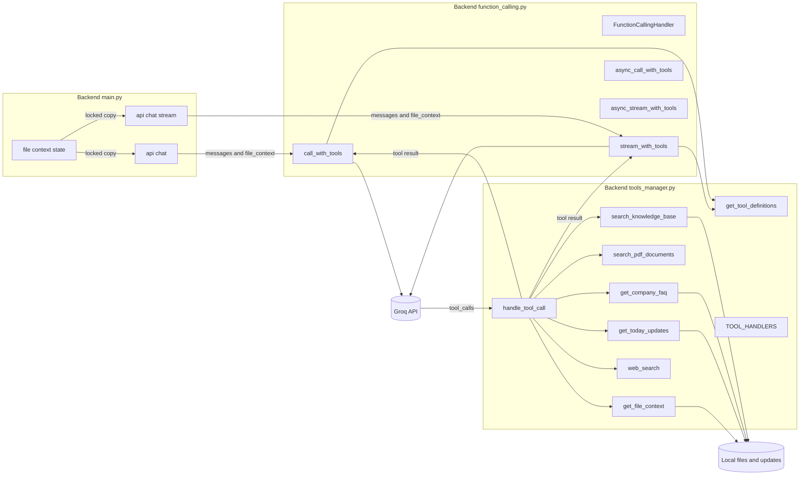
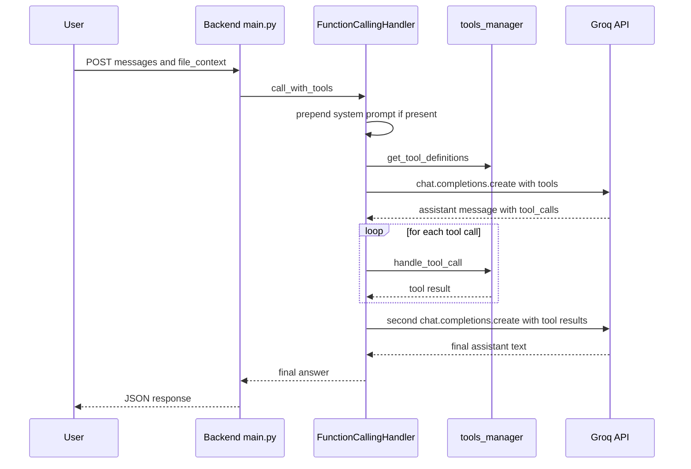
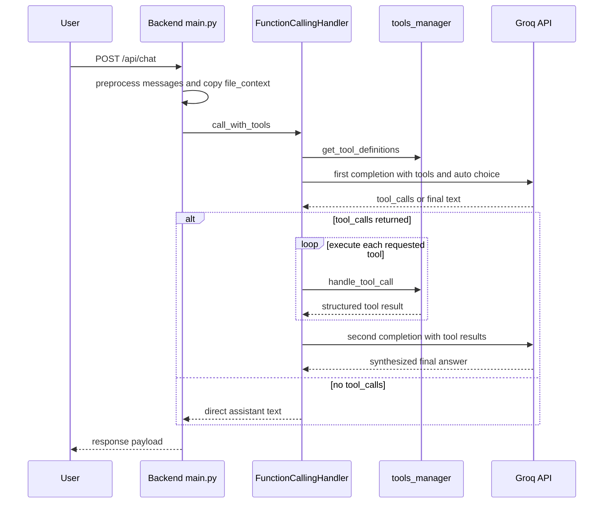
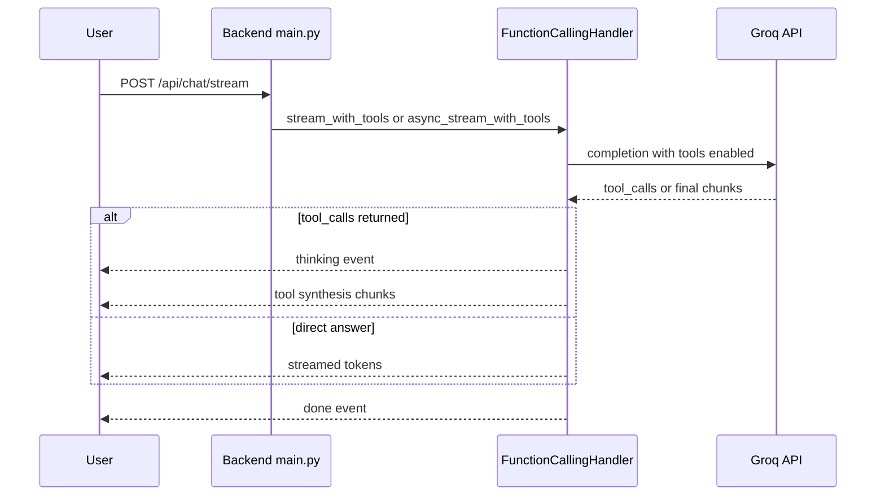

# System Architecture and Primary Entry Points - Backend Tool Calling Request Lifecycle and Integration Seam

## Overview

This backend path turns a normal chat request into a tool-aware request flow when the documented integration is enabled. The request starts in , captures the current `file_context`, and delegates the model turn to the function-calling orchestration layer in , which can invoke one or more handlers from  before performing a second Groq synthesis pass.

The user-visible value is that Nexus can answer with current file context, knowledge-base content, company FAQ material, daily updates, and other live sources without fine-tuning. The same architecture also supports a fallback path: if tool calling is disabled, not needed, or fails, the request can continue through the regular chat completion path documented in the quick-start and integration examples.

## Architecture Overview



## Component Structure

### 1. Primary Entry Points in 

The checked-in  snippet still shows _run_chat_completion(...) calling chat_completion(...) directly. The documented integration in  and  replaces that call with the tool-aware wrapper, so the tool-calling seam is activated only after applying that documented change.

*File: `Backend/main.py`*

The chat endpoints perform request preprocessing first, then hand off to the model path. In the documented tool-calling integration, the normal completion step is swapped for a tool-aware wrapper that passes the copied `file_context` into the orchestration layer.

#### `ChatRequest`

| Property | Type | Description |
| --- | --- | --- |
| `messages` | `List[dict]` | Conversation payload sent into `/api/chat` and `/api/chat/stream`. Each item is used as a chat message with `role` and `content` in the request flow. |


#### Chat Completion

```api
{
    "title": "Chat Completion",
    "description": "Processes a chat request after request preprocessing in main.py and, in the documented integration, routes the model turn through the tool-calling wrapper with file_context",
    "method": "POST",
    "baseUrl": "<BackendBaseUrl>",
    "endpoint": "/api/chat",
    "headers": [
        {
            "key": "Content-Type",
            "value": "application/json",
            "required": true
        }
    ],
    "queryParams": [],
    "pathParams": [],
    "bodyType": "json",
    "requestBody": "{\n    \"messages\": [\n        {\n            \"role\": \"system\",\n            \"content\": \"You are NexusAI.\"\n        },\n        {\n            \"role\": \"user\",\n            \"content\": \"What updates happened today?\"\n        }\n    ]\n}",
    "formData": [],
    "rawBody": "",
    "responses": {
        "200": {
            "description": "Success",
            "body": "{\n    \"response\": \"<div style=\\\"white-space:pre-wrap;word-wrap:break-word;overflow-wrap:break-word;color:white;\\\">Final answer</div>\"\n}"
        }
    }
}
```

#### Chat Stream

```api
{
    "title": "Chat Stream",
    "description": "Streams chat output as server-sent events. The documented integration can swap the inner model call for the streaming function-calling path so tool use is surfaced as streamed events",
    "method": "POST",
    "baseUrl": "<BackendBaseUrl>",
    "endpoint": "/api/chat/stream",
    "headers": [
        {
            "key": "Content-Type",
            "value": "application/json",
            "required": true
        }
    ],
    "queryParams": [],
    "pathParams": [],
    "bodyType": "json",
    "requestBody": "{\n    \"messages\": [\n        {\n            \"role\": \"system\",\n            \"content\": \"You are NexusAI.\"\n        },\n        {\n            \"role\": \"user\",\n            \"content\": \"Summarize today's changes from the uploaded file.\"\n        }\n    ]\n}",
    "formData": [],
    "rawBody": "",
    "responses": {
        "200": {
            "description": "Server-sent event stream with event objects such as start, thinking, token, prefix, error, and done",
            "body": "{\n    \"type\": \"token\",\n    \"content\": \"Final answer chunk\"\n}"
        }
    }
}
```

### 2. Function Calling Orchestrator

*File: `Backend/function_calling.py`*

`FunctionCallingHandler` is the orchestration seam between the chat endpoint and the tool registry. It owns the Groq call loop, detects whether the model requested tool execution, and feeds tool results back into a second Groq synthesis pass.

#### `FunctionCallingHandler`

| Property | Type | Description |
| --- | --- | --- |
| `client` | `Groq` | Injected Groq client used for all completion calls. |
| `model` | `str` | Model name passed into Groq; defaults to `mixtral-8x7b-32768`. |
| `max_iterations` | `int` | Loop cap that prevents infinite tool-calling cycles; set to `10`. |


##### Constructor Dependencies

| Type | Description |
| --- | --- |
| `Groq` | Injected client instance used to call `chat.completions.create`. |
| `str` | Model selector passed into the Groq requests. |


##### Public Methods

| Method | Description |
| --- | --- |
| `__init__` | Stores the Groq client and model and initializes the tool-call loop limit. |
| `call_with_tools` | Runs the synchronous tool-calling loop, appends tool messages, and returns the final assistant text. |
| `stream_with_tools` | Streams the response path, emitting a thinking event when tools are used and token-like chunks for the final answer. |
| `async_call_with_tools` | Async wrapper that delegates to `call_with_tools`. |
| `async_stream_with_tools` | Async wrapper that iterates over `stream_with_tools`. |


#### Tool Calling Loop

`call_with_tools` performs these steps:

1. Copies the incoming `messages`.
2. Prepends `system_prompt` if one is supplied.
3. Loads Groq-compatible tool definitions from `get_tool_definitions()`.
4. Calls `self.client.chat.completions.create(...)` with `tools` and `tool_choice="auto"`.
5. If the response includes `tool_calls`, it appends an assistant message containing the call metadata.
6. Each tool call is executed through `handle_tool_call(...)`.
7. The tool result is appended as a `role: "tool"` message.
8. The loop repeats until the model returns final text or `max_iterations` is reached.

#### Tool-Aware Sequence



#### Streaming and Async Support

call_with_tools and stream_with_tools both pass file_context into handle_tool_call(...), but the visible handle_tool_call implementation does not forward that argument into the handler invocation. The tool result path therefore depends on the handler signature alone, not the file_context parameter that is passed into the dispatcher.

The documented async methods do not create a separate asynchronous Groq transport. They wrap the synchronous orchestration path and expose it as async helpers so the backend can fit the same logic into async request handlers or stream generators.

- `stream_with_tools` yields a serialized `thinking` event when tool use is triggered.
- After tool execution, it continues with streamed response chunks.
- `async_stream_with_tools` simply yields tokens from `stream_with_tools`.
- `async_call_with_tools` returns the synchronous result through an async signature.

### 3. Tool Registry and Handlers

*File: `Backend/tools_manager.py`*

`tools_manager.py` defines the function schemas exposed to Groq and the handlers that back those tool calls. The handlers resolve local files, document content, daily updates, and external search inputs.

#### Public Methods

| Method | Description |
| --- | --- |
| `get_tool_definitions` | Returns the Groq function definitions for the available tools. |
| `handle_tool_call` | Dispatches a single tool invocation to a registered handler and wraps errors in a structured result. |
| `search_knowledge_base` | Performs keyword search over . |
| `search_pdf_documents` | Provides the PDF search hook used by the document pipeline. |
| `get_company_faq` | Searches the FAQ and steps documents under `documents/`. |
| `get_today_updates` | Collects daily update content from local files and optional online sources. |
| `web_search` | Exposes real-time web search through the Groq tool schema. |
| `get_file_context` | Returns a file-context status payload for the current upload state. |


#### Tool Definitions Returned by `get_tool_definitions`

| Tool | Purpose | Inputs |
| --- | --- | --- |
| `search_knowledge_base` | Search the local knowledge base for relevant information. | `query`, `max_results` |
| `search_pdf_documents` | Search uploaded PDFs for topic-specific text. | `query`, `document_type` |
| `get_company_faq` | Retrieve company FAQ and steps content. | `topic`, `search_term` |
| `get_today_updates` | Return today’s updates and recent changes. | `category`, `days`, `include_online` |
| `web_search` | Search the web for current information. | `query`, `num_results` |
| `get_file_context` | Expose the current uploaded file context. | `section` |


#### Tool Handler Registry

| Tool Name | Handler |
| --- | --- |
| `search_knowledge_base` | `search_knowledge_base` |
| `search_pdf_documents` | `search_pdf_documents` |
| `get_company_faq` | `get_company_faq` |
| `get_today_updates` | `get_today_updates` |
| `web_search` | `web_search` |
| `get_file_context` | `get_file_context` |


#### Handler Details

| Handler | Description | Key Behavior |
| --- | --- | --- |
| `search_knowledge_base` | Searches  with simple keyword matching. | Limits search scope to the first 100 items, returns `results_count`, `results`, and `timestamp`. |
| `search_pdf_documents` | PDF search integration hook. | Returns a success payload that points to the document extraction pipeline. |
| `get_company_faq` | Searches  and . | Truncates matched content to 1000 characters per source. |
| `get_today_updates` | Reads daily update files and optional online sources. | Honors `TOOLS_INCLUDE_ONLINE` and supports Slack, GitHub, and RSS when configured. |
| `web_search` | Real-time search tool definition. | Requires Google API credentials according to the quick-start docs. |
| `get_file_context` | Exposes a file-context status object. | Returns `status`, `section`, and a note that it requires integration with `main.py` state. |


#### Tool Handler Dispatch

`handle_tool_call` applies the following behavior:

- unknown tool name → structured error response
- handler invocation failure → structured error response
- normal handler result → handler payload plus `tool_name`

## Feature Flows

### 1. Tool-Calling Chat Request Flow

get_file_context does not read the full upload buffer itself. The visible implementation returns a status payload that explicitly says it requires integration with main.py's _file_context, so the actual file content still comes from the shared backend state.

1. The client sends `messages` to `/api/chat`.
2. `main.py` applies request preprocessing such as history trimming and message normalization.
3. The documented integration copies `_file_context` under `_file_context_lock`.
4. The chat branch calls the tool-aware wrapper, which delegates into `FunctionCallingHandler.call_with_tools(...)`.
5. `FunctionCallingHandler` sends the first Groq request with tool definitions and `tool_choice="auto"`.
6. If the model requests tools, each handler runs through `handle_tool_call(...)`.
7. The tool results are appended and a second Groq synthesis step produces the final answer.
8. The backend returns the final response payload to the client.



### 2. Streaming Flow

The streaming variant keeps the same request entry point and message preparation, but emits response chunks through `StreamingResponse`. In the documented function-calling version, the streaming generator can surface a `thinking` event before token output so the UI can show that tools are being used.



### 3. Smart Routing Flow

The integration examples document a query gate that only enables tool calling for requests that are likely to benefit from fresh data. The suggested triggers are keywords such as `today`, `update`, `new`, `current`, `latest`, `search`, and `find`.

| Condition | Action |
| --- | --- |
| Query matches update or search keywords | Enable function calling |
| Query is routine or static | Use regular chat completion |
| Function calling disabled explicitly | Use the existing non-tool path |


The quick-start docs describe the cost as roughly `200-500ms` per tool call, which is why the smart-routing gate is positioned before the tool-aware wrapper.

## State Management

### Shared File Context State

`main.py` keeps a shared `_file_context` dictionary protected by `_file_context_lock`. The tool-calling seam copies that state under the lock and passes it into the orchestration layer.

| Field | Type | Description |
| --- | --- | --- |
| `text` | `str` | Extracted file content available for answer synthesis. |
| `filename` | `str` | Name of the uploaded file currently in context. |
| `type` | `str` | File type marker used by the upload pipeline. |
| `processing` | `bool` | Indicates the file is still being indexed. |
| `ready` | `bool` | Indicates the file is ready for retrieval and use. |
| `error` | `str` | Error string from the file-processing pipeline. |


### Tool Loop State

| Field | Type | Description |
| --- | --- | --- |
| `prepared_messages` | `List[Dict[str, str]]` | Mutable message list passed through the Groq tool loop. |
| `iteration` | `int` | Current loop counter for the tool-calling cycle. |
| `max_iterations` | `int` | Upper bound that prevents infinite tool requests. |


## Error Handling and Fallbacks

### Endpoint-Level Handling

| Trigger | Behavior |
| --- | --- |
| Empty `messages` payload | Returns `HTTPException` with status `400`. |
| Chat request timeout | Returns `HTTPException` with status `504`. |
| Unhandled chat failure | Returns `HTTPException` with status `500`. |
| Tool name not found | Returns `{"status":"error", ...}` from `handle_tool_call`. |
| Tool parameter mismatch | Returns `{"status":"error", ...}` from `handle_tool_call`. |
| Tool execution exception | Returns `{"status":"error", ...}` from `handle_tool_call`. |


### Model and Tool Fallbacks

| Layer | Fallback |
| --- | --- |
| `chat_completion` in `main.py` | Retries up to three times, switches from `openai/gpt-oss-20b` to `openai/gpt-oss-safeguard-20b` on rate limit, and backs off on timeout or connection failures. |
| Tool-calling loop | Returns a limit message when `max_iterations` is exceeded. |
| Documented integration | Falls back to regular chat completion when `use_functions=False` or when the tool-aware wrapper is not selected. |
| Streaming path | Emits an error event if the stream cannot produce a final answer. |


### Observed Response Messages

The visible chat branch in main.py still shows the plain completion helper. The documented tool-calling fallback to regular chat applies after the integration swap is made, while the currently checked-in path remains on the non-tool completion helper.

- unknown tool: structured error payload
- invalid parameters: structured error payload
- tool execution failure: structured error payload
- exceeded tool loop: limit message from the orchestrator
- request timeout: HTTP `504`

## Integration Points

- : searched by `search_knowledge_base`.
-  and : searched by `get_company_faq`.
- **Daily update files** such as `daily_updates_YYYY_MM_DD.txt`: consumed by `get_today_updates`.
- **Optional online sources**: Slack, GitHub, and RSS when the related environment variables are set.
- **Groq API**: used for both the initial tool-selection pass and the second synthesis pass.
- **Shared file context in ****`main.py`**: copied and passed into tool-aware requests.
- **Google search credentials**: `GOOGLE_API_KEY` and `GOOGLE_CX` for `web_search`.

## Dependencies

### Python and Runtime Dependencies

- `groq`
- `fastapi`
- `asyncio`
- `json`
- `os`
- `threading`
- `datetime`
- `requests`

### Document and Search Dependencies

- 
- local `documents` files for FAQ and steps content
- optional online source variables for daily updates

### Environment Variables Referenced by the Tooling Path

| Variable | Purpose |
| --- | --- |
| `GROQ_API_KEY` | Required for Groq client initialization. |
| `GOOGLE_API_KEY` | Enables web search support. |
| `GOOGLE_CX` | Search engine identifier for web search support. |
| `TOOLS_INCLUDE_ONLINE` | Enables Slack, GitHub, and RSS update collection when set to a truthy value. |
| `SLACK_BOT_TOKEN` | Slack fetch support for `get_today_updates`. |
| `SLACK_CHANNEL` | Slack channel selection for `get_today_updates`. |
| `GITHUB_TOKEN` | GitHub fetch support for `get_today_updates`. |
| `GITHUB_REPO` | GitHub repository selection for `get_today_updates`. |
| `RSS_FEEDS` | Comma-separated feed list for `get_today_updates`. |


## Testing Considerations

 covers the following scenarios:

| Test | What It Verifies |
| --- | --- |
| `test_imports` | `tools_manager` and `function_calling` import successfully. |
| `test_tool_definitions` | Tool definitions are present and enumerable. |
| `test_tool_handlers` | `TOOL_HANDLERS` contains registered handlers. |
| `test_tool_execution` | Individual tools can be invoked through `handle_tool_call`. |
| `test_file_structure` | Required backend files exist. |
| `test_knowledge_base` | The knowledge base file is present. |
| `test_env_file` | Required and optional environment variables are configured. |


## Key Classes Reference

| Class | Location | Responsibility |
| --- | --- | --- |
| `FunctionCallingHandler` | `function_calling.py` | Orchestrates tool-aware Groq chat requests, executes handlers, and performs the second synthesis pass. |
| `ChatRequest` | `main.py` | Carries the chat message array into `/api/chat` and `/api/chat/stream`. |
