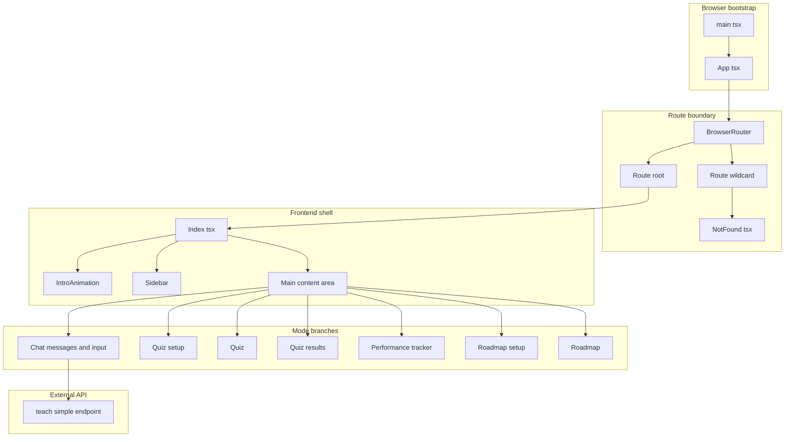
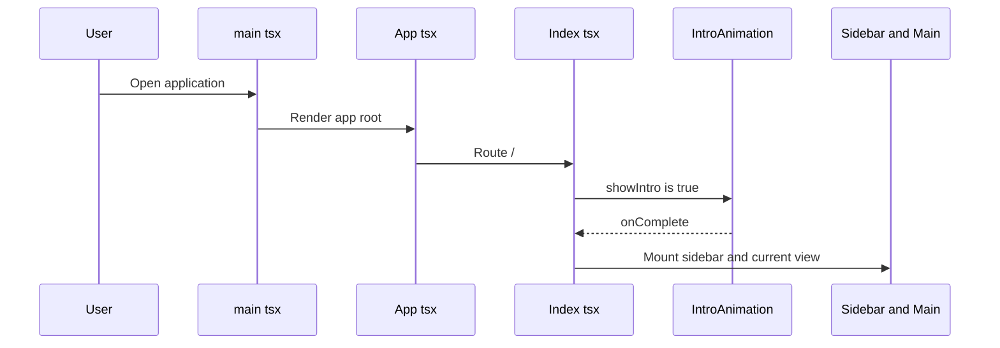
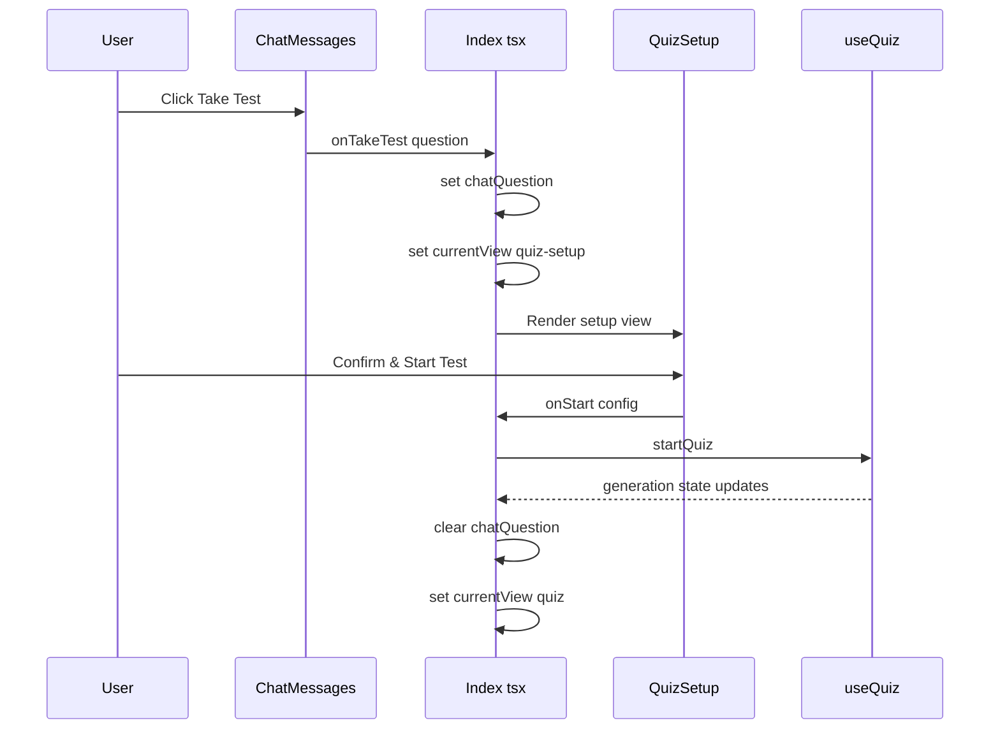
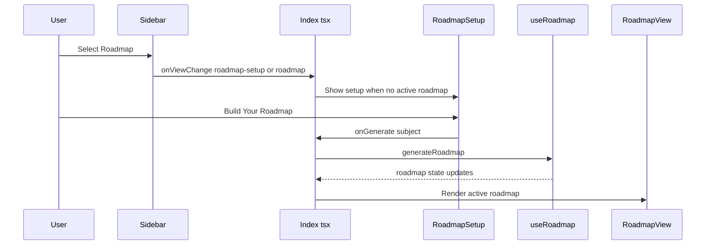
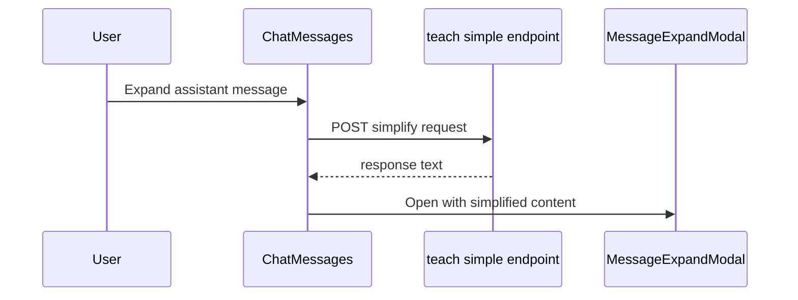
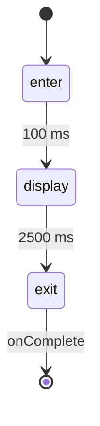

# System Architecture and Primary Entry Points

## Overview

This frontend is a single-route shell centered on . The user lands on `/`, sees the intro animation gate, and then stays inside the same page while the UI switches between chat, quiz setup, quiz execution, quiz results, performance tracking, roadmap setup, and roadmap playback. The application does not move those modes into separate routes; it keeps them inside one orchestration surface and swaps the rendered feature view based on local state.

 owns the application-wide providers and route boundaries, while  is the DOM mount point.  is the persistent navigation surface that drives mode changes, conversation selection, quiz history, and roadmap history without leaving the page.  is the only non-root route and is used as the wildcard fallback.

## Architecture Overview



## Frontend Shell and Route Boundary

### 

This is the browser entry point. It finds the root DOM node and renders `<App />` into it.

### 

`App` wraps the entire frontend in the app-level providers and defines the route boundary.

#### Shell responsibilities

- Mounts the application router.
- Provides query, tooltip, and notification context at the top of the tree.
- Routes `/` to `Index`.
- Routes every other path to `NotFound`.

#### Mounted providers

- `QueryClientProvider`
- `TooltipProvider`
- `Toaster`
- `Sonner`
- `BrowserRouter`

#### Route map

| Path | Element | Responsibility |
| --- | --- | --- |
| `/` | `Index` | Main app shell and mode orchestrator |
| `*` | `NotFound` | Wildcard fallback for unknown routes |


### 

`NotFound` is the route fallback. It reads the current pathname from `useLocation`, logs the failed route through `console.error`, and renders a minimal return link to `/`.

#### Behavior

- `useEffect` logs attempted navigation to a missing route.
- The page provides a direct anchor back to the home route.
- The page does not redirect automatically; the user chooses to return home.

## View Orchestration in `Index.tsx`

### 

The root route is the only application entry point for the chat, quiz, performance, and roadmap flows. Those modes are all rendered inside Index.tsx rather than mapped to separate routes.

`Index` is the central orchestrator for the entire product shell. It binds three state hooks, owns the current view mode, and passes the right callbacks into `Sidebar`, `ChatMessages`, `QuizSetup`, `QuizPage`, `QuizResults`, `PerformanceTracker`, `RoadmapSetup`, and `RoadmapView`.

#### Local state and derived values

| State | Type | Purpose |
| --- | --- | --- |
| `sidebarOpen` | `boolean` | Controls whether the persistent sidebar is expanded |
| `showIntro` | `boolean` | Gates the intro animation before the shell becomes interactive |
| `currentView` | `ViewType` | Selects which feature branch is rendered in `<main>` |
| `latestResult` | `QuizResult \ | null` | Holds the last quiz result for the `quiz-results` branch |
| `chatQuestion` | `string \ | null` | Carries a chat-derived quiz question into quiz setup |
| `activeConversation` | derived from `conversations.find(...)` | Resolves the currently active chat conversation |


#### View type union

`ViewType` is defined as:

`chat`, `quiz-setup`, `quiz`, `quiz-results`, `performance`, `roadmap-setup`, `roadmap`

#### Hook bindings

##### `useChat`

`Index` destructures these values from `useChat()`:

| Binding | Role in `Index` |
| --- | --- |
| `conversations` | Source list for sidebar chat history and the active conversation lookup |
| `activeConversationId` | Used to derive the active conversation object |
| `messages` | Passed into `ChatMessages` |
| `isTyping` | Controls chat loading cursor and input disabling |
| `isUploadingFile` | Bound but not shown in the visible render branch |
| `setActiveConversationId` | Passed to `Sidebar` for conversation selection |
| `createNewConversation` | Passed to `Sidebar` for “New Chat” |
| `sendMessage` | Passed to `ChatInput` |
| `deleteConversation` | Passed to `Sidebar` |
| `uploadFile` | Used by the file upload handler |
| `checkUploadStatus` | Used by the upload status handler |
| `clearFile` | Used by the file clear handler |


##### `useQuiz`

`Index` destructures these values from `useQuiz()`:

| Binding | Role in `Index` |
| --- | --- |
| `quizResults` | Supplied to `Sidebar` history and `PerformanceTracker` |
| `currentQuiz` | Drives the `quiz` branch |
| `isGenerating` | Renamed to `isQuizGenerating` and used to show the quiz loader |
| `startQuiz` | Starts quiz generation from quiz setup |
| `updateAnswer` | Used by `QuizPage` to persist answer updates |
| `evaluateQuiz` | Runs quiz evaluation before moving into the results branch |
| `setCurrentQuiz` | Used to reset and retry from quiz page |


##### `useRoadmap`

`Index` destructures these values from `useRoadmap()`:

| Binding | Role in `Index` |
| --- | --- |
| `roadmaps` | Supplied to `Sidebar` history |
| `activeRoadmap` | Drives the `roadmap` branch |
| `isGenerating` | Renamed to `isRoadmapGenerating` and used to show the roadmap loader |
| `generateRoadmap` | Starts roadmap generation from setup or chat |
| `toggleLessonFinished` | Passed to `RoadmapView` |
| `setActiveRoadmap` | Used when a user opens a roadmap from history |


#### Handler flow

| Handler | Behavior |
| --- | --- |
| `handleIntroComplete` | Hides the intro gate and reveals the shell |
| `handleToggleSidebar` | Toggles sidebar open state |
| `handleFileUpload` | Uploads a file through `useChat`, then shows success or failure toasts |
| `handleCheckUploadStatus` | Reads upload status and shows info, success, or error toasts |
| `handleClearFile` | Clears the file through `useChat`, then shows success or failure toasts |
| `handleStartQuiz` | Calls `startQuiz`, clears `chatQuestion`, and switches to `quiz` |
| `handleSubmitQuiz` | Calls `evaluateQuiz`; on result, stores it and switches to `quiz-results` |
| `handleViewChange` | Updates `currentView` directly |
| `handleTakeTestFromChat` | Stores a chat question and opens `quiz-setup` |
| `handleRoadmapFromChat` | Opens `roadmap` and triggers roadmap generation |
| `handleRoadmapGenerate` | Same behavior as chat-triggered roadmap generation |
| `handleSelectQuizResult` | Restores a previous quiz result and opens `quiz-results` |
| `handleSelectRoadmap` | Restores a saved roadmap and opens `roadmap` |


#### Render boundary logic

| `currentView` value | Rendered branch |
| --- | --- |
| `chat` | `ChatMessages` plus `ChatInput` |
| `quiz-setup` | `QuizSetup` |
| `quiz` | `QuizPage` or a loading placeholder while quiz generation is active |
| `quiz-results` | `QuizResults` when `latestResult` exists |
| `performance` | `PerformanceTracker` |
| `roadmap-setup` | `RoadmapSetup` |
| `roadmap` | `RoadmapView`, roadmap loading placeholder, or `RoadmapSetup` fallback |


#### Shell layout behavior

- `AnimatedBackground` is lazily imported and wrapped in `Suspense fallback={null}`.
- `Sidebar` is mounted outside `<main>` and remains persistent across view changes.
- The chat composer area changes width based on `sidebarOpen`.
- The shell stays in the same page container while mode branches change under `<main>`.

### User flows

#### App boot and intro gate



#### Chat to quiz setup



#### Roadmap launch and playback



## Sidebar Navigation Surface

### 

QuizPage and Index both bind useQuiz() independently. Index uses the hook to drive the page-level quiz-results branch, while QuizPage uses the hook to manage quiz submission and the in-view result surface.

The sidebar is the persistent navigation and history surface for the app. It lets the user create a new chat, jump into quiz or roadmap modes, revisit prior quiz results and roadmaps, and collapse the shell.

#### `SidebarProps`

| Prop | Type | Description |
| --- | --- | --- |
| `conversations` | `Conversation[]` | Chat history shown under the chats tab |
| `activeId` | `string \ | null` | Active conversation id |
| `onSelect` | `(id: string) => void` | Selects a conversation |
| `onNew` | `() => void` | Creates a new conversation |
| `onDelete` | `(id: string) => void` | Deletes a conversation |
| `isOpen` | `boolean` | Controls open or collapsed sidebar width |
| `onToggle` | `() => void` | Toggles the sidebar open state |
| `currentView` | `ViewType` | Drives active styling and history tab switching |
| `onViewChange` | `(view: ViewType) => void` | Switches the main view |
| `quizResults` | `QuizResult[]` | Quiz history shown under the quizzes tab |
| `onSelectQuizResult` | `(result: QuizResult) => void` | Opens a prior quiz result |
| `roadmaps` | `Roadmap[]` | Roadmap history shown under the roadmaps tab |
| `onSelectRoadmap` | `(roadmap: Roadmap) => void` | Opens a prior roadmap |


#### Sidebar state

| State | Type | Purpose |
| --- | --- | --- |
| `historyTab` | `'chats' \ | 'quizzes' \ | 'roadmaps'` | Controls which history list is visible |


#### Mode coupling

`Sidebar` reacts to `currentView` in an effect:

- `quiz-setup`, `quiz`, `quiz-results` → `quizzes`
- `roadmap-setup`, `roadmap` → `roadmaps`
- `chat` → `chats`

#### Interaction flow

- The “New Chat” button calls `onNew()` and then switches the view back to `chat`.
- “Quiz Mode”, “Performance Tracker”, and “Roadmap” update `currentView` without leaving the page.
- The quizzes and roadmaps history panels use the collections passed from `Index`.
- The closed state shows a floating toggle button so the user can reopen the sidebar.

#### Sidebar data flow

| Source in `Index` | Used by `Sidebar` |
| --- | --- |
| `conversations` | Recent chats list |
| `quizResults` | Quiz history list |
| `roadmaps` | Roadmap history list |
| `activeConversationId` | Active chat highlighting |
| `currentView` | Button highlighting and history tab selection |


## Feature Mode Components

### 

`ChatMessages` is the chat timeline surface used in the default `chat` branch. It renders the message list, scrolls to the bottom when new messages arrive, shows a typing cursor while the assistant is streaming, and supports “simplify” expansion for assistant messages.

#### `ChatMessagesProps`

| Prop | Type | Description |
| --- | --- | --- |
| `messages` | `Message[]` | Chat transcript rendered in order |
| `isTyping` | `boolean` | Controls the streaming cursor and empty-state behavior |
| `uploadedFile` | `UploadedFile \ | undefined` | File context passed from the active conversation |
| `onClearFile` | `() => void` | Clears the attached file from chat |
| `onTakeTest` | `(question: string) => void` | Sends a chat question into quiz setup |
| `onRoadmap` | `(subject: string) => void` | Sends a chat subject into roadmap generation |


#### Local state

| State | Type | Purpose |
| --- | --- | --- |
| `bottomRef` | `RefObject<HTMLDivElement>` | Auto-scroll anchor |
| `expandedMessage` | `Message \ | null` | Message shown in the expand modal |
| `simplifiedContent` | `string` | Simplified assistant output returned by the API |
| `isLoadingSimplified` | `boolean` | Shows the simplification overlay |


#### Behavior

- Scrolls to the newest message whenever `messages` or `isTyping` changes.
- Shows an empty-state prompt when the transcript is empty and the assistant is not typing.
- Opens `MessageExpandModal` after expansion completes.
- If simplification fails, the modal still opens with the original message content.

#### API integration

#### Simplify Assistant Response

```api
{
    "title": "Simplify Assistant Response",
    "description": "Requests a simpler rephrasing of an assistant message using the local teach simple endpoint",
    "method": "POST",
    "baseUrl": "http://localhost:8000",
    "endpoint": "/api/teach-simple",
    "headers": [
        {
            "key": "Content-Type",
            "value": "application/json",
            "required": true
        }
    ],
    "queryParams": [],
    "pathParams": [],
    "bodyType": "json",
    "requestBody": "{\n    \"topic\": \"Explain quantum entanglement in simple terms\",\n    \"language\": \"en\",\n    \"previous_response\": \"Quantum entanglement is a phenomenon where ...\"\n}",
    "formData": [],
    "rawBody": "",
    "responses": {
        "200": {
            "description": "Simplified response payload",
            "body": "{\n    \"response\": \"Quantum entanglement means two particles stay connected even when far apart.\"\n}"
        }
    }
}
```

#### Message expansion flow



### 

`QuizSetup` is the parameter builder for the quiz branch. It can be launched from chat with a prefilled question or opened directly from the sidebar.

#### `QuizSetupProps`

| Prop | Type | Description |
| --- | --- | --- |
| `onStart` | `(config: QuizConfig) => void` | Starts quiz generation with the chosen configuration |
| `onBack` | `() => void` | Returns to chat |
| `chatQuestion` | `string \ | null \ | undefined` | Prefills the setup from a chat-derived question |
| `isLoading` | `boolean \ | undefined` | Disables the form while quiz generation is active |


#### Local state

| State | Type | Purpose |
| --- | --- | --- |
| `subject` | `string` | Quiz subject or chat-derived title |
| `questions` | `QuestionConfig[]` | Question blocks with `marks` and `count` |
| `timeHours` | `number` | Quiz duration hours |
| `timeMinutes` | `number` | Quiz duration minutes |
| `mode` | `'normal' \ | 'real'` | Toggles copy and paste behavior |
| `attachedFile` | `{ name: string; text: string } \ | null` | Attached file context |
| `isExtracting` | `boolean` | File extraction state |
| `fileInputRef` | `RefObject<HTMLInputElement>` | Hidden file picker reference |


#### Submission shape

`handleStart` passes a `QuizConfig` that includes:

- `questions`
- `timeHours`
- `timeMinutes`
- `mode`
- `useFileContext: !!attachedFile`

#### Mode behavior

- If `chatQuestion` exists, the UI shows the question from chat instead of the subject input.
- `Normal Mode` allows copy and paste.
- `Real Mode` disables copy and paste in the quiz experience.
- The visible file picker accepts PDF, Word, and plain text attachments.

### 

`QuizPage` is the active quiz workspace. It renders the timed quiz, collects answers, disables copy and paste in real mode, and submits the response payload through the quiz hook.

#### `QuizPageProps`

| Prop | Type | Description |
| --- | --- | --- |
| `config` | `QuizConfig` | Quiz configuration including subject, duration, and mode |
| `questions` | `QuizQuestion[]` | Questions to render |
| `answers` | `QuizAnswer[]` | Current answer state |
| `onUpdateAnswer` | `(questionId: string, answer: Partial<QuizAnswer>) => void` | Persists answer changes |
| `onSubmit` | `() => void` | Triggers parent-level submission or evaluation |
| `onRetryQuiz` | `() => void` | Resets the quiz flow from the page |


#### Local state and refs

| State | Type | Purpose |
| --- | --- | --- |
| `expandedQuestion` | `string \ | null` | Controls which question is expanded |
| `showConfirm` | `boolean` | Controls the submit confirmation dialog |
| `motivationMsg` | `string` | Stores the current motivational message |
| `showMotivation` | `boolean` | Toggles the floating encouragement banner |
| `selectedOrChoice` | `Record<number, 'a' \ | 'b'>` | Tracks one-of-two selection state for `orGroup` questions |
| `editorRefs` | `RefObject<Record<string, AnswerEditorRef \ | null>>` | Exports text and canvas data from written answers |


#### Hook bindings inside `QuizPage`

`QuizPage` calls `useQuiz()` directly and binds:

- `submitAnswers`
- `result`
- `reset`
- `loading` as `submitLoading`

#### Quiz submission flow

- On timer expiry, `handleTimeUp` flushes every written answer editor before calling `onSubmit`.
- On explicit submit, `handleSubmitConfirmed` flushes editor state, builds the evaluation payload, and calls `submitAnswers`.
- On retry, `reset()` runs and `onRetryQuiz` is invoked if provided.

#### Result surface note

If the hook exposes a `result`, `QuizPage` renders `QuizResultsBackend` in place of the quiz workspace. That keeps the result surface inside the quiz branch even before `Index` switches to `quiz-results`.

### 

This file exports two distinct result surfaces for two different data shapes.

#### `QuizResultsProps`

| Prop | Type | Description |
| --- | --- | --- |
| `result` | `QuizResult` | Client-side quiz result shape used by `Index` |
| `onBack` | `() => void` | Returns to chat |
| `onNewQuiz` | `() => void` | Opens quiz setup again |


#### `QuizResultsBackendProps`

| Prop | Type | Description |
| --- | --- | --- |
| `result` | `QuizResultData` | Backend evaluation result shape |
| `onRetry` | `() => void` | Restarts the current quiz flow |


#### Default result surface

QuizResults and QuizResultsBackend are separate components in the same file. Index.tsx uses the default QuizResults for QuizResult, while QuizPage.tsx aliases QuizResultsBackend as QuizResults for QuizResultData.

- Computes a percentage from `obtainedMarks / totalMarks`.
- Uses the percentage to choose success, average, or low-score messaging.
- Renders question-by-question feedback.
- Provides “Take Another Quiz” and “Back to Chat” actions.

#### Backend result surface

- Computes a percentage from `total_awarded / total_possible`.
- Renders a grade label: `Excellent`, `Good`, `Pass`, or `Needs Improvement`.
- Lists each evaluation entry with awarded marks and feedback.
- Provides a single retry action.

### 

`QuizTimer` is the countdown widget used in the quiz header.

#### `QuizTimerProps`

| Prop | Type | Description |
| --- | --- | --- |
| `totalSeconds` | `number` | Initial countdown duration |
| `onTimeUp` | `() => void` | Fired when the timer reaches zero |


#### Behavior

- Starts from `totalSeconds`.
- Ticks once per second.
- Calls `onTimeUp` when the remaining time reaches zero.
- Switches to the destructive visual style when less than one minute remains.

### 

`RoadmapSetup` is the roadmap launcher used when the user opens roadmap mode without an active roadmap yet. It accepts a subject, submits it upward, and returns to chat through the back action.

#### Interaction points shown in the shell

- `onGenerate(subject)` starts roadmap generation.
- `onBack()` returns to the chat branch.
- `isGenerating` disables the input and shows a loading state.

### 

`RoadmapView` renders the active roadmap timeline and lets the user expand lessons and toggle lesson completion. `Index` passes `onToggleLesson={toggleLessonFinished}` and `onBack={() => setCurrentView('chat')}` into this branch.

#### Behavior visible in the shell

- Displays the roadmap subject and lesson sequence.
- Highlights finished lessons.
- Expands lesson cards in place.
- Lets the user mark lessons finished through the checkbox action.

### 

`PerformanceTracker` is the quiz analytics branch used when `currentView` is `performance`. `Index` passes the current quiz history into this view through `results={quizResults}` and a `Back` action to return to chat. The component is wired to `recharts` imports, which matches its score charting role in the shell.

### 

`IntroAnimation` is the startup gate that shows before the app shell becomes interactive.

#### Internal state

| State | Type | Purpose |
| --- | --- | --- |
| `phase` | `'enter' \ | 'display' \ | 'exit'` | Controls the intro lifecycle |


#### Lifecycle

- Enters an initial transition.
- Switches into display mode after 100 ms.
- Begins exit after 2.5 seconds.
- Calls `onComplete()` after the exit delay finishes.



### 

`AnimatedBackground` is lazily loaded and rendered behind the shell. It draws animated particles and connection lines on a full-screen canvas, and it is wrapped in `Suspense fallback={null}` so it never blocks the rest of the UI from rendering.

## State Management

### `Index` state model

- `showIntro` gates the shell before the app becomes interactive.
- `currentView` is the top-level mode switch.
- `sidebarOpen` drives the persistent shell width.
- `latestResult` keeps the quiz-results page open for previously evaluated results.
- `chatQuestion` bridges chat messages into quiz setup.

### `Sidebar` state model

- `historyTab` mirrors the active mode and keeps the history lists aligned with the current branch.

### `QuizSetup` state model

- Keeps the quiz configuration local until `onStart` packages it into `QuizConfig`.
- Stores file attachment context as part of the setup form.

### `QuizPage` state model

- Keeps answer expansion, submission confirmation, and motivational messaging local to the page.
- Uses refs for per-question editor export so answer content can be flushed before submission.

### `ChatMessages` state model

- Stores the expanded message dialog state locally.
- Maintains the simplification overlay state while the `teach-simple` request is in flight.

### `ViewType`

The shell mode union is: `chat`, `quiz-setup`, `quiz`, `quiz-results`, `performance`, `roadmap-setup`, `roadmap`.

## API Integration Surface

### Simplify assistant messages

The only explicit HTTP call in the visible frontend shell is the `POST` request made by `ChatMessages` to `/api/teach-simple`. It is used when the user expands an assistant message and requests a simpler version of the response.

#### Request details

- Method: `POST`
- URL: `http://localhost:8000/api/teach-simple`
- Required header: `Content-Type: application/json`
- Body fields:- `topic`
- `language`
- `previous_response`

#### Response handling

The component reads `data.response` from the returned JSON and uses it as the simplified content shown in the expansion modal.

## Error Handling

### `Index.tsx`

- `handleFileUpload` shows a success toast after upload and an error toast plus `console.error` on failure.
- `handleClearFile` shows success or failure toasts around the clear operation.
- `handleCheckUploadStatus` maps upload status into `toast.info`, `toast.success`, or `toast.error`.
- `handleStartQuiz` and `handleSubmitQuiz` are awaited; the visible code only updates shell state on success.

### `ChatMessages.tsx`

- The simplification request is wrapped in `try/catch/finally`.
- On failure, the component logs `teach-simple error` and still opens the original message in the modal.
- The loading overlay is cleared in the `finally` block.

### `NotFound.tsx`

- Missing routes are logged through `console.error` with the attempted pathname.

### `QuizPage.tsx`

- Submission errors are caught and logged with `console.error('Submit error:', error)`.
- The confirmation dialog prevents accidental submit by requiring an explicit confirmation action.

## Dependencies

### Shell and routing

- `react`
- `react-dom/client`
- `react-router-dom`
- `@tanstack/react-query`
- `sonner`
- `lucide-react`

### Frontend shell components

- `Sidebar`
- `ChatMessages`
- `ChatInput`
- `IntroAnimation`
- `QuizSetup`
- `QuizPage`
- `QuizResults`
- `PerformanceTracker`
- `RoadmapSetup`
- `RoadmapView`
- `AnimatedBackground`

### Local utilities and hooks

- `useChat`
- `useQuiz`
- `useRoadmap`
- `cn`

## Key Classes Reference

| Class | Responsibility |
| --- | --- |
| `main.tsx` | Browser mount point for the React application |
| `App.tsx` | Application shell, providers, and route boundary |
| `Index.tsx` | Central mode orchestrator for chat, quiz, performance, and roadmap |
| `NotFound.tsx` | Wildcard route fallback with pathname logging |
| `Sidebar.tsx` | Persistent navigation, history switching, and shell controls |
| `ChatMessages.tsx` | Chat transcript rendering and assistant message expansion |
| `QuizSetup.tsx` | Quiz configuration and launch surface |
| `QuizPage.tsx` | Active timed quiz workspace and submission flow |
| `QuizResults.tsx` | Client and backend quiz result surfaces |
| `QuizTimer.tsx` | Countdown timer for the quiz header |
| `RoadmapSetup.tsx` | Roadmap subject entry and generation trigger |
| `RoadmapView.tsx` | Active roadmap playback and lesson completion controls |
| `PerformanceTracker.tsx` | Quiz performance visualization branch |
| `IntroAnimation.tsx` | Startup gate before the shell becomes interactive |
| `AnimatedBackground.tsx` | Full-screen ambient canvas background |
