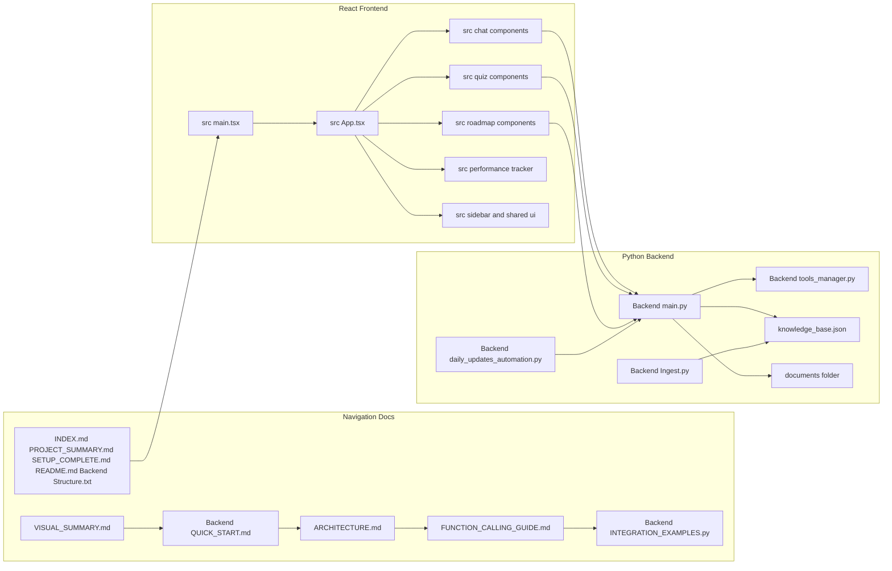
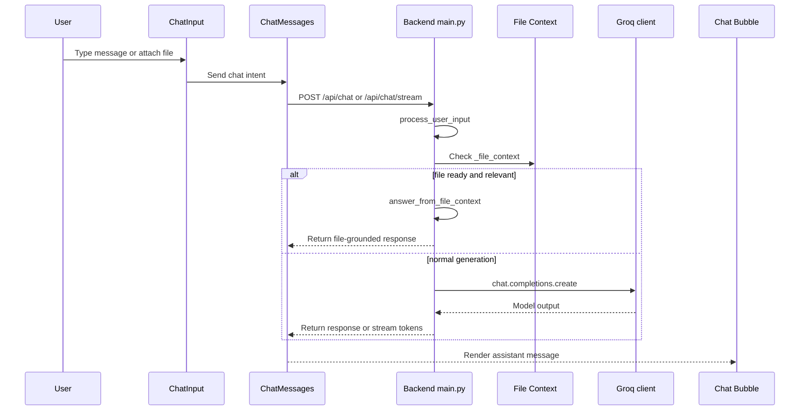
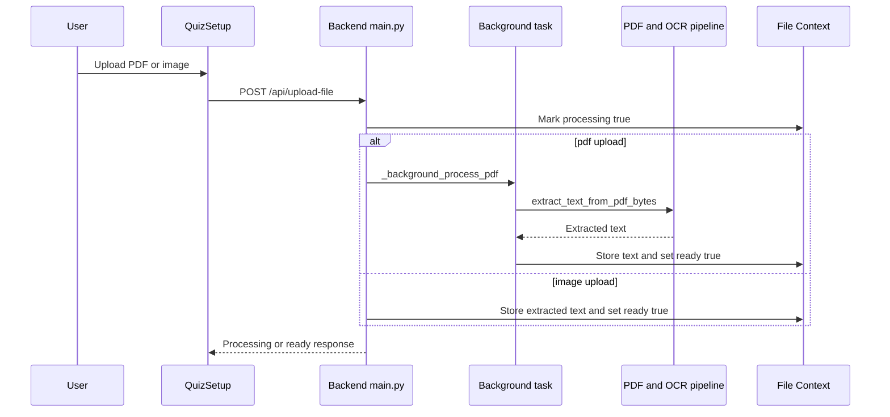

# System Architecture and Primary Entry Points

## Overview

From the user’s point of view, Nexus is one browser app with four visible workstreams: chat, quiz, roadmap, and performance tracking. The browser UI handles composition, expansion, uploads, and navigation, while the Python backend handles Groq-orchestrated function calling, retrieval from local files, uploaded file context, OCR-assisted extraction, and daily update injection.

The repository is deliberately split into a React/Vite/TypeScript frontend under `src/` and a FastAPI/Python backend under `Backend/`. The frontend owns interaction state and rendering; the backend owns AI orchestration, retrieval workflows, and file processing. The repo also uses a small set of navigation docs as the onboarding map: `INDEX.md`, `VISUAL_SUMMARY.md`, `PROJECT_SUMMARY.md`, `SETUP_COMPLETE.md`, `README.md`, and .

## Repository Structure and Runtime Split

| Area | Paths | Runtime | Responsibility |
| --- | --- | --- | --- |
| Frontend bootstrap | , , ,  | Browser | Mounts the SPA, routes users into the main interface, and provides the fallback route. |
| Chat surface | `src/components/chat/*`, ,  | Browser | Message composition, assistant response rendering, message expansion, and file attachment UX. |
| Quiz surface | `src/components/quiz/*`, ,  | Browser | Quiz setup, answer entry, timer, and results display. |
| Roadmap surface | `src/components/roadmap/*`, ,  | Browser | Subject planning, lesson progress, and resource browsing. |
| Performance surface |  | Browser | Score history, trend charts, and subject breakdowns. |
| Shared UI | `src/components/ui/*`,  | Browser | Reusable primitives and the `cn` helper used across feature views. |
| Backend API | ,  | Server | HTTP endpoints, function-calling orchestration, retrieval routing, and streaming responses. |
| Ingestion and automation | ,  | Server and CLI | Knowledge base chunking and daily update file generation. |
| Local data and docs | , `Backend/documents/`, ,  | Filesystem | Retrieval corpus, uploaded documents, and operational content. |


## Canonical Reading Order

The supplied  listing spans both the backend tree and the frontend src/ tree in the provided context. Treat it as a combined navigation map rather than a backend-only manifest.

1. `VISUAL_SUMMARY.md`
2. 
3. `ARCHITECTURE.md`
4. `FUNCTION_CALLING_GUIDE.md`
5. 
6. `INDEX.md`
7. `PROJECT_SUMMARY.md`
8. `SETUP_COMPLETE.md`
9. `README.md`
10. 

The recommended onboarding path starts with `VISUAL_SUMMARY.md` and , then moves into `ARCHITECTURE.md`, `FUNCTION_CALLING_GUIDE.md`, and  for implementation depth. The remaining top-level docs act as the broader repository map and setup reference.

## Architecture Overview



## Frontend Entry Points

The frontend is organized by user task rather than by technical layer. Chat is the primary interaction surface, quiz pages turn generated content into test flows, roadmap pages turn a topic into a study path, and performance pages summarize quiz history. Shared UI primitives live under `src/components/ui/`, while state coordination is split across the feature hooks in `src/hooks/`.

### Chat Surface

#### `ChatInput.tsx`

*`src/components/chat/ChatInput.tsx`*

| Property | Type | Description |
| --- | --- | --- |
| `onSend` | `(message: string) => void` | Sends the composed prompt to the parent flow. |
| `onFileUpload?` | `(file: File) => void` | Optional callback for PDF or image attachment. |
| `disabled?` | `boolean` | Disables input, upload, and send controls. |


`ChatInput` keeps the typed message in local state, exposes speech recognition controls, and enforces the frontend-side file type and size checks. It accepts PDFs and images, warns on large uploads, and clears the file picker after a successful attachment.

#### `ChatMessages.tsx`

*`src/components/chat/ChatMessages.tsx`*

| Property | Type | Description |
| --- | --- | --- |
| `messages` | `Message[]` | Conversation history rendered in order. |
| `isTyping` | `boolean` | Controls the typing cursor and loading affordances. |
| `uploadedFile?` | `UploadedFile` | Optional file metadata shown alongside the chat. |
| `onClearFile?` | `() => void` | Optional handler to clear the attached file state. |
| `onTakeTest?` | `(question: string) => void` | Opens the quiz flow from an assistant message. |
| `onRoadmap?` | `(subject: string) => void` | Opens the roadmap flow from an assistant message. |


`ChatMessages` scrolls to the latest entry, shows an empty-state prompt when there are no messages, and opens message expansion via `MessageBubble`. It also calls `http://localhost:8000/api/teach-simple` to generate a simplified version of an assistant response before showing the expand modal.

#### `MessageBubble.tsx`

*`src/components/chat/MessageBubble.tsx`*

| Property | Type | Description |
| --- | --- | --- |
| `message` | `Message` | The chat entry being rendered. |
| `userQuestion?` | `string` | The question paired with an assistant answer when available. |
| `onExpand?` | `(message: Message) => void` | Opens the detailed expansion flow. |
| `onTakeTest?` | `(question: string) => void` | Starts quiz generation from the message content. |
| `onRoadmap?` | `(subject: string) => void` | Starts roadmap generation from the message content. |
| `isStreaming?` | `boolean` | Hides action buttons while the answer is still being built. |


The bubble supports copy-to-clipboard, image enlargement, PDF export via `jsPDF`, quiz launch, and roadmap launch. It also strips UI hint strings from exported content before copying or PDF generation.

#### `MessageExpandModal.tsx`

*`src/components/chat/MessageExpandModal.tsx`*

| Property | Type | Description |
| --- | --- | --- |
| `message` | `Message` | The assistant message being expanded or simplified. |
| `onClose` | `() => void` | Closes the modal and returns to chat. |


| Local state | Type | Purpose |
| --- | --- | --- |
| `showRobotDialog` | `boolean` | Controls the initial understand prompt. |
| `showReExplain` | `boolean` | Switches into the simplified explanation view. |
| `paragraphs` | `string[]` | Holds the simplified paragraph breakdown. |
| `loading` | `boolean` | Shows request progress while simplification is pending. |


When the user selects “No”, the modal posts to `http://localhost:8000/api/explain-like-child` and re-renders the returned plain text into paragraphs. The file also contains a defensive parser that strips leading emoji-only lines before splitting the response.

#### Support visuals

- `LoadingIndicator.tsx` shows a spinner while assistant content is generated.
- `ThinkingRobot.tsx` animates the “thinking” state.
- `TypingIndicator.tsx` renders the three-dot typing marker.

### Quiz Surface

#### `QuizSetup.tsx`

*`src/components/quiz/QuizSetup.tsx`*

| Property | Type | Description |  |
| --- | --- | --- | --- |
| `onStart` | `(config: QuizConfig) => void` | Starts quiz generation with the current configuration. |  |
| `onBack` | `() => void` | Returns to the previous screen. |  |
| `chatQuestion?` | `string \ | null` | Pre-fills the quiz subject when launched from chat. |
| `isLoading?` | `boolean` | Disables the form during generation. |  |


| Local state | Type | Purpose |  |
| --- | --- | --- | --- |
| `subject` | `string` | Manual quiz subject. |  |
| `questions` | `QuestionConfig[]` | Marks and question-count groups. |  |
| `timeHours` | `number` | Quiz time limit hours. |  |
| `timeMinutes` | `number` | Quiz time limit minutes. |  |
| `mode` | `'normal' \ | 'real'` | Copy-paste policy. |
| `attachedFile` | `{ name: string; text: string } \ | null` | Tracks uploaded source content. |
| `isExtracting` | `boolean` | Shows file upload progress. |  |


`QuizSetup` posts attachments to `http://localhost:8000/api/upload-file` and then marks the file as backend-managed context. It allows `.pdf`, `.doc`, `.docx`, and `.txt` in the UI, but the backend upload handler only accepts PDFs and images.

#### `QuizPage.tsx`

QuizSetup.tsx accepts .doc, .docx, and .txt, but  only branches upload_file for PDFs and images. The quiz upload path therefore succeeds only when the file is already a PDF or image by the time it reaches the backend.

*`src/components/quiz/QuizPage.tsx`*

| Property | Type | Description |
| --- | --- | --- |
| `config` | `QuizConfig` | Quiz-level settings such as subject, mode, and time limit. |
| `questions` | `QuizQuestion[]` | Questions shown on the page. |
| `answers` | `QuizAnswer[]` | Current answer state. |
| `onUpdateAnswer` | `(questionId: string, answer: Partial<QuizAnswer>) => void` | Persists answer edits. |
| `onSubmit` | `() => void` | Submits the quiz. |
| `onRetryQuiz?` | `() => void` | Optional retry handler after results are shown. |


| Local state | Type | Purpose |  |
| --- | --- | --- | --- |
| `expandedQuestion` | `string \ | null` | Controls written-answer expansion. |
| `showConfirm` | `boolean` | Shows the submit confirmation dialog. |  |
| `motivationMsg` | `string` | Rotating encouragement text. |  |
| `showMotivation` | `boolean` | Controls the visible motivational toast. |  |
| `selectedOrChoice` | `Record<number, 'a' \ | 'b'>` | Tracks OR-choice selection. |
| `editorRefs` | `Record<string, AnswerEditorRef \ | null>` | Reads text and drawing exports before submit. |


`QuizPage` disables copy, paste, and cut in real mode. On submit, it flushes every `AnswerEditor` ref into `newAnswers` and then calls `useQuiz().submitAnswers`.

#### `AnswerEditor.tsx`

AnswerEditor.getExportData() returns canvasData: '', while QuizPage only appends drawing data when canvasData is truthy. The current quiz submission path therefore preserves typed text but does not serialize the drawing canvas into the submitted answer payload.

*`src/components/quiz/AnswerEditor.tsx`*

| Property | Type | Description |
| --- | --- | --- |
| `placeholder?` | `string` | Text shown in the first text block. |
| `minWords?` | `number` | Minimum word count shown in the footer. |
| `readOnly?` | `boolean` | Locks all editing interactions. |
| `onCopy?` | `(e: React.ClipboardEvent) => void` | Optional copy handler. |
| `onPaste?` | `(e: React.ClipboardEvent) => void` | Optional paste handler. |
| `className?` | `string` | Optional wrapper class name. |


| Export contract | Type | Description |
| --- | --- | --- |
| `getExportData` | `() => { text: string; canvasData: string }` | Returns the text answer and a canvas payload placeholder. |


| Drawing block props | Type | Description |
| --- | --- | --- |
| `block` | `Extract<Block, { kind: 'drawing' }>` | Drawing canvas block being edited. |
| `activeTool` | `DrawTool` | Current tool selection. |
| `color` | `string` | Active drawing color. |
| `lineWidth` | `number` | Active stroke width. |
| `readOnly` | `boolean` | Prevents editing. |
| `onStrokesChange` | `(id: string, strokes: DrawStroke[]) => void` | Persists stroke edits. |
| `onDelete` | `(id: string) => void` | Removes the drawing block. |


`AnswerEditor` combines text blocks and drawing blocks, supports select/move/resize editing, and exposes the current text through `useImperativeHandle`. The drawing toolchain supports pen, rectangle, ellipse, line, triangle, eraser, select, and text.

#### `QuizTimer.tsx`

*`src/components/quiz/QuizTimer.tsx`*

| Property | Type | Description |
| --- | --- | --- |
| `totalSeconds` | `number` | Starting time limit in seconds. |
| `onTimeUp` | `() => void` | Fires when the timer reaches zero. |


#### `QuizResults.tsx`

*`src/components/quiz/QuizResults.tsx`*

The file exports two result views:

- `QuizResults` for the older client-scored path.
- `QuizResultsBackend` for the backend-scored path.

`QuizPage` imports `QuizResultsBackend as QuizResults`, so the backend-evaluated version is the active one in the current quiz flow.

#### `QuizResultsBackend` props

*`src/components/quiz/QuizResults.tsx`*

| Property | Type | Description |
| --- | --- | --- |
| `result` | `QuizResultData` | Backend scoring payload. |
| `onRetry` | `() => void` | Starts a new quiz attempt. |


### Roadmap and Performance Surface

#### `RoadmapSetup.tsx`

*`src/components/roadmap/RoadmapSetup.tsx`*

| Property | Type | Description |
| --- | --- | --- |
| `onGenerate` | `(subject: string) => void` | Creates the roadmap for a subject. |
| `onBack` | `() => void` | Returns to chat. |
| `isGenerating` | `boolean` | Disables the form while the roadmap is created. |


#### `RoadmapView.tsx`

*`src/components/roadmap/RoadmapView.tsx`*

| Property | Type | Description |
| --- | --- | --- |
| `roadmap` | `Roadmap` | Current roadmap model. |
| `onBack` | `() => void` | Returns to the previous screen. |
| `onToggleLesson` | `(roadmapId: string, lessonId: string) => void` | Marks a lesson finished or unfinished. |


#### `PerformanceTracker.tsx`

*`src/components/performance/PerformanceTracker.tsx`*

| Property | Type | Description |
| --- | --- | --- |
| `results` | `QuizResult[]` | Quiz history shown in charts and cards. |
| `onBack` | `() => void` | Returns to the prior view. |


`PerformanceTracker` computes the current average, best score, improvement trend, weak subjects, and strong subjects from the supplied results. It renders both a line chart and a subject bar chart through `recharts`.

### Navigation and Shell

#### `ConversationItem.tsx`

*`src/components/sidebar/ConversationItem.tsx`*

| Property | Type | Description |
| --- | --- | --- |
| `conversation` | `Conversation` | Conversation row data. |
| `isActive` | `boolean` | Highlights the current conversation. |
| `onClick` | `() => void` | Selects the conversation. |
| `onDelete` | `() => void` | Deletes the conversation. |


#### `NavLink.tsx`

*`src/components/NavLink.tsx`*

| Property | Type | Description |
| --- | --- | --- |
| `className?` | `string` | Base class name forwarded to `RouterNavLink`. |
| `activeClassName?` | `string` | Applied when the route is active. |
| `pendingClassName?` | `string` | Applied while the route is pending. |


`NavLink` wraps `react-router-dom`’s `NavLink` and keeps the active/pending styling API that the app expects.

#### `AnimatedBackground.tsx`

*`src/components/ui/AnimatedBackground.tsx`*

This component has no props. It renders a full-screen animated canvas background and is used as a visual shell layer.

#### `IntroAnimation.tsx`

*`src/components/ui/IntroAnimation.tsx`*

| Property | Type | Description |
| --- | --- | --- |
| `onComplete` | `() => void` | Called when the intro animation finishes. |


## Backend Entry Points

The backend is centered in . It loads environment variables, configures `FastAPI`, allows local frontend origins from `http://localhost:8080` and `http://localhost:5173`, and sets up a shared `ThreadPoolExecutor` plus several guarded global stores. The same module owns chat orchestration, file upload and indexing, streaming responses, SVG generation, OCR-assisted extraction, and file-context answering.

### Backend bootstrap

- `load_dotenv()` loads `.env`.
- `GROQ_API_KEY` is required.
- `CORSMiddleware` allows the local frontend dev servers.
- `_file_context_lock` protects shared file state.
- `_svg_cache_lock` protects cached SVG outputs.
- `_groq_client_lock` protects Groq client pooling.
- `ThreadPoolExecutor(max_workers=20)` offloads blocking work.

### Core backend request models

#### `ChatRequest`

*`Backend/main.py`*

| Property | Type | Description |
| --- | --- | --- |
| `messages` | `List[dict]` | Chat message history. Each item is a dictionary with at least `role` and `content`. |


#### `SimpleTeachRequest`

*`Backend/main.py`*

| Property | Type | Description |
| --- | --- | --- |
| `topic` | `str` | Topic to simplify. |
| `language` | `str` | Target language, defaults to `en`. |
| `previous_response` | `str` | Prior assistant response to simplify. |
| `questions?` | `Optional[List[str]]` | Optional list of questions to simplify in bulk. |


#### `ChildTeachRequest`

*`Backend/main.py`*

| Property | Type | Description |
| --- | --- | --- |
| `topic` | `str` | Topic to re-explain for a child audience. |
| `language` | `str` | Target language, defaults to `en`. |
| `questions?` | `Optional[List[str]]` | Optional list of questions to re-explain in bulk. |


### Backend helper functions that shape the runtime

| Function | Responsibility |
| --- | --- |
| `build_language_instruction` | Turns a detected language code into a prompt instruction. |
| `translate_headings` | Translates section headings when translation support is available. |
| `get_section_headings` | Async wrapper around heading translation. |
| `extract_user_context` | Pulls context hints like notes mode or exam framing from the prompt. |
| `process_user_input` | Normalizes mixed-language input and translates non-English input to English. |
| `build_system_prompt` | Builds the main chat prompt for the active mode. |
| `build_coding_system_prompt` | Builds the JSON coding prompt. |
| `format_coding_response` | Wraps code, explanation, and output into HTML. |
| `clean_to_plain_text` | Strips HTML and markdown-like formatting. |
| `answer_from_file_context` | Searches uploaded file text and asks the model to answer from that excerpt. |
| `generate_svg_diagram` | Builds SVG diagrams and caches them. |
| `get_image_for_topic` | Returns the SVG data URL used by the chat image pipeline. |
| `_background_process_pdf` | Performs background extraction for uploaded PDFs. |
| `_cache_svg` | Stores SVG outputs in the LRU cache. |


### File Context Store

The backend uses `_file_context` as the handoff point between uploads and later chat queries.

| Field | Type | Description |
| --- | --- | --- |
| `text` | `str` | Extracted file content. |
| `filename` | `str` | Uploaded file name. |
| `type` | `str` | File kind such as `pdf` or `image`. |
| `processing` | `bool` | Indicates background indexing. |
| `ready` | `bool` | Indicates the file is ready for retrieval. |
| `error` | `str` | Stores the last processing error. |


`upload_file` updates the context, `upload_status` reports it, `clear_file` resets it, and `answer_from_file_context` reads from it when a query matches the uploaded content.

### SVG Diagram Cache

`generate_svg_diagram` caches generated SVG output in `_svg_cache` using the first 120 characters of the user message as the cache key. `_cache_svg` keeps the cache at 60 entries and moves hot keys to the end before evicting the oldest item.

### Tool Registry and Retrieval

#### `tools_manager.py`

*`Backend/tools_manager.py`*

| Tool | Purpose |
| --- | --- |
| `search_knowledge_base` | Searches `knowledge_base.json` for relevant content. |
| `search_pdf_documents` | Searches uploaded PDFs and related document content. |
| `get_company_faq` | Returns FAQ and procedure information. |
| `get_today_updates` | Returns daily updates, recent changes, and optional online sources. |
| `web_search` | Performs real-time web search when Google credentials are present. |
| `get_file_context` | Exposes the current uploaded file context to the tool layer. |


The registry exposes Groq-compatible function definitions through `get_tool_definitions()` and binds them to handlers through `TOOL_HANDLERS`. `get_today_updates` can also merge Slack, GitHub, and RSS inputs when the corresponding environment variables are present.

### Daily Updates Automation

#### `DailyUpdatesManager`

*`Backend/daily_updates_automation.py`*

| Property | Type | Description |
| --- | --- | --- |
| `backend_dir` | `Path` | Base directory for daily update files. |
| `today` | `datetime` | Current timestamp used for file naming. |
| `date_str` | `str` | `YYYY_MM_DD` suffix for the daily file. |
| `updates_file` | `Path` | Target `daily_updates_YYYY_MM_DD.txt` path. |


| Public method | Description |
| --- | --- |
| `get_today_updates` | Collects announcements, schedule, new documents, and team notes. |
| `create_updates_file` | Writes the daily update file to disk. |


The module also exposes `setup_automation()`, which prints cron and Task Scheduler instructions for running the daily update job.

### Ingestion

#### `ingest()`

*`Backend/Ingest.py`*

`ingest()` reads `.txt` files from `../documents`, splits them into chunks, and writes the result to . This is the repository’s local knowledge-base build step.

## API Integration

The frontend calls the backend directly over HTTP. The visible callers in the provided code are `ChatMessages.tsx`, `MessageExpandModal.tsx`, and `QuizSetup.tsx`. The backend exposes JSON endpoints for chat, simplification, child-style explanation, file uploads, file status, file clearing, and SSE streaming.

#### Chat Completion

```api
{
    "title": "Chat Completion",
    "description": "Processes a chat request, normalizes the latest user message, applies file-context and mode detection, and returns a rendered assistant response",
    "method": "POST",
    "baseUrl": "<BackendApiBaseUrl>",
    "endpoint": "/api/chat",
    "headers": [
        {
            "key": "Content-Type",
            "value": "application/json",
            "required": true
        }
    ],
    "queryParams": [],
    "pathParams": [],
    "bodyType": "json",
    "requestBody": "{\n    \"messages\": [\n        {\n            \"role\": \"system\",\n            \"content\": \"You are NexusAI.\"\n        },\n        {\n            \"role\": \"user\",\n            \"content\": \"Explain compilers in simple terms.\"\n        }\n    ]\n}",
    "formData": [],
    "rawBody": "",
    "responses": {
        "200": {
            "description": "Success",
            "body": "{\n    \"response\": \"<div style=\\\"white-space:pre-wrap;word-wrap:break-word;overflow-wrap:break-word;color:white;\\\">Hello! I'm NexusAI, your intelligent assistant. How can I help you today?</div>\"\n}"
        },
        "400": {
            "description": "No messages provided",
            "body": "{\n    \"detail\": \"No messages provided\"\n}"
        },
        "504": {
            "description": "Request timed out",
            "body": "{\n    \"detail\": \"Request timed out. Please try again.\"\n}"
        }
    }
}
```

#### Chat Stream

```api
{
    "title": "Chat Stream",
    "description": "Streams chat output as Server Sent Events, including prefix, start, token, error, and done events",
    "method": "POST",
    "baseUrl": "<BackendApiBaseUrl>",
    "endpoint": "/api/chat/stream",
    "headers": [
        {
            "key": "Content-Type",
            "value": "application/json",
            "required": true
        }
    ],
    "queryParams": [],
    "pathParams": [],
    "bodyType": "json",
    "requestBody": "{\n    \"messages\": [\n        {\n            \"role\": \"system\",\n            \"content\": \"You are NexusAI.\"\n        },\n        {\n            \"role\": \"user\",\n            \"content\": \"Show me the steps of photosynthesis.\"\n        }\n    ]\n}",
    "formData": [],
    "rawBody": "",
    "responses": {
        "200": {
            "description": "Server Sent Events stream",
            "body": "{\n    \"type\": \"token\",\n    \"content\": \"Hello! I'm NexusAI, your intelligent assistant.\"\n}"
        },
        "400": {
            "description": "No messages provided",
            "body": "{\n    \"detail\": \"No messages provided\"\n}"
        }
    }
}
```

#### Teach Simple

```api
{
    "title": "Teach Simple",
    "description": "Rewrites a topic or previous assistant response into a simpler explanation, optionally in batch mode for multiple questions",
    "method": "POST",
    "baseUrl": "<BackendApiBaseUrl>",
    "endpoint": "/api/teach-simple",
    "headers": [
        {
            "key": "Content-Type",
            "value": "application/json",
            "required": true
        }
    ],
    "queryParams": [],
    "pathParams": [],
    "bodyType": "json",
    "requestBody": "{\n    \"topic\": \"Compilers\",\n    \"language\": \"en\",\n    \"previous_response\": \"A compiler translates source code into machine code.\",\n    \"questions\": [\n        \"What is a compiler?\"\n    ]\n}",
    "formData": [],
    "rawBody": "",
    "responses": {
        "200": {
            "description": "Success",
            "body": "{\n    \"response\": \"<div style=\\\"white-space:pre-wrap;word-wrap:break-word;overflow-wrap:break-word;font-family:'Segoe UI',Arial,sans-serif;color:white;line-height:1.7;\\\">A compiler is a program that turns source code into machine-readable instructions.\\nIt reads the code, checks it for errors, and creates output the computer can run.\\nThis lets developers write code in a human-friendly language and still execute it efficiently.</div>\",\n    \"is_multiple\": false,\n    \"question_count\": 1\n}"
        },
        "500": {
            "description": "Internal error",
            "body": "{\n    \"detail\": \"An error occurred. Please try again.\"\n}"
        }
    }
}
```

#### Explain Like Child

```api
{
    "title": "Explain Like Child",
    "description": "Produces a plain-text child-friendly explanation for a topic or batch of questions",
    "method": "POST",
    "baseUrl": "<BackendApiBaseUrl>",
    "endpoint": "/api/explain-like-child",
    "headers": [
        {
            "key": "Content-Type",
            "value": "application/json",
            "required": true
        }
    ],
    "queryParams": [],
    "pathParams": [],
    "bodyType": "json",
    "requestBody": "{\n    \"topic\": \"Compilers\",\n    \"language\": \"en\",\n    \"questions\": [\n        \"What is a compiler?\"\n    ]\n}",
    "formData": [],
    "rawBody": "",
    "responses": {
        "200": {
            "description": "Success",
            "body": "{\n    \"response\": \"A compiler is like a helper that reads your instructions and turns them into a language the computer understands.\\nThink of it like a translator who makes sure the computer knows what to do.\\nThat is why programmers can write in one language and still run their programs.\",\n    \"is_multiple\": false,\n    \"question_count\": 1\n}"
        },
        "500": {
            "description": "Internal error",
            "body": "{\n    \"detail\": \"An error occurred. Please try again.\"\n}"
        }
    }
}
```

#### Upload File

```api
{
    "title": "Upload File",
    "description": "Accepts a PDF or image, extracts content, and updates the shared file context",
    "method": "POST",
    "baseUrl": "<BackendApiBaseUrl>",
    "endpoint": "/api/upload-file",
    "headers": [
        {
            "key": "Content-Type",
            "value": "multipart/form-data",
            "required": true
        }
    ],
    "queryParams": [],
    "pathParams": [],
    "bodyType": "form-data",
    "requestBody": "[]",
    "formData": [
        {
            "key": "file",
            "value": "<binary file>",
            "required": true
        }
    ],
    "rawBody": "",
    "responses": {
        "200": {
            "description": "PDF accepted and indexed in the background",
            "body": "{\n    \"success\": true,\n    \"filename\": \"study_notes.pdf\",\n    \"file_type\": \"pdf\",\n    \"processing\": true,\n    \"message\": \"\\u2705 'study_notes.pdf' (3.4 MB) received! Indexing in the background (30-60 seconds)...\"\n}"
        },
        "400": {
            "description": "Unsupported file type or empty content",
            "body": "{\n    \"detail\": \"Unsupported file type. Upload a PDF or image.\"\n}"
        },
        "413": {
            "description": "File too large",
            "body": "{\n    \"detail\": \"File too large. Maximum size is 100 MB.\"\n}"
        },
        "504": {
            "description": "File processing timed out",
            "body": "{\n    \"detail\": \"File processing timed out\"\n}"
        }
    }
}
```

#### Upload Status

```api
{
    "title": "Upload Status",
    "description": "Returns the current file-processing state for the shared upload context",
    "method": "GET",
    "baseUrl": "<BackendApiBaseUrl>",
    "endpoint": "/api/upload-status",
    "headers": [],
    "queryParams": [],
    "pathParams": [],
    "bodyType": "none",
    "requestBody": "",
    "formData": [],
    "rawBody": "",
    "responses": {
        "200": {
            "description": "Success",
            "body": "{\n    \"ready\": true,\n    \"processing\": false,\n    \"error\": \"\",\n    \"filename\": \"study_notes.pdf\",\n    \"chars_extracted\": 12456\n}"
        }
    }
}
```

#### Clear File

```api
{
    "title": "Clear File",
    "description": "Resets the shared file context back to empty values",
    "method": "POST",
    "baseUrl": "<BackendApiBaseUrl>",
    "endpoint": "/api/clear-file",
    "headers": [
        {
            "key": "Content-Type",
            "value": "application/json",
            "required": true
        }
    ],
    "queryParams": [],
    "pathParams": [],
    "bodyType": "json",
    "requestBody": "[]",
    "formData": [],
    "rawBody": "",
    "responses": {
        "200": {
            "description": "Success",
            "body": "{\n    \"success\": true,\n    \"message\": \"File context cleared.\"\n}"
        }
    }
}
```

## Feature Flows

### Chat Request and File Context Resolution



### File Upload and Background Indexing



## State Management

### Frontend local state

| Scope | Store | Purpose |
| --- | --- | --- |
| Chat input | `input`, `isRecording`, `attachedFile` | Manages compose, voice, and upload UX. |
| Chat rendering | `expandedMessage`, `simplifiedContent`, `isLoadingSimplified` | Drives expansion and simplification. |
| Quiz flow | `expandedQuestion`, `showConfirm`, `motivationMsg`, `showMotivation`, `selectedOrChoice` | Controls quiz form and submission UX. |
| Drawing editor | `blocks`, `activeTool`, `color`, `lineWidth`, selection state | Manages text blocks, strokes, and edit tools. |
| Roadmap | `expandedLesson` | Controls which lesson card is open. |
| Performance | Chart-derived locals such as average, best, and subject buckets | Summarizes the result history. |


### Backend shared state

| Store | Type | Purpose |
| --- | --- | --- |
| `_file_context` | `dict` | Shared upload and retrieval state. |
| `_svg_cache` | `OrderedDict` | Caches generated SVG diagrams. |
| `_groq_client_instances` | `list` | Supports Groq client pooling. |
| `_executor` | `ThreadPoolExecutor` | Offloads blocking OCR, translation, and model work. |


## Error Handling

The backend returns structured HTTP errors for invalid or missing input and for processing failures. The visible handlers include `400` for missing chat messages, `413` for oversized uploads, `504` for timeouts, and `500` for internal processing errors. Streaming chat also emits `error` events when generation or parsing fails.

The frontend responds with toasts, modal fallbacks, and retry-safe UI paths. `ChatMessages` and `MessageExpandModal` both catch fetch errors, while `QuizSetup` reports upload failures through `toast.error`.

## Caching Strategy

| Cache | Key | Invalidation | Purpose |
| --- | --- | --- | --- |
| `_svg_cache` | First 120 characters of the user message | Evicts oldest entries once 60 items are stored | Reuses generated SVG diagrams for repeated topics. |
| `_file_context` | Shared global state | Replaced by `clear_file` or overwritten by a new upload | Stores the latest processed file for retrieval. |


`_cache_svg` maintains a bounded LRU-style store by moving used keys to the end and trimming overflow. The chat file-context path is not a deep cache; it is a live shared state buffer that is reset when a new file is uploaded or cleared.

## Dependencies

### Frontend

- `react`, `react-dom`
- `react-router-dom`
- `lucide-react`
- `sonner`
- `jspdf`
- `recharts`
- `pdfjs-dist`
- `@/lib/utils` for `cn`

### Backend

- `fastapi`
- `uvicorn[standard]`
- `groq`
- `python-dotenv`
- `PyMuPDF`
- `googletrans`
- `pydantic`
- `aiofiles`
- `langchain`
- `langchain-community`
- `pdf2image`
- `pytesseract`
- `pillow`
- `requests`

### Local repository assets

- 
- `Backend/documents/`
- 
- 
- 

## Testing Considerations

-  checks the presence of the function-calling files and integration points.
-  validates the OCR-related dependencies and the message structure used for Groq calls.
- Upload-path testing should cover PDFs, images, oversized files, and unsupported file types.
- Chat-path testing should cover empty message arrays, plain chat, file-grounded chat, and SSE streaming.
- Quiz-path testing should cover text answers, drawing edits, real mode restrictions, and submit-time export.

## Key Classes Reference

| Class | Responsibility |
| --- | --- |
| `ChatInput.tsx` | Compose chat text, handle voice input, and attach files. |
| `ChatMessages.tsx` | Render message history and launch simplification flows. |
| `MessageBubble.tsx` | Render a single message with copy, PDF export, roadmap, and quiz actions. |
| `MessageExpandModal.tsx` | Show simplified or child-friendly expansion of an assistant message. |
| `QuizSetup.tsx` | Configure subject, marks, timing, mode, and source file for a quiz. |
| `QuizPage.tsx` | Render the quiz, collect answers, and trigger submission. |
| `AnswerEditor.tsx` | Provide text and drawing input for written answers. |
| `QuizTimer.tsx` | Count down the quiz time limit and trigger auto-submit. |
| `QuizResults.tsx` | Display older client-scored quiz results. |
| `RoadmapSetup.tsx` | Collect the subject used to generate a roadmap. |
| `RoadmapView.tsx` | Render roadmap lessons, progress, and resources. |
| `PerformanceTracker.tsx` | Visualize quiz performance history and trends. |
| `ConversationItem.tsx` | Render one sidebar conversation row. |
| `NavLink.tsx` | Apply active and pending class names to router links. |
| `AnimatedBackground.tsx` | Render the animated canvas background. |
| `IntroAnimation.tsx` | Show the startup animation before the app becomes interactive. |
| `main.py` | Host the FastAPI application, endpoints, file context, and orchestration helpers. |
| `tools_manager.py` | Define Groq tool schemas and tool handlers. |
| `Ingest.py` | Build `knowledge_base.json` from text files. |
| `daily_updates_automation.py` | Generate daily update files and print scheduler instructions. |
